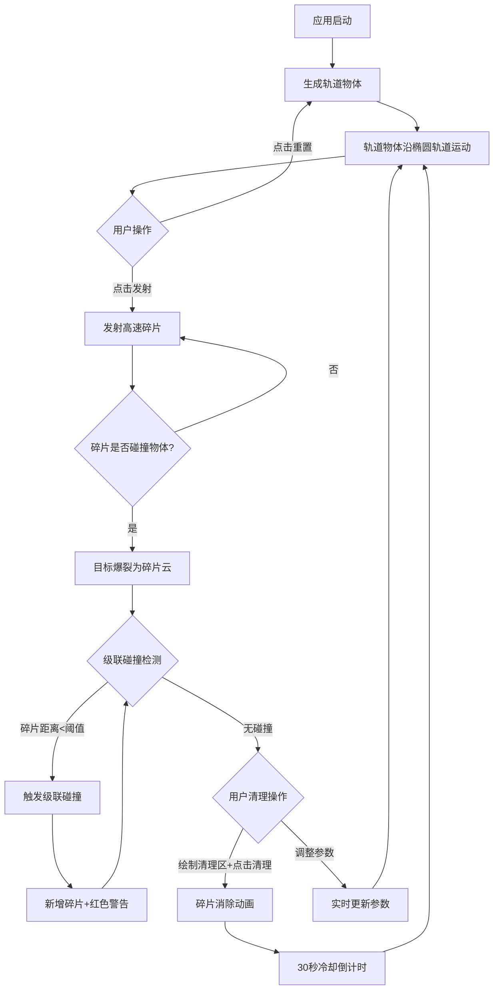

## 1. 产品概述

太空碎片碰撞模拟器是一款面向航天教育的交互式可视化应用，旨在直观展示低地球轨道碎片的高速碰撞过程和凯斯勒综合征的演化机制。用户可以在2D俯视角深空场景中发射碎片撞击轨道物体，观察碎片云扩散和级联碰撞现象，并通过清理机制干预碎片演化过程。

- 目标用户：航天爱好者、STEM教育学生、航天工程科普受众
- 核心价值：将抽象的轨道碎片危险性和连锁碰撞效应转化为可交互、可感知的视觉体验

## 2. 核心功能

### 2.1 功能模块

1. **轨道模拟区**：中央2D深空场景，展示轨道物体的椭圆轨道运动和碎片云扩散
2. **统计面板**：左侧实时碰撞数据统计
3. **预测面板**：右侧碎片增长率折线图与凯斯勒综合征阈值标注
4. **控制面板**：发射、清理、重置按钮及参数调节滑块

### 2.2 页面详情

| 页面名称 | 模块名称 | 功能描述 |
|----------|----------|----------|
| 主页面 | 轨道模拟区 | 2D Canvas渲染3-5个轨道物体沿椭圆轨道运动，支持发射碎片触发碰撞爆散动画，碎片云扩散与级联碰撞检测 |
| 主页面 | 统计面板 | 实时显示总碎片数、碰撞次数、碎片密度、已碰撞解体物体数量，毛玻璃半透明效果 |
| 主页面 | 预测面板 | 折线图展示碎片增长率，X轴时间/Y轴碎片数，标注凯斯勒综合征阈值红线（>100碎片） |
| 主页面 | 控制面板 | 发射按钮、清理按钮（30秒冷却）、重置按钮；参数滑块：目标物体数量(2-8)、碎片速度倍数(0.5-2.0)、碰撞检测半径(10-30px)、重力强度(0-5) |

## 3. 核心流程

用户打开应用后看到深空背景中多个轨道物体沿椭圆轨道运动。用户点击"发射"按钮后，一个高速红色碎片从指定方向飞出，当碎片与轨道物体碰撞时，目标物体爆裂为20-40个小碎片形成碎片云。碎片在重力场作用下扩散，当碎片与另一轨道物体或其他碎片云距离小于阈值时触发级联碰撞，产生更多碎片。用户可拖拽矩形区域并点击"清理"按钮消除碎片，每次清理有30秒冷却时间。

## 4. 用户界面设计

### 4.1 设计风格

- 配色：深空科幻风——背景#0B0E14、主面板#1A1D2E、强调色#E74C3C（警告）和#3498DB（信息）、文字#ECF0F1
- 按钮风格：圆角按钮，悬浮放大效果（transform: scale(1.05)），点击波纹动画
- 字体：等宽字体'Courier New'用于数据展示，Inter用于UI文字
- 布局：中心70%为轨道模拟区，左右两侧为统计/预测面板，底部参数调节栏
- 动画：碰撞时屏幕边缘泛红（CSS滤镜，0.3秒消失），级联碰撞警告文字闪烁（0.5秒频率），视差星点背景

### 4.2 页面设计概览

| 页面名称 | 模块名称 | UI元素 |
|----------|----------|--------|
| 主页面 | 轨道模拟区 | Canvas 2D，深空背景#0B0E14，视差闪烁星点1px半透明白点，轨道物体（灰色#888888废弃卫星、蓝色#3498DB正常卫星），红色#E74C3C高速碎片，爆散碎片（亮红#FF4444到暗红#880000渐变） |
| 主页面 | 统计面板 | 毛玻璃效果（backdrop-filter: blur(6px)），等宽字体，实时数字：总碎片数、碰撞次数、碎片密度、解体物体数 |
| 主页面 | 预测面板 | 毛玻璃效果，折线图#E74C3C色，半透明网格背景，凯斯勒阈值红线（>100碎片标记） |
| 主页面 | 控制面板 | 底部参数栏，滑块带实时数值显示，发射/清理/重置按钮，清理按钮30秒冷却灰色状态 |
| 主页面 | 碰撞警告 | 屏幕中央红色警告文字，Courier New 18px，闪烁0.5秒频率，2秒后淡出 |
| 主页面 | 屏幕边缘效果 | 碰撞时红色渐变rgba(255,0,0,0)→rgba(255,0,0,0.3)，0.3秒消失 |

### 4.3 响应式

桌面优先设计，Canvas区域自适应窗口大小，面板使用固定宽度。轨道模拟区占中心70%区域。

### 4.4 性能要求

- 50个碎片以上时帧率不低于50FPS
- Canvas 2D渲染，requestAnimationFrame驱动
- 碰撞检测使用四叉树优化
