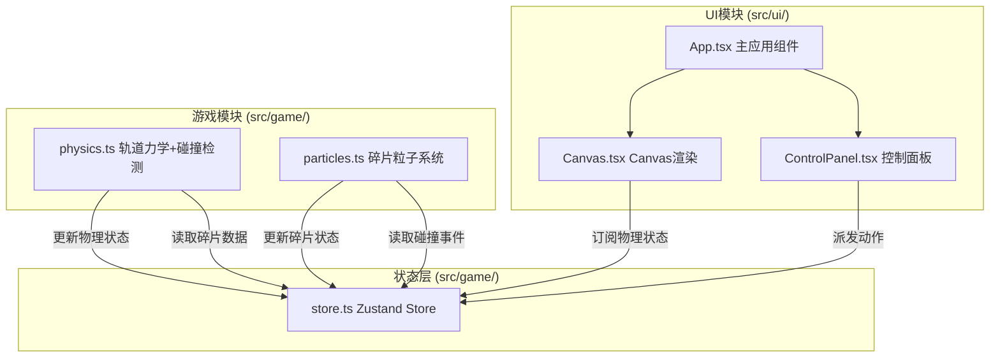

## 1. 架构设计



两个模块通过Zustand store交换数据：game模块更新物理状态和碰撞事件，ui模块订阅并渲染状态。

## 2. 技术说明

- 前端：React@18 + TypeScript + Vite
- 状态管理：Zustand
- 渲染：Canvas 2D（无第三方物理引擎）
- 构建：Vite
- 初始化工具：vite-init（react-ts模板）

## 3. 路由定义

| 路由 | 用途 |
|------|------|
| / | 主页面，包含轨道模拟、统计面板、预测面板和控制面板 |

## 4. 数据模型

### 4.1 核心数据结构

```typescript
interface OrbitalObject {
  id: string;
  x: number;
  y: number;
  radius: number;
  color: string;
  orbitA: number;
  orbitB: number;
  orbitCenterX: number;
  orbitCenterY: number;
  angle: number;
  angularSpeed: number;
  velocity: { x: number; y: number };
  isDestroyed: boolean;
}

interface Debris {
  id: string;
  x: number;
  y: number;
  vx: number;
  vy: number;
  radius: number;
  color: string;
  opacity: number;
  age: number;
  rotation: number;
  rotationSpeed: number;
}

interface CollisionEvent {
  id: string;
  x: number;
  y: number;
  time: number;
  debrisCount: number;
  isCascade: boolean;
}

interface SimulationParams {
  objectCount: number;
  speedMultiplier: number;
  collisionRadius: number;
  gravityStrength: number;
}

interface SimulationState {
  objects: OrbitalObject[];
  debris: Debris[];
  collisions: CollisionEvent[];
  params: SimulationParams;
  totalCollisions: number;
  destroyedCount: number;
  cleanupCooldown: number;
  cleanupActive: boolean;
  cleanupRect: { x: number; y: number; w: number; h: number } | null;
  isLaunched: boolean;
  debrisHistory: { time: number; count: number }[];
  warningMessage: string | null;
  edgeFlash: boolean;
}
```

### 4.2 文件组织

| 文件路径 | 职责 |
|----------|------|
| package.json | 依赖：react@18, react-dom@18, zustand, uuid, vite |
| index.html | 入口页面，全屏Canvas，Inter字体 |
| vite.config.js | React插件和构建配置 |
| tsconfig.json | 严格模式，target ES2020 |
| src/game/physics.ts | 轨道力学、碰撞检测（四叉树优化）、碎片扩散计算，暴露update()和detectCollisions() |
| src/game/particles.ts | 碎片粒子系统，生成、更新、清除，暴露addParticles()和updateParticles() |
| src/game/store.ts | Zustand store定义，包含轨道物体、碎片、碰撞事件、参数等状态 |
| src/ui/App.tsx | 主应用组件，组合控制面板、统计面板、参数栏和Canvas模拟区 |
| src/ui/Canvas.tsx | Canvas渲染组件，订阅store绘制轨道物体和碎片 |
| src/ui/ControlPanel.tsx | 控制面板组件，发射/清理/重置按钮和参数滑块 |

## 5. 性能优化策略

- **四叉树碰撞检测**：将屏幕空间递归划分为四个象限，只检测同一象限或相邻象限内的物体碰撞，将O(n²)降至O(n log n)
- **requestAnimationFrame循环**：使用deltaTime进行帧率无关的物理更新
- **碎片生命周期管理**：超过一定时间或透明度低于阈值的碎片自动清除
- **Canvas批量绘制**：减少状态切换，同类型物体批量绘制
