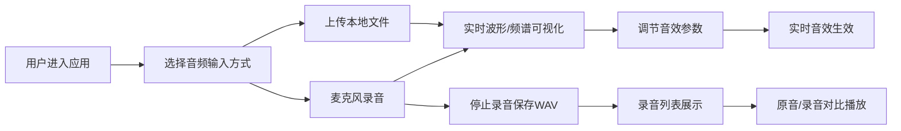

## 1. 产品概述

VoiceCanvas 是一款在线实时音频波形可视化与音效处理 Web 应用，支持麦克风录音和本地音频文件加载，提供实时波形图、频谱图展示，并内置混响、延迟、低通滤波等基础音效处理功能。

- 面向音乐创作者、播客制作者、音频爱好者
- 提供直观的音频可视化和实时音效调节体验
- 基于浏览器原生 Web Audio API，无需安装任何插件

## 2. 核心功能

### 2.1 功能模块

1. **音频输入模块**：麦克风录音、本地音频文件上传（WAV/MP3/OGG）
2. **实时可视化模块**：时域波形图、频域频谱图
3. **音效处理模块**：混响、延迟、低通滤波
4. **录音回放模块**：录音保存、原音与录音对比播放

### 2.3 页面详情

| 页面名称 | 模块名称 | 功能描述 |
|---------|---------|---------|
| 主页面 | 波形显示区 | 实时时域波形图，青绿色平滑曲线，左右声道区分透明度 |
| 主页面 | 频谱显示区 | 实时频域频谱图，128条渐变柱状条，圆角顶部，平滑动画 |
| 主页面 | 控制面板 | 录制/停止按钮、文件上传、音效参数滑块 |
| 主页面 | 录音列表 | 已录音文件列表，小波形预览，对比播放 |

## 3. 核心流程

## 4. 用户界面设计

### 4.1 设计风格

- **主题**：暗黑科技风，深色背景配合亮色波形
- **主色调**：青绿色 #00E5FF（波形）、蓝色 #1E90FF（低频频谱）、紫色 #8A2BE2（高频频谱）
- **强调色**：红色 #FF3B30（录制按钮）、橙色 #FF6B35（录音波形）、白色 #FFFFFF（原音波形）
- **背景色**：#0D1117（主背景）、#1A202C（面板背景）
- **边框色**：#2D3748
- **文字色**：#E2E8F0
- **按钮风格**：扁平化圆形按钮，悬停缩放 1.05 倍，0.2 秒过渡
- **卡片风格**：半透明深色背景，1px 灰色边框，12px 圆角，内阴影
- **字体**：现代无衬线字体，标题 18px/600 字重

### 4.2 页面设计概览

| 页面名称 | 模块名称 | UI 元素 |
|---------|---------|--------|
| 主页面 | 布局容器 | 网格布局，左侧 70% 波形/频谱，右侧 30% 控制/录音列表 |
| 主页面 | 波形画布 | Canvas 绘制，30fps 刷新，平滑曲线，左右声道透明度区分 |
| 主页面 | 频谱画布 | Canvas 绘制，128 条柱状图，蓝紫渐变，圆角顶部，网格背景 |
| 主页面 | 控制面板 | 圆形录制/停止按钮，文件上传按钮，三个音效滑块 |
| 主页面 | 录音列表 | 录音项卡片，小波形预览，播放按钮 |

### 4.3 响应式设计

- **桌面端**：左右布局，左侧 70% / 右侧 30%
- **平板端**：左右布局，左侧 60% / 右侧 40%
- **手机端**：上下布局，上方波形频谱，下方控制面板
- 触摸优化：增大按钮点击区域，适配手势操作

### 4.4 动效设计

- 录制按钮脉冲动画（录音中状态）
- 频谱柱状条高度变化 ease-out 平滑过渡
- 按钮悬停缩放 1.05，0.2s 过渡
- 滑块值变化实时显示气泡提示
