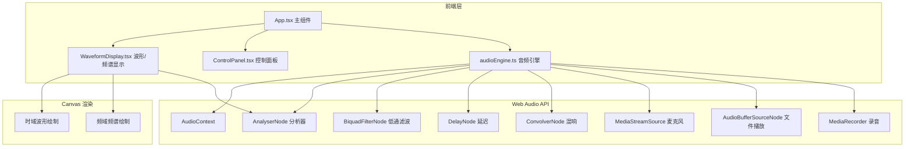

## 1. 架构设计



## 2. 技术选型

- **前端框架**：React@18 + TypeScript
- **构建工具**：Vite
- **音频处理**：Web Audio API（AudioContext, AnalyserNode, BiquadFilterNode, DelayNode, ConvolverNode, MediaRecorder）
- **波形渲染**：HTML5 Canvas 2D
- **状态管理**：React useState/useReducer（轻量级，无需额外状态库）
- **音频编码**：wav-encoder（WAV 文件导出）
- **工具库**：uuid（生成唯一 ID）

## 3. 项目结构

```
src/
├── audioEngine.ts      # Web Audio API 封装，音频输入/输出/分析/音效
├── App.tsx             # 主组件，状态管理，组件组合
├── WaveformDisplay.tsx # Canvas 波形图和频谱图绘制
├── ControlPanel.tsx    # 控制面板：录制/上传/音效滑块
├── main.tsx            # 应用入口
└── index.css           # 全局样式
```

## 4. 核心模块说明

### 4.1 audioEngine.ts

音频引擎核心类，封装 Web Audio API：

| 方法/属性 | 说明 |
|----------|------|
| `init()` | 初始化 AudioContext |
| `startMicrophone()` | 请求麦克风权限并开始录音 |
| `stopRecording()` | 停止录音，返回 WAV 音频 Blob |
| `loadAudioFile(file)` | 加载本地音频文件 |
| `playAudio(buffer)` | 播放音频缓冲区 |
| `getFrequencyData()` | 获取频域数据（Uint8Array） |
| `getTimeDomainData()` | 获取时域数据（Float32Array） |
| `setReverb(value)` | 设置混响强度 0-100 |
| `setDelayTime(value)` | 设置延迟时间 0-2 秒 |
| `setLowpassFrequency(value)` | 设置低通滤波频率 20-20000Hz |
| `connectEffects(source)` | 连接音效节点链 |

**节点连接图：**
```
音源 → 低通滤波器 → 延迟节点 → 混响节点 → 分析器 → 输出
                ↓                    ↑
              干信号 ────────────────┘
```

### 4.2 WaveformDisplay.tsx

Canvas 可视化组件：

| 属性 | 说明 |
|------|------|
| `frequencyData` | 频域数据 Uint8Array(128) |
| `timeDomainData` | 时域数据 Float32Array |
| `sampleRate` | 采样率，用于频谱标注 |
| `waveColor` | 波形颜色 |
| `showSpectrum` | 是否显示频谱图 |
| `showWaveform` | 是否显示波形图 |

**绘制特性：**
- 30fps 刷新率（requestAnimationFrame）
- 频谱柱状条高度变化 ease-out 插值动画
- 波形平滑曲线（二次贝塞尔曲线）
- 左右声道透明度区分（左 100%，右 50%）

### 4.3 ControlPanel.tsx

控制面板组件：

| 控件 | 说明 |
|------|------|
| 录制按钮 | 圆形红色，点击开始/停止录音 |
| 文件上传 | 点击选择本地音频文件 |
| 混响滑块 | 0-100%，实时调节混响强度 |
| 延迟滑块 | 0-2秒，实时调节延迟时间 |
| 低通滑块 | 20-20000Hz，实时调节截止频率 |

### 4.4 App.tsx

主应用组件：

- 管理全局状态：录音状态、当前音频、音效参数、录音列表
- 组织布局：左侧波形/频谱区，右侧控制面板/录音列表
- 协调音频引擎与 UI 组件的数据流
- 响应式布局判断

## 5. 性能优化

- 使用 `requestAnimationFrame` 同步 Canvas 绘制
- 频谱数据使用 `Uint8Array` 减少内存占用
- Canvas 尺寸适配 devicePixelRatio 保证清晰度
- 音效节点复用，避免频繁创建销毁
- 录音数据增量存储，减少内存拷贝

## 6. 兼容性要求

- Chrome 90+
- Firefox 90+
- Safari 14+
- 音频处理延迟 ≤ 50ms
- 可视化帧率 ≥ 30fps
