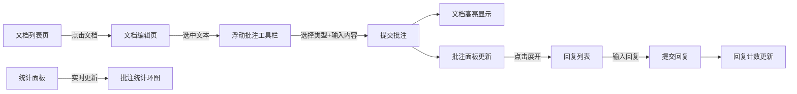

# CollabNote 协作批注与反馈系统 - 产品需求文档

## 1. 产品概述
CollabNote 是一款面向在线教育平台的协作式论文批注与反馈工具，支持导师和学生团队在共享文档上添加批注、讨论和修订，并自动生成批注统计报告。

- **核心价值**：提升团队协作效率，让文档批注与讨论过程更直观、高效
- **目标用户**：学生团队、导师、教育工作者
- **核心场景**：论文协作批注、文档审阅反馈、团队文档修订

## 2. 核心功能

### 2.1 用户角色
| 角色 | 说明 | 核心权限 |
|------|------|----------|
| 普通用户 | 使用系统的所有用户 | 创建/编辑文档、添加批注、回复讨论、查看统计 |

### 2.2 功能模块
1. **文档管理模块**：文档列表展示、创建新文档、编辑文档内容、删除文档
2. **批注模块**：文本选中标注、批注类型分类、批注回复讨论、批注叠加高亮
3. **统计报告模块**：批注数量统计、按类型分类统计、最新批注摘要

### 2.3 页面详情
| 页面名称 | 模块名称 | 功能描述 |
|----------|----------|----------|
| 文档列表页 | 文档管理 | 卡片网格展示文档列表，支持创建/删除文档，显示批注数量徽章 |
| 文档编辑页 | 文档编辑 + 批注 + 统计 | 左侧编辑器、右侧批注面板和统计面板，支持文本选中批注、回复讨论 |

## 3. 核心流程

### 3.1 文档管理流程
用户进入文档列表页 → 查看所有文档卡片 → 点击创建新文档 → 填写标题和内容 → 保存后返回列表
或点击已有文档 → 进入文档编辑页 → 编辑内容 → 自动保存

### 3.2 批注创建流程
用户在文档编辑器中选中文本 → 弹出浮动批注工具栏 → 选择批注类型（建议/疑问/错误）→ 输入批注内容 → 提交批注 → 文档中显示高亮标记和批注图标 → 右侧批注面板显示新批注

### 3.3 批注讨论流程
用户点击批注图标或批注条目 → 展开批注详情 → 查看回复列表 → 输入回复内容 → 提交回复 → 批注图标显示回复计数徽章

## 4. 用户界面设计

### 4.1 设计风格
- **主色调**：蓝色 `#3498DB` 到紫色 `#9B59B6` 渐变
- **辅助色**：绿色 `#27AE60`（建议）、橙色 `#E67E22`（疑问）、红色 `#E74C3C`（错误）
- **背景色**：浅灰 `#F4F6F9`
- **卡片/面板背景**：白色 `#FFFFFF`
- **深色边框/文字**：深灰 `#2C3E50`
- **按钮风格**：圆角 6px，主色蓝色，悬停加深，点击缩放 0.98
- **字体**：Inter，标题 24px 加粗，正文适中
- **布局风格**：卡片式布局，细微圆角 8px，浅灰阴影
- **动画过渡**：统一 0.2s-0.3s ease-out

### 4.2 页面设计概览
| 页面名称 | 模块名称 | UI 元素 |
|----------|----------|---------|
| 文档列表页 | 顶部标题栏 | 蓝紫渐变背景，80px 高，24px 加粗标题 |
| 文档列表页 | 文档卡片网格 | 每行 4 个卡片，渐变色背景，悬停上浮动画，批注数量徽章 |
| 文档编辑页 | 文档编辑器 | 左侧 65% 宽度，可编辑文本区，选中文本高亮 |
| 文档编辑页 | 批注叠加层 | 文本上渲染高亮标记和批注图标，颜色随类型变化 |
| 文档编辑页 | 批注面板 | 右侧固定 280px 宽，批注列表按时间倒序，支持展开回复 |
| 文档编辑页 | 统计面板 | Canvas 环图，按类型分类百分比，最新 3 条批注摘要 |
| 文档编辑页 | 浮动批注工具栏 | 毛玻璃背景，白色文字，跟随选区位置 |
| 全局 | 通知条 | 底部滑入，深灰背景，3 秒后自动滑出 |

### 4.3 响应式设计
- **桌面端**（≥1024px）：编辑器左侧 65%，批注统计面板右侧固定 280px
- **平板/移动端**（<1024px）：编辑器占全宽，批注面板移至页面底部
- **触摸优化**：按钮和交互元素尺寸适配触摸操作

### 4.4 动效设计
- 卡片悬停：上浮 5px + 阴影加深，0.3s ease-out
- 按钮交互：悬停颜色加深，点击缩放 0.98，0.2s ease-out
- 通知条：从底部滑入/滑出，0.3s 过渡
- 批注展开/收起：平滑高度过渡
- 页面切换：响应时间 ≤ 200ms
