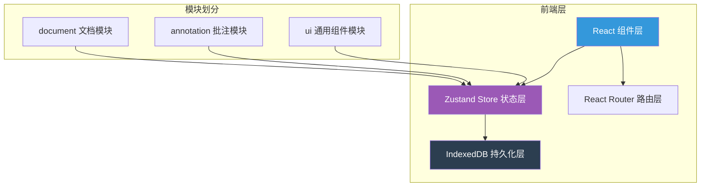
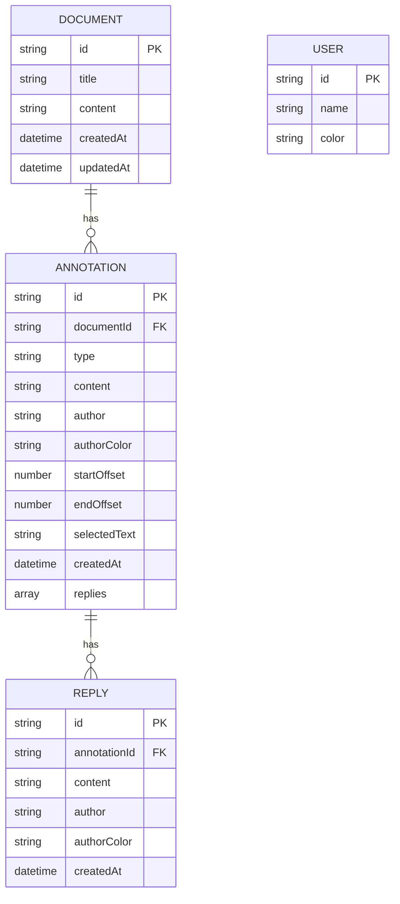

# CollabNote 协作批注与反馈系统 - 技术架构文档

## 1. 架构设计



## 2. 技术栈说明

- **前端框架**：React@18 + TypeScript
- **构建工具**：Vite
- **状态管理**：Zustand
- **数据持久化**：IndexedDB（封装在 store 中）
- **路由管理**：React Router DOM@6
- **样式方案**：原生 CSS + CSS Modules
- **工具库**：
  - `uuid`：生成唯一 ID
  - `date-fns`：日期时间处理
  - `diff-match-patch`：文本差异比对
  - `@fontsource/inter`：Inter 字体

## 3. 路由定义

| 路由 | 页面 | 说明 |
|------|------|------|
| `/` | 文档列表页 | 展示所有文档卡片，支持创建和删除 |
| `/document/:id` | 文档编辑页 | 文档编辑器 + 批注面板 + 统计面板 |

## 4. 数据模型

### 4.1 数据模型定义



### 4.2 类型定义

```typescript
interface Document {
  id: string;
  title: string;
  content: string;
  createdAt: Date;
  updatedAt: Date;
}

type AnnotationType = 'suggestion' | 'question' | 'error';

interface Annotation {
  id: string;
  documentId: string;
  type: AnnotationType;
  content: string;
  author: string;
  authorColor: string;
  startOffset: number;
  endOffset: number;
  selectedText: string;
  createdAt: Date;
  replies: Reply[];
}

interface Reply {
  id: string;
  annotationId: string;
  content: string;
  author: string;
  authorColor: string;
  createdAt: Date;
}

interface User {
  id: string;
  name: string;
  color: string;
}
```

## 5. 项目文件结构

```
src/
├── main.tsx                    # 应用入口，挂载路由和全局样式
├── store/
│   └── index.ts               # Zustand store，管理文档、批注、用户状态
├── document/
│   ├── DocumentList.tsx       # 文档列表组件
│   └── DocumentEditor.tsx     # 文档编辑器组件
├── annotation/
│   ├── AnnotationPanel.tsx    # 批注面板组件
│   └── AnnotationOverlay.tsx  # 批注叠加层组件
├── components/
│   ├── StatsPanel.tsx         # 统计报告面板
│   ├── NotificationBar.tsx    # 通知条组件
│   └── FloatingToolbar.tsx    # 浮动批注工具栏
├── hooks/
│   └── useSelection.ts        # 文本选中文本 hook
├── utils/
│   ├── idb.ts                 # IndexedDB 封装
│   └── colors.ts              # 颜色工具函数
├── types/
│   └── index.ts               # 全局类型定义
└── styles/
    └── global.css             # 全局样式
```

## 6. 数据流向

### 6.1 文档模块数据流
```
DocumentList → store.getDocuments → IndexedDB
DocumentEditor → store.addDocument / updateDocument → IndexedDB
```

### 6.2 批注模块数据流
```
DocumentEditor (选中文本) → FloatingToolbar → store.addAnnotation → IndexedDB
AnnotationPanel → store.getAnnotationsByDocument → 渲染批注列表
AnnotationOverlay → store.getAnnotationsByDocument → 渲染高亮标记
```

### 6.3 统计模块数据流
```
StatsPanel → store.annotations → 计算统计数据 → Canvas 绘制环图
```

### 6.4 通知数据流
```
store 状态更新 → 订阅变化 → NotificationBar → 显示通知
```

## 7. 性能优化策略

1. **批注列表渲染优化**：每条批注渲染时间 ≤ 20ms，使用 React.memo 避免不必要重渲染
2. **统计环图性能**：Canvas 绘制，重绘频率 ≥ 30fps，仅在数据变化时重绘
3. **路由切换性能**：响应时间 ≤ 200ms，组件按需加载，避免冗余计算
4. **IndexedDB 操作**：异步读写，避免阻塞主线程
5. **选择器优化**：使用 Zustand 选择器，仅订阅需要的状态片段

## 8. 构建配置

- **Vite 配置**：React 插件，路径别名 `@` 指向 `src`
- **TypeScript 配置**：严格模式，路径别名
- **开发脚本**：`npm run dev`
