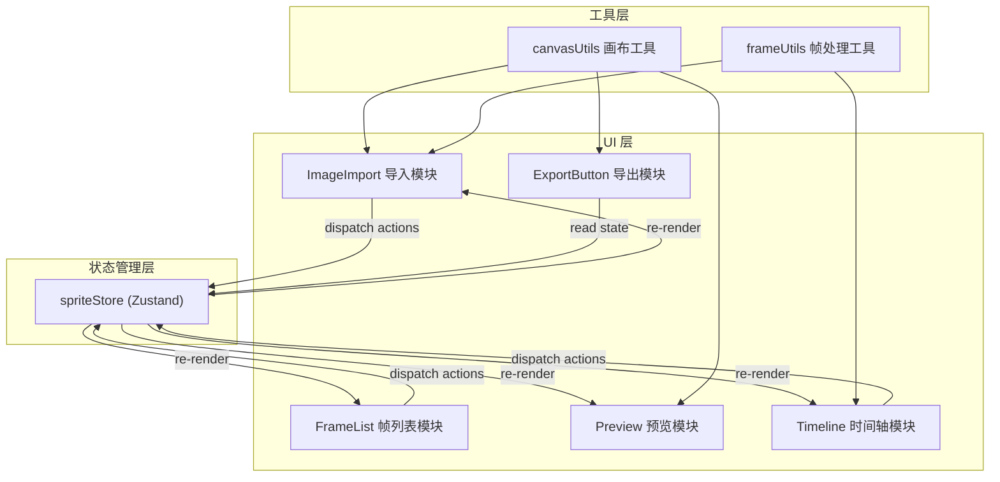

## 1. 架构设计



## 2. 技术描述

- **前端框架**：React 18 + TypeScript
- **构建工具**：Vite 5
- **状态管理**：Zustand
- **UI 图标**：lucide-react
- **工具库**：uuid
- **图像渲染**：原生 Canvas API（无第三方库）
- **样式方案**：CSS Modules / 内联样式（按模块组织）

## 3. 文件结构

```
src/
├── main.tsx                    # 应用入口
├── App.tsx                     # 主应用组件
├── store/
│   └── spriteStore.ts          # Zustand 状态管理
├── modules/
│   ├── import/
│   │   └── ImageImport.tsx     # 精灵表导入与切割
│   ├── frames/
│   │   └── FrameList.tsx       # 帧管理面板
│   ├── animator/
│   │   ├── Preview.tsx         # 动画预览画布
│   │   └── Timeline.tsx        # 时间轴编辑器
│   └── export/
│       └── ExportButton.tsx    # 导出功能
├── utils/
│   ├── canvasUtils.ts          # Canvas 操作工具
│   └── frameUtils.ts           # 帧处理工具函数
├── types/
│   └── index.ts                # TypeScript 类型定义
└── styles/
    └── globals.css             # 全局样式
```

## 4. 数据模型

### 4.1 类型定义

```typescript
interface SpriteFrame {
  id: string;
  name: string;
  imageData: ImageData;
  width: number;
  height: number;
  duration: number; // 秒
}

interface SpriteSheet {
  image: HTMLImageElement | null;
  width: number;
  height: number;
  selection: {
    x: number;
    y: number;
    width: number;
    height: number;
  } | null;
}

interface TimelineState {
  frameIds: string[];
  currentFrameIndex: number;
  isPlaying: boolean;
  fps: number;
  loop: boolean;
  loopCount: number;
}

interface ExportState {
  isExporting: boolean;
  progress: number;
}
```

### 4.2 状态结构

```typescript
interface SpriteStore {
  // 精灵表
  spriteSheet: SpriteSheet;
  
  // 帧列表
  frames: SpriteFrame[];
  selectedFrameIds: string[];
  
  // 时间轴
  timeline: TimelineState;
  
  // 导出
  exportState: ExportState;
  
  // Actions
  setSpriteSheet: (image: HTMLImageElement) => void;
  setSelection: (selection: Selection | null) => void;
  cutFrames: () => void;
  renameFrame: (id: string, name: string) => void;
  deleteFrames: (ids: string[]) => void;
  setFrameDuration: (id: string, duration: number) => void;
  setBulkDuration: (ids: string[], duration: number) => void;
  selectFrame: (id: string, multi?: boolean) => void;
  addToTimeline: (frameId: string, index?: number) => void;
  removeFromTimeline: (index: number) => void;
  reorderTimeline: (fromIndex: number, toIndex: number) => void;
  duplicateFrame: (index: number) => void;
  insertBlankFrame: (index: number) => void;
  setPlaying: (playing: boolean) => void;
  setFps: (fps: number) => void;
  setLoop: (loop: boolean) => void;
  setCurrentFrameIndex: (index: number) => void;
  exportSpriteSheet: () => Promise<void>;
}
```

## 5. 性能优化

- **Canvas 渲染**：使用离屏 Canvas 缓存帧图像，避免重复解码
- **requestAnimationFrame**：精确控制播放帧率，误差 < 5ms
- **状态选择器**：使用 Zustand selector 避免不必要的重渲染
- **图像数据复用**：帧图像数据以 ImageData 形式存储，直接 putImageData 渲染
- **防抖处理**：滑块调节等高频操作使用防抖
- **虚拟滚动**：帧数量多时考虑虚拟滚动（按需实现）
