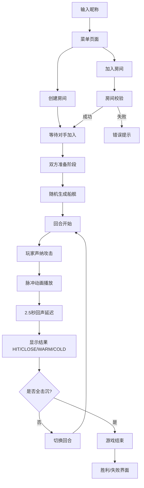

## 1. 产品概述

EchoBattleship 是一款基于声纳探测机制的多人联网海战游戏，两名玩家通过回合制猜谜进行对战，创新性地加入了三维声纳探测机制，玩家需根据回声强度和时间差推断敌方船只位置。

- 核心玩法：经典战舰游戏的创新升级，通过声纳脉冲动画和回声反馈增加策略深度
- 目标用户：休闲游戏玩家、喜欢策略对战的用户
- 产品价值：提供沉浸式的科技感海战体验，结合视觉动效与策略推理

## 2. 核心功能

### 2.1 用户角色
| 角色 | 注册方式 | 核心权限 |
|------|----------|----------|
| 玩家 | 输入昵称即可 | 创建/加入房间、进行游戏、实时聊天 |

### 2.2 功能模块
1. **主菜单**：昵称输入、创建房间、加入房间
2. **游戏主界面**：双海域网格（己方/敌方）、回合状态、声纳攻击、聊天面板
3. **声纳系统**：脉冲动画、回声判定、视觉反馈
4. **房间管理**：房间创建、加入、匹配、断开重连
5. **实时通信**：WebSocket消息中转、聊天广播、状态同步

### 2.3 页面详情
| 页面名称 | 模块名称 | 功能描述 |
|----------|----------|----------|
| 菜单页面 | 昵称输入 | 校验2-12字符，显示当前玩家信息 |
| 菜单页面 | 房间操作 | 创建房间生成6位房间码，加入房间输入房间码 |
| 游戏页面 | 海域网格 | 10x10己方/敌方海域，显示船只和探测标记 |
| 游戏页面 | 声纳攻击 | 点击敌方格子发送脉冲，2.5秒后返回回声结果 |
| 游戏页面 | 回合系统 | 45秒倒计时，超时自动切换回合 |
| 游戏页面 | 聊天面板 | 实时文字聊天，系统消息提示 |
| 游戏页面 | 游戏结束 | 胜利/失败界面，击沉统计 |

## 3. 核心流程

### 3.1 用户主流程
1. 玩家输入昵称进入菜单
2. 选择创建房间或加入房间
3. 匹配成功后随机生成船舰布局
4. 回合制交替进行声纳攻击
5. 根据回声反馈推断船只位置
6. 击沉所有敌方船只获胜

### 3.2 流程图

## 4. 用户界面设计

### 4.1 设计风格
- **主色调**：深空蓝 #0D1117（背景）、电光蓝 #38BDF8（主色）
- **辅助色**：深蓝 #1E3A5F、橙红 #F97316（警告）、红 #EF4444（危险）、绿 #10B981（成功）
- **按钮风格**：圆角按钮，渐变背景，点击弹性收缩动画
- **字体**：Orbitron（科技感标题）、Inter（正文）
- **布局风格**：深色半透明卡片，网格布局，星尘粒子背景
- **动效**：声纳脉冲扩散、粒子爆炸、全屏闪烁、震动反馈

### 4.2 页面设计概述
| 页面名称 | 模块名称 | UI元素 |
|----------|----------|--------|
| 菜单页面 | 卡片容器 | 半透明深色卡片 #161B22，圆角16px，模糊背景 |
| 菜单页面 | 粒子背景 | 星尘粒子动画，缓慢漂浮 |
| 菜单页面 | 输入框 | 圆角8px，边框 #1A365D，聚焦发光效果 |
| 游戏页面 | 海域网格 | 400x400px，深蓝渐变背景 #0A1929→#0D2137 |
| 游戏页面 | 网格单元 | 悬停半透明 #1E3A5F，点击缩放动画 |
| 游戏页面 | 船只显示 | 航母深红、战列舰橙色、驱逐舰黄色、潜艇灰色渐变 |
| 游戏页面 | 探测标记 | 半透明圆点+HIT红/CLOSE橙/WARM黄/COLD蓝+发光效果 |
| 游戏页面 | 声纳按钮 | 圆形渐变 #38BDF8→#0EA5E9，脉动光晕 |
| 聊天面板 | 消息气泡 | 己方右对齐蓝色 #1E3A5F，对方左对齐灰色 #2D3748 |

### 4.3 响应式设计
- **桌面端**（≥768px）：双网格水平排列，尺寸400x400px，间距20px
- **移动端**（<768px）：双网格垂直排列，尺寸300x300px
- 触摸优化：增大点击区域，优化触摸反馈

### 4.4 视觉特效
- **声纳脉冲**：Canvas圆形扩散波，半径每帧+5px，透明度0.8→0，持续1.5秒
- **粒子爆炸**：10个白色粒子随机方向飞散，0.3秒消失
- **命中反馈**：全屏半透明红色闪烁0.3秒，CSS滤镜模糊+震动
- **倒计时条**：动态进度条，剩余操作时间可视化
- **击沉通知**：从顶部滑入，停留2秒滑出，轻微震动
