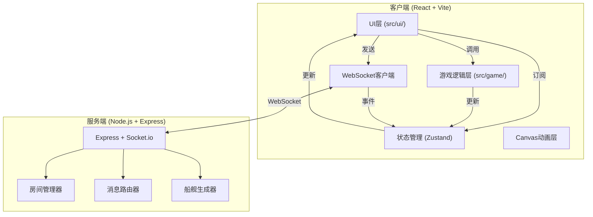

## 1. 架构设计



## 2. 技术栈说明

### 2.1 前端技术栈
- **框架**: React 18 + TypeScript
- **构建工具**: Vite 5
- **状态管理**: Zustand
- **网络通信**: socket.io-client
- **动画**: Canvas API + requestAnimationFrame + CSS动画
- **样式**: CSS Modules + Tailwind CSS 3
- **图标**: lucide-react

### 2.2 后端技术栈
- **运行时**: Node.js
- **Web框架**: Express 4
- **实时通信**: socket.io
- **开发工具**: tsx (TypeScript执行器)
- **并发工具**: concurrently (同时启动前后端)

### 2.3 核心依赖
- react@18.2.0, react-dom@18.2.0
- zustand@4.5.0
- socket.io-client@4.7.4, socket.io@4.7.4
- express@4.18.2
- uuid@9.0.1
- concurrently@8.2.2
- tailwindcss@3.4.1
- lucide-react@0.344.0

## 3. 目录结构

```
EchoBattleship/
├── .trae/documents/
│   ├── PRD.md                    # 产品需求文档
│   └── TechnicalArchitecture.md  # 技术架构文档
├── server/
│   └── simulateServer.ts         # 模拟服务端实现
├── src/
│   ├── game/
│   │   ├── GameEngine.ts         # 游戏核心逻辑
│   │   └── SonarPulse.ts         # 声纳脉冲动画逻辑
│   ├── ui/
│   │   ├── App.tsx               # 主应用组件
│   │   ├── MenuScreen.tsx        # 开始菜单界面
│   │   ├── GameScreen.tsx        # 游戏主界面
│   │   ├── SonarButton.tsx       # 声纳发射按钮
│   │   ├── ChatPanel.tsx         # 聊天面板
│   │   ├── GameGrid.tsx          # 海域网格组件
│   │   └── Notification.tsx      # 通知组件
│   ├── store/
│   │   └── gameStore.ts          # Zustand状态管理
│   ├── utils/
│   │   └── arrayHelpers.ts       # 工具函数
│   ├── types/
│   │   └── index.ts              # 类型定义
│   ├── main.tsx                  # React入口
│   └── index.css                 # 全局样式
├── public/
├── index.html                    # HTML入口
├── package.json                  # 依赖配置
├── vite.config.ts                # Vite配置
├── tsconfig.json                 # TypeScript配置
├── tailwind.config.js            # Tailwind配置
└── postcss.config.js             # PostCSS配置
```

## 4. 状态管理设计 (Zustand Store)

### 4.1 状态类型定义
```typescript
type ShipType = 'carrier' | 'battleship' | 'destroyer' | 'submarine';
type EchoResult = 'HIT' | 'CLOSE' | 'WARM' | 'COLD';
type GamePhase = 'menu' | 'waiting' | 'playing' | 'gameover';
type Turn = 'player' | 'opponent';

interface Ship {
  id: string;
  type: ShipType;
  length: number;
  cells: { x: number; y: number }[];
  hits: { x: number; y: number }[];
  sunk: boolean;
}

interface SonarResult {
  x: number;
  y: number;
  result: EchoResult;
  timestamp: number;
}

interface ChatMessage {
  id: string;
  sender: 'player' | 'opponent' | 'system';
  content: string;
  timestamp: number;
}

interface GameState {
  // 房间信息
  roomCode: string | null;
  playerId: string | null;
  playerName: string;
  opponentName: string | null;
  
  // 游戏状态
  gamePhase: GamePhase;
  currentTurn: Turn;
  turnTimeRemaining: number;
  
  // 船舰数据
  myShips: Ship[];
  opponentShips: Ship[];
  
  // 探测结果
  mySonarResults: SonarResult[];
  opponentSonarResults: SonarResult[];
  
  // 统计
  mySunkCount: number;
  opponentSunkCount: number;
  
  // 聊天
  messages: ChatMessage[];
  
  // 连接状态
  opponentConnected: boolean;
  isReconnecting: boolean;
}
```

### 4.2 Store Actions
- `setPlayerName(name: string)`
- `createRoom()`: 调用服务端创建房间
- `joinRoom(roomCode: string)`: 加入房间
- `leaveRoom()`: 离开房间
- `fireSonar(x: number, y: number)`: 发射声纳
- `sendChatMessage(content: string)`: 发送聊天消息
- `handleOpponentMove(data: MoveData)`: 处理对手移动
- `handleOpponentDisconnect()`: 处理对手断开
- `resetGame()`: 重置游戏

## 5. 服务端API定义 (Socket.io)

### 5.1 客户端发送事件
| 事件名 | 参数 | 说明 |
|--------|------|------|
| `create_room` | `{ playerName: string }` | 创建房间 |
| `join_room` | `{ roomCode: string, playerName: string }` | 加入房间 |
| `leave_room` | `{ roomCode: string, playerId: string }` | 离开房间 |
| `sonar_fire` | `{ roomCode: string, playerId: string, x: number, y: number }` | 发射声纳 |
| `chat_message` | `{ roomCode: string, playerId: string, content: string }` | 发送聊天 |

### 5.2 服务端发送事件
| 事件名 | 参数 | 说明 |
|--------|------|------|
| `room_created` | `{ roomCode: string, playerId: string }` | 房间创建成功 |
| `room_joined` | `{ roomCode: string, playerId: string, opponentName: string }` | 加入房间成功 |
| `opponent_joined` | `{ opponentName: string, opponentId: string }` | 对手加入 |
| `game_start` | `{ myShips: Ship[], firstPlayer: string }` | 游戏开始 |
| `sonar_result` | `{ x: number, y: number, result: EchoResult, sunkShip?: Ship }` | 声纳结果 |
| `opponent_sonar` | `{ x: number, y: number, result: EchoResult }` | 对手声纳结果 |
| `chat_message` | `{ senderName: string, content: string, timestamp: number }` | 聊天消息 |
| `turn_change` | `{ currentTurn: string, timeRemaining: number }` | 回合切换 |
| `game_over` | `{ winner: string, mySunkCount: number, opponentSunkCount: number }` | 游戏结束 |
| `opponent_disconnected` | `{}` | 对手断开 |
| `opponent_reconnected` | `{ opponentName: string }` | 对手重连 |
| `error` | `{ message: string }` | 错误消息 |

## 6. 数据模型

### 6.1 服务端房间数据模型
```typescript
interface Room {
  code: string;
  players: {
    id: string;
    name: string;
    socketId: string;
    ships: Ship[];
    sonarResults: SonarResult[];
    sunkCount: number;
  }[];
  currentTurn: string;
  turnExpiry: number;
  gameStarted: boolean;
  gameOver: boolean;
  winner: string | null;
}
```

### 6.2 船舰配置
| 类型 | 长度 | 数量 | 颜色 |
|------|------|------|------|
| 航母 (Carrier) | 5 | 1 | 深红渐变 |
| 战列舰 (Battleship) | 4 | 2 | 橙色渐变 |
| 驱逐舰 (Destroyer) | 3 | 3 | 黄色渐变 |
| 潜艇 (Submarine) | 2 | 4 | 灰色渐变 |

## 7. 核心算法

### 7.1 声纳回声判定算法
```
function getSonarResult(targetX, targetY, ships):
    for each ship in ships:
        for each cell in ship.cells:
            distance = max(|targetX - cell.x|, |targetY - cell.y|)
            if distance == 0:
                return "HIT"
            elif distance == 1:
                return "CLOSE"
            elif distance == 2:
                return "WARM"
    return "COLD"
```

### 7.2 船舰放置算法
```
function generateShipLayout():
    grid = 10x10 empty matrix
    for each shipType in [carrier, battleship×2, destroyer×3, submarine×4]:
        placed = false
        while not placed:
            orientation = random(horizontal, vertical)
            x = random(0, 9)
            y = random(0, 9)
            if canPlaceShip(grid, x, y, length, orientation):
                placeShip(grid, x, y, length, orientation)
                placed = true
    return ships
```

### 7.3 击沉检测算法
```
function checkShipSunk(ship, hits):
    return all(cell in hits for cell in ship.cells)

function checkAllShipsSunk(ships):
    return all(ship.sunk for ship in ships)
```

## 8. 性能优化

### 8.1 动画性能
- 使用 `requestAnimationFrame` 驱动Canvas动画，确保60fps
- 声纳脉冲动画计算使用 `setTimeout` 模拟Web Worker异步处理
- 粒子系统限制10个粒子，避免过度计算
- CSS动画使用 `transform` 和 `opacity`，避免触发重排

### 8.2 状态更新
- Zustand状态分片更新，避免不必要的重渲染
- 使用 `shallow` 比较选择器减少订阅更新
- 聊天消息列表虚拟滚动（如需要）

### 8.3 网络优化
- WebSocket消息使用二进制压缩（可选）
- 本地模拟延迟控制在100ms以内
- 心跳检测确保连接稳定
