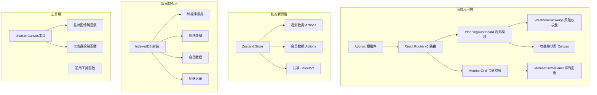
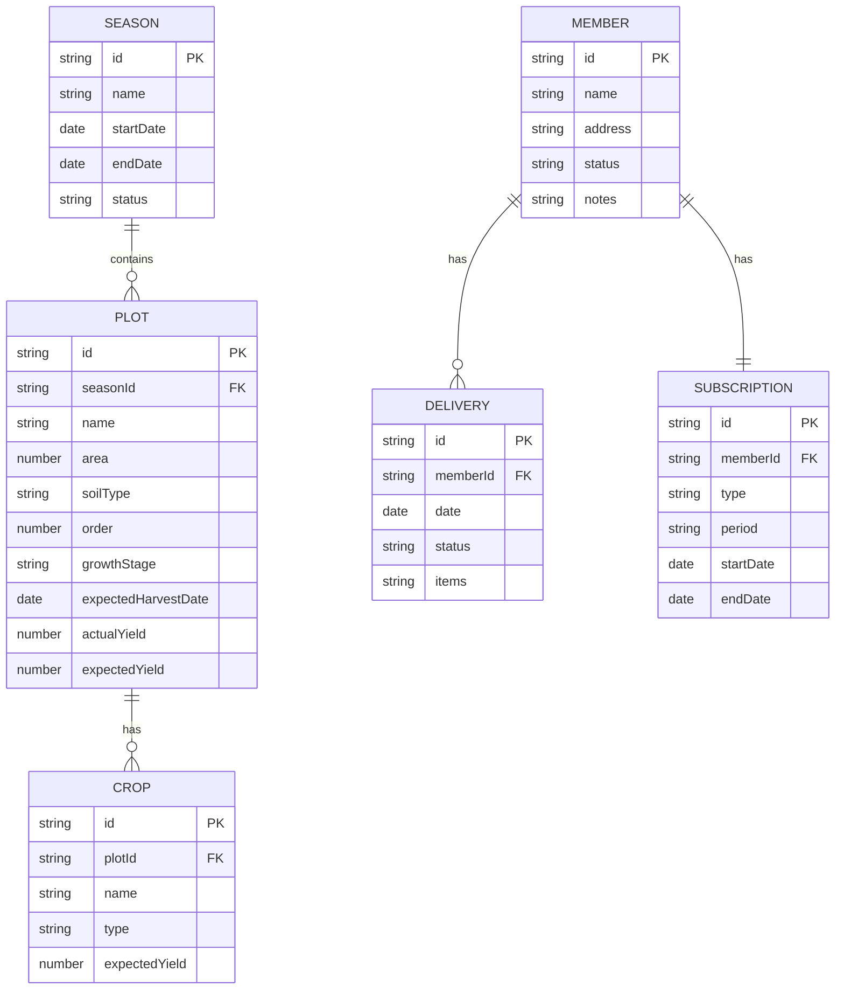

## 1. 架构设计



## 2. 技术描述

- **前端框架**：React@18 + TypeScript
- **构建工具**：Vite
- **状态管理**：Zustand
- **路由管理**：react-router-dom@6
- **数据持久化**：IndexedDB（自定义封装）
- **图表绘制**：Canvas 原生 API
- **唯一标识**：uuid
- **字体**：@fontsource/roboto
- **代码分割**：Vite 内置 + React.lazy 懒加载模块

### 2.1 目录结构

```
src/
├── App.tsx                 # 根组件，路由配置
├── store/
│   └── useStore.ts         # Zustand 全局状态管理
├── modules/
│   ├── planning/
│   │   ├── PlanningDashboard.tsx   # 规划大屏
│   │   └── WeatherRiskGauge.tsx    # 风险仪表盘
│   └── membership/
│       ├── MemberGrid.tsx          # 会员网格
│       └── MemberDetailPanel.tsx   # 会员详情面板
└── utils/
    └── chart.ts            # Canvas 绘图工具函数
```

## 3. 路由定义

| 路由 | 用途 | 组件 |
|------|------|------|
| / | 重定向到规划页 | - |
| /planning | 农场规划大屏 | PlanningDashboard |
| /membership | 会员管理面板 | MemberGrid |

## 4. 数据模型

### 4.1 数据模型定义



### 4.2 TypeScript 类型定义

```typescript
// 种植季
interface Season {
  id: string;
  name: string;
  startDate: string;
  endDate: string;
  status: 'planning' | 'active' | 'completed';
}

// 地块
type CropType = 'leaf' | 'root' | 'fruit';
type GrowthStage = 'seedling' | 'growing' | 'mature';

interface Plot {
  id: string;
  seasonId: string;
  name: string;
  area: number;
  soilType: string;
  cropType: CropType;
  cropName: string;
  expectedYield: number;
  actualYield: number;
  order: number;
  growthStage: GrowthStage;
  expectedHarvestDate: string;
}

// 会员
type MemberStatus = 'active' | 'paused' | 'cancelled';
type SubscriptionType = 'standard' | 'deluxe';

interface Member {
  id: string;
  name: string;
  address: string;
  subscriptionType: SubscriptionType;
  subscriptionPeriod: string;
  status: MemberStatus;
  notes: string;
  nextDeliveryDate: string;
  deliveryHistory: DeliveryRecord[];
}

interface DeliveryRecord {
  id: string;
  date: string;
  items: string[];
  status: 'delivered' | 'pending';
}

// 风险数据
interface RiskData {
  droughtProbability: number;
  frostProbability: number;
  pestRiskLevel: 'low' | 'medium' | 'high';
  overallScore: number;
}

// 收益数据
interface WeeklyRevenue {
  week: number;
  amount: number;
}
```

## 5. 状态管理设计

### 5.1 Store Actions

**规划模块 Actions:**
- `addSeason(season: Omit<Season, 'id'>): void`
- `updateSeason(id: string, updates: Partial<Season>): void`
- `deleteSeason(id: string): void`
- `addPlot(plot: Omit<Plot, 'id'>): void`
- `updatePlot(id: string, updates: Partial<Plot>): void`
- `deletePlot(id: string): void`
- `reorderPlots(plotIds: string[]): void`

**会员模块 Actions:**
- `addMember(member: Omit<Member, 'id'>): void`
- `updateMember(id: string, updates: Partial<Member>): void`
- `deleteMember(id: string): void`
- `updateMemberStatus(id: string, status: MemberStatus): void`
- `importMembers(members: Omit<Member, 'id'>[]): void`

### 5.2 Store Selectors

- `getSeasons(): Season[]`
- `getPlotsBySeason(seasonId: string): Plot[]`
- `getMembers(filter?: MemberStatus): Member[]`
- `getMemberById(id: string): Member | undefined`
- `getRiskData(): RiskData`
- `getWeeklyRevenue(seasonId: string): WeeklyRevenue[]`

## 6. 性能优化策略

1. **代码分割**：使用 React.lazy 动态导入 planning 和 membership 模块
2. **懒加载**：路由级别的代码分割，首次加载仅加载必要模块
3. **记忆化**：使用 useMemo/useCallback 优化重渲染
4. **虚拟滚动**：会员列表超过100条时启用虚拟滚动
5. **Web Worker**：复杂收益计算移至 Worker 线程
6. **IndexedDB 缓存**：数据本地持久化，减少重复计算
7. **Canvas 优化**：使用 requestAnimationFrame 批量绘制
