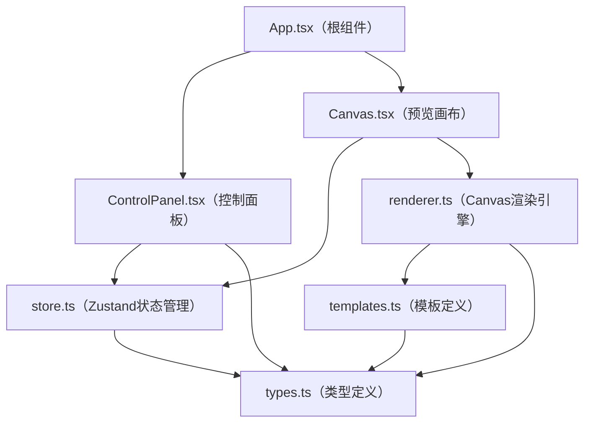
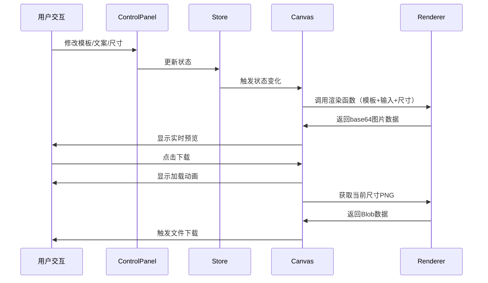

## 1. 架构设计

## 2. 技术说明

- 前端框架：React@18 + TypeScript
- 构建工具：Vite
- 状态管理：Zustand
- 图像处理：原生Canvas API（无第三方图像库）
- 文件下载：file-saver
- 唯一ID：uuid

## 3. 文件结构与职责

| 文件路径 | 职责说明 | 被引用模块 |
|---------|---------|-----------|
| `src/types.ts` | 定义Template、BannerSize、UserInput等核心类型接口 | 所有模块 |
| `src/templates.ts` | 预设3套模板配置（颜色、布局、样式） | renderer.ts |
| `src/store.ts` | Zustand Store，管理模板选择、用户输入、横幅列表 | ControlPanel.tsx, Canvas.tsx |
| `src/renderer.ts` | Canvas渲染核心，按模板绘制背景、图片、文字 | Canvas.tsx |
| `src/components/Canvas.tsx` | 实时预览组件，监听store变化触发渲染 | App.tsx |
| `src/components/ControlPanel.tsx` | 用户控制面板，模板/文案/尺寸输入 | App.tsx |
| `src/App.tsx` | 根组件，左右分栏布局，拖拽分割线 | main.tsx |

## 4. 数据流向

## 5. 核心技术实现

### 5.1 Canvas渲染策略

- 使用百分比布局适配不同尺寸
- 图片处理：圆角裁剪（12px）+ 投影（偏移2px，模糊4px）
- 文字处理：文字阴影、渐变填充、自动换行
- 性能优化：使用requestAnimationFrame，渲染耗时控制在200ms内

### 5.2 状态管理

Zustand Store包含：
- selectedTemplate: string - 当前选中模板ID
- userInput: { imageUrl, title, subtitle, buttonText } - 用户输入
- selectedSize: string - 当前选中尺寸
- banners: Array<{ size, dataUrl }> - 生成的横幅列表

### 5.3 响应式布局

- 使用CSS Flexbox + 媒体查询
- 拖拽分割线使用原生Mouse事件实现
- 移动端切换为Flex-direction: column
