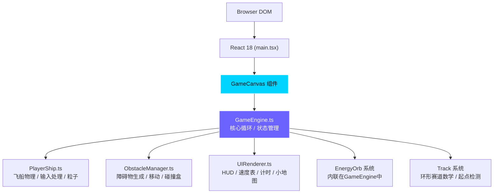

## 1. 架构设计



核心是面向对象的游戏引擎架构：React作为宿主层负责挂载Canvas和键盘事件，所有游戏逻辑（物理、实体、渲染）都在TypeScript类中完成，通过 requestAnimationFrame 驱动 60fps 游戏循环。

## 2. 技术说明

- **前端框架**：React 18 + TypeScript（严格模式 strict，target ES2020）
- **构建工具**：Vite 5，输出到 `dist/`
- **渲染层**：HTML5 Canvas 2D API（不使用任何第三方游戏引擎）
- **状态管理**：GameEngine 内部维护 gameState（playing/paused/finished），React ref 持有引擎实例
- **键盘输入**：原生 window 事件 keydown/keyup，在 PlayerShip 中维护按键状态 Map
- **粒子系统**：固定大小环形数组实现对象池（上限200），每帧最多新增5个，超出覆盖最旧
- **依赖包**：react@18、react-dom@18、uuid、vite

## 3. 文件结构定义

```
auto201/
├── index.html                    # 入口页面，全屏Canvas，Google Fonts引入
├── package.json                  # 依赖和npm run dev脚本
├── tsconfig.json                 # strict:true, target:ES2020
├── vite.config.js                # React插件，输出dist
└── src/
    ├── main.tsx                  # React入口，挂载GameCanvas，初始化引擎，键盘事件
    ├── GameEngine.ts             # 核心游戏循环、update/render、状态机、实体列表
    ├── PlayerShip.ts             # 玩家飞船类：绘制、AABB碰撞盒、推进器粒子、输入处理
    ├── ObstacleManager.ts        # 障碍物管理器：岩石/EMP球生成、移动、障碍物数组
    └── UIRenderer.ts             # HUD渲染器：速度表/能量条/圈数/计时器/小地图
```

## 4. 核心类与接口定义

### 4.1 GameEngine 状态与接口

```typescript
type GameState = 'ready' | 'playing' | 'paused' | 'finished';

interface Vector2 { x: number; y: number; }
interface Particle { x:number; y:number; vx:number; vy:number; life:number; maxLife:number; color:string; size:number; }
interface AABB { minX:number; minY:number; maxX:number; maxY:number; }

interface Orb {
  pos: Vector2;
  radius: number;
  pulsePhase: number;
  collected: boolean;
}

interface LapTime { lap: number; time: number; color: string; }

class GameEngine {
  ctx: CanvasRenderingContext2D;
  width: number;
  height: number;
  state: GameState;
  elapsedMs: number;
  totalMs: number;
  currentLap: number;       // 1-4
  totalLaps: number;        // 4
  lapTimes: LapTime[];
  passedStart: boolean;
  trackCenter: Vector2;
  trackOuterRadius: number;
  trackWidth: number;       // 200 → 150 随圈数减少
  player: PlayerShip;
  obstacleManager: ObstacleManager;
  ui: UIRenderer;
  orbs: Orb[];
  orbSpawnTimer: number;    // 每3000ms生成
  particles: Particle[];    // 对象池，固定200
  particleCursor: number;   // 下一个覆盖索引
  hitFlash: { type:'red'|'green', alpha:number };
  lastTimestamp: number;
  constructor(canvas: HTMLCanvasElement);
  start(): void;
  pause(): void;
  resume(): void;
  restart(): void;
  resize(w:number, h:number): void;
  private loop(timestamp:number): void;
  private update(dt:number): void;
  private render(): void;
  private spawnOrb(): void;
  private checkCollisions(): void;
  private checkLapLine(): void;
  getTrackRadius(): number;   // 返回当前赛道外圈半径
  getTrackWidth(): number;    // 返回当前赛道宽度
}
```

### 4.2 PlayerShip 类

```typescript
type Keys = { up:boolean; down:boolean; left:boolean; right:boolean; boost:boolean; };

class PlayerShip {
  pos: Vector2;
  vel: Vector2;
  angle: number;              // 朝向角度（弧度）
  speed: number;              // 当前速度
  maxSpeed: number;           // 200 px/s
  boostActive: boolean;
  energy: number;             // 0-100
  energyCooling: boolean;
  boostTimer: number;         // 最多5000ms
  cooldownTimer: number;      // 3000ms
  slowTimer: number;          // 碰撞减速 1000ms
  flashTimer: number;         // 红色边框闪烁
  keys: Keys;
  constructor(engine: GameEngine);
  update(dt:number, keys:Keys): void;
  render(ctx:CanvasRenderingContext2D): void;
  getAABB(): AABB;
  applyDamage(): void;        // 减速50%持续1s，闪烁
  addEnergy(amount:number): void;
  private emitParticles(engine:GameEngine, count:number): void;
}
```

### 4.3 ObstacleManager 类

```typescript
type ObstacleType = 'rock' | 'emp';

interface Obstacle {
  type: ObstacleType;
  pos: Vector2;
  angle: number;              // 在赛道圆环上的角度
  radius: number;
  vertices?: Vector2[];       // 岩石多边形顶点
  velocity?: number;          // EMP球沿赛道方向的速度
  direction?: number;         // +1 / -1
}

class ObstacleManager {
  engine: GameEngine;
  obstacles: Obstacle[];
  constructor(engine: GameEngine);
  reset(): void;              // 重新生成障碍物
  update(dt:number): void;
  render(ctx:CanvasRenderingContext2D): void;
  getAABBs(): Array<{aabb:AABB, obstacle:Obstacle}>;
  private generateRocks(count:number): void;
  private generateEMPs(count:number): void;
}
```

### 4.4 UIRenderer 类

```typescript
class UIRenderer {
  engine: GameEngine;
  isMobile: boolean;
  constructor(engine: GameEngine);
  update(dt:number): void;
  render(ctx:CanvasRenderingContext2D): void;
  private renderEnergyBar(ctx:CanvasRenderingContext2D): void;
  private renderSpeedometer(ctx:CanvasRenderingContext2D): void;
  private renderLapIcons(ctx:CanvasRenderingContext2D): void;
  private renderTimer(ctx:CanvasRenderingContext2D): void;
  private renderMinimap(ctx:CanvasRenderingContext2D): void;
  private renderLapMarkers(ctx:CanvasRenderingContext2D): void;
  private renderHitFlash(ctx:CanvasRenderingContext2D): void;
  formatTime(ms:number): string;   // mm:ss:ms
}
```

## 5. 碰撞检测与性能优化

- **AABB 碰撞盒**：所有可碰撞实体（飞船、岩石、EMP、能量球）使用矩形包围盒检测，不做像素级
- **空间简化**：因所有实体分布在一个圆环上，可按角度分区（每30°一组）减少检测对数
- **粒子上限**：200 个固定容量数组环形复用，避免 GC 抖动
- **渲染批处理**：同类实体统一绘制样式（fillStyle/strokeStyle 只设置一次）
- **节流**：能量球生成 3000ms 间隔、键盘事件不做 debounce（直接读取状态）
- **帧率控制**：使用 `performance.now()` 计算 dt，所有位移乘以 dt，保证不同刷新率下速度一致

## 6. 赛道数学模型

赛道为圆环（椭圆适配视口），定义：
- 中心：`(width/2, height/2)`
- 外圈半径：`R = min(width, height) * 0.42`
- 内圈半径：`R - trackWidth`
- `trackWidth = lerp(200, 150, (currentLap-1)/3)` 随圈数线性变窄
- 任意点与赛道距离：计算该点到中心的距离 `d`，若 `R-width < d < R` 则在赛道内
- 起点线：角度 0° 处沿半径方向的蓝色发光线段
- EMP球沿圆周切向移动：`dAngle/dt = (0.7 * maxSpeed) / d`
