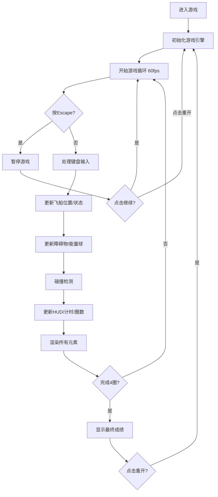

## 1. 产品概述

AstroRacer是一款赛博朋克风格的宇宙赛道竞速游戏，玩家操控小型飞船在环形太空赛道上躲避障碍物、收集能量球，通过完成4圈竞赛以最优时间取胜。

- 主要目的：提供快节奏、视觉炫目的休闲竞速体验，融合操控技巧与策略（能量管理）
- 目标用户：喜欢街机风格竞速游戏的玩家群体
- 产品价值：无需安装额外软件，在浏览器中即可体验沉浸式Canvas渲染的太空竞速

## 2. 核心特性

### 2.1 用户角色

| 角色 | 注册方式 | 核心权限 |
|------|----------|----------|
| 玩家 | 无需注册，直接访问 | 完整游戏体验、暂停/重开 |

### 2.2 功能模块

1. **游戏主界面**：全屏Canvas渲染、赛博朋克HUD界面
2. **飞船操控系统**：WASD/方向键移动、Shift加速、粒子尾焰效果
3. **赛道与障碍物系统**：环形渐变赛道、岩石/电磁脉冲球障碍物、碰撞反馈
4. **能量系统**：能量球收集、弧形能量条、加速冷却机制
5. **计时与圈数系统**：4圈竞赛、分段计时、圈数指示图标
6. **暂停与重开**：Escape暂停、继续/重开按钮、状态重置

### 2.3 页面详情

| 页面名称 | 模块名称 | 功能描述 |
|----------|----------|----------|
| 游戏主界面 | Canvas渲染层 | 赛道、飞船、障碍物、能量球的2D绘制 |
| 游戏主界面 | HUD层 | 速度表、计时器、圈数、能量条、小地图 |
| 游戏主界面 | 暂停蒙层 | 半透明暂停面板、继续/重开按钮 |

## 3. 核心流程

玩家打开页面 → 游戏自动开始初始化 → 玩家操控飞船沿环形赛道移动 → 躲避岩石和电磁脉冲球 → 收集能量球补充能量 → 使用Shift加速冲刺 → 经过起点线完成一圈 → 完成4圈后显示最终时间 → 可随时按Escape暂停或重开

## 4. 用户界面设计

### 4.1 设计风格

- **主色调**：深空蓝 `#0A1628`（背景）、赛博蓝 `#00D4FF`（HUD文字）、紫罗兰 `#6C63FF`（赛道渐变）
- **强调色**：红色 `#FF4444`（速度指针/碰撞）、绿色 `#00FF88`（能量球/收集）、黄色`#FFD700`（粒子尾焰）
- **字体**：Google Fonts - Orbitron（赛博朋克风格数字字体）+ Rajdhani（正文）
- **按钮样式**：矩形带发光边框，悬停0.2s过渡变亮
- **发光效果**：HUD文字 `text-shadow: 0 0 10px #00D4FF`，关键UI元素带box-shadow发光

### 4.2 页面设计概述

| 页面名称 | 模块名称 | UI元素 |
|----------|----------|--------|
| 游戏主界面 | Canvas游戏层 | 深空蓝背景、星空粒子、环形渐变赛道（内/外圈）、飞船（带黄色尾焰粒子）、灰色岩石障碍物、白色半透明EMP球、绿色呼吸能量球、蓝色发光起点线 |
| 游戏主界面 | HUD层（左上） | 弧形能量条（满时发光），粒子拖尾效果 |
| 游戏主界面 | HUD层（左下） | 半圆形速度仪表盘（0-300），红色指针每50抖动 |
| 游戏主界面 | HUD层（右上） | 圈数图标（方块1-4），当前圈高亮放大1.2倍 |
| 游戏主界面 | HUD层（右下） | 200x200半透明迷你地图（#1A237E 0.5透明度），显示赛道轮廓和绿色玩家点 |
| 游戏主界面 | HUD层（中上） | mm:ss:ms格式计时器，前三圈分段计时（蓝/绿/紫）标记在赛道转弯处 |
| 游戏主界面 | 暂停蒙层 | 黑色0.6半透明全屏、PAUSED白色48px投影大字、继续/重开按钮 |

### 4.3 响应式设计

- **桌面端（≥768px）**：默认布局，弧形能量条左上、半圆速度表左下、圈数图标右上、小地图右下
- **移动端（<768px）**：
  - 能量条改为顶部线性进度条
  - 速度表改为数字显示置于左下
  - 所有字号缩小至80%
  - 小地图缩小至150x150px

### 4.4 视觉特效

- 碰撞障碍物：屏幕边缘红色闪烁边框，0.3秒渐隐
- 收集能量球：屏幕边缘绿光闪过，0.2秒渐隐
- 暂停/继续切换：0.2秒淡入淡出缓动
- 能量球呼吸动画：正弦波缩放
- 粒子系统：尾焰10-15个，上限200个，复用最旧粒子
