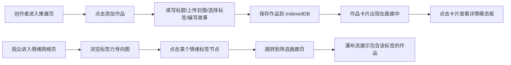

## 1. 产品概述

ArtVault 是一个面向数字艺术创作者的在线策展与情绪关联可视化平台。艺术家可以将系列作品整理成虚拟展览，为每件作品添加情绪标签和幕后故事，观众可以通过情绪标签筛选作品并探索作品间的关联网络。

- **目标用户**：数字艺术家、策展人、艺术爱好者
- **核心价值**：提供沉浸式的艺术策展体验，通过情绪标签网络发现作品间的隐秘联系

## 2. 核心功能

### 2.1 功能模块
1. **作品策展模块**：网格画廊展示、作品添加/编辑/删除、详情模态框
2. **情绪关联模块**：力导向网络图、标签筛选画廊、作品关联可视化

### 2.2 页面详情
| 页面名称 | 模块名称 | 功能描述 |
|---------|---------|---------|
| 策展画廊页 | 策展模块 | 网格布局展示所有作品卡片，支持点击查看详情，添加新作品 |
| 情绪网络图页 | 情绪模块 | d3-force 绘制标签关联网络，节点大小表示频率，连线表示共现 |
| 筛选画廊页 | 情绪模块 | 按选中标签筛选作品，瀑布流布局展示匹配结果 |

## 3. 核心流程

## 4. 用户界面设计

### 4.1 设计风格
- **主题**：深色奢华艺术风，营造画廊沉浸感
- **主背景**：#1A1A2E 深空蓝紫
- **卡片底色**：#2D2D44 暗紫灰
- **文字主色**：#E0E0E0 浅灰白
- **强调色**：#FF6B6B 珊瑚红
- **标签分类色**：温暖类 #FF8C00、冷峻类 #4682B4、神秘类 #9370DB

### 4.2 字体
- **字体**：Google Fonts - Inter
- **标题**：600 字重，20-28px
- **正文**：400 字重，14-16px
- **标签**：500 字重，14px

### 4.3 交互细节
- **卡片悬停**：上浮 8px + 阴影投影，0.3s 过渡
- **入场动画**：0.5s 淡入 + 轻微上移
- **模态框**：全屏遮罩 + 居中内容
- **网络节点**：拖拽固定、双击释放、点击高亮

### 4.4 页面设计概述
| 页面名称 | 模块名称 | UI 元素 |
|---------|---------|---------|
| 策展画廊页 | 策展模块 | 顶部导航、网格卡片、添加按钮、详情模态框 |
| 情绪网络图页 | 情绪模块 | 全屏 SVG 画布、节点标签、力导向动画 |
| 筛选画廊页 | 情绪模块 | 筛选标签提示、两列瀑布流、作品卡片 |

### 4.5 响应式
- 桌面端优先设计
- 平板端：网格从 4 列降至 3 列
- 移动端：网格降至 2 列，网络图自适应缩放
