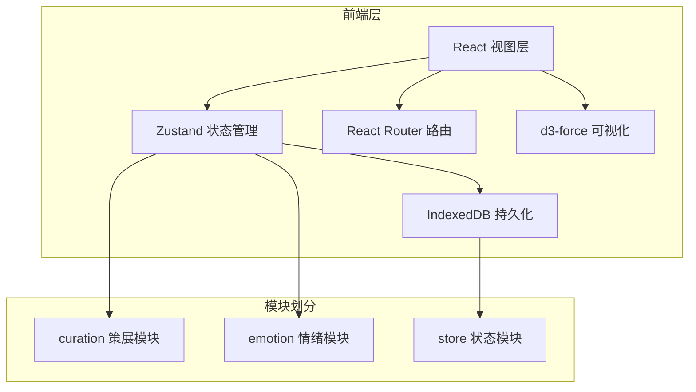

## 1. 架构设计



## 2. 技术描述

- **前端框架**：React@18 + TypeScript
- **构建工具**：Vite
- **状态管理**：Zustand
- **数据持久化**：IndexedDB (idb 库)
- **路由**：React Router DOM@6
- **可视化**：d3-force
- **样式方案**：CSS Modules / 内联样式（按需求实现）
- **字体**：Google Fonts - Inter

## 3. 路由定义

| 路由 | 页面 | 组件路径 |
|------|------|---------|
| `/` | 策展画廊页 | `src/curation/Curator.tsx` |
| `/emotion` | 情绪网络图页 | `src/emotion/EmotionMap.tsx` |
| `/emotion/filter/:tag` | 筛选画廊页 | `src/emotion/FilteredGallery.tsx` |

## 4. 数据模型

### 4.1 作品数据模型

```typescript
interface Work {
  id: string;
  title: string;
  cover: string; // Base64 图片
  tags: string[]; // 情绪标签，最多 5 个
  story: string; // 幕后故事
  createdAt: number;
}
```

### 4.2 情绪标签分类

```typescript
interface EmotionTag {
  name: string;
  category: 'warm' | 'cold' | 'mystery';
}
```

### 4.3 Store 状态

```typescript
interface AppState {
  works: Work[];
  selectedTag: string | null;
  addWork: (work: Omit<Work, 'id' | 'createdAt'>) => void;
  updateWork: (id: string, updates: Partial<Work>) => void;
  deleteWork: (id: string) => void;
  setSelectedTag: (tag: string | null) => void;
}
```

## 5. 文件结构

```
src/
├── main.tsx              # 应用入口
├── App.tsx               # 根组件
├── curation/
│   ├── Curator.tsx       # 策展画廊视图
│   ├── WorkEditor.tsx    # 作品编辑器
│   └── WorkCard.tsx      # 作品卡片组件
├── emotion/
│   ├── EmotionMap.tsx    # 情绪网络图
│   └── FilteredGallery.tsx # 筛选画廊
└── store/
    ├── useStore.ts       # Zustand store
    └── persistence.ts    # IndexedDB 封装
```

## 6. 数据流向

1. **策展模块 → Store**：用户添加/编辑/删除作品 → 调用 store actions → 更新 works 数组
2. **Store → IndexedDB**：状态变更后自动同步保存到 IndexedDB
3. **Store → 情绪模块**：EmotionMap 从 store 读取 works → 计算 nodes 和 links → 传递给 d3 渲染
4. **情绪模块 → Store**：点击标签节点 → 设置 selectedTag → FilteredGallery 响应式筛选
5. **初始化**：应用启动 → 从 IndexedDB 加载数据 → 初始化 store
