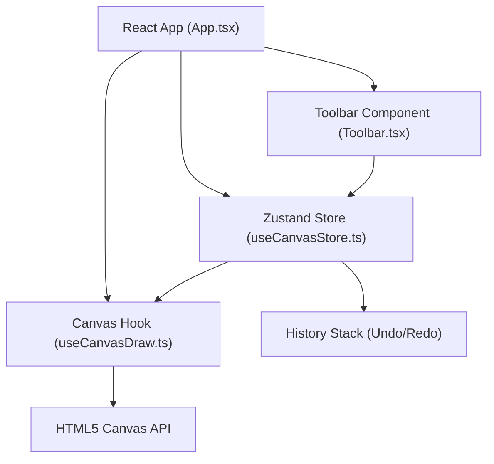

## 1. 架构设计



## 2. 技术描述

- **前端框架**：React@18 + TypeScript
- **构建工具**：Vite
- **状态管理**：Zustand
- **工具库**：uuid（生成唯一标识）
- **渲染技术**：HTML5 Canvas 2D API
- **动画**：requestAnimationFrame确保帧率≥50fps

## 3. 目录结构

```
auto100/
├── package.json
├── vite.config.js
├── tsconfig.json
├── index.html
└── src/
    ├── App.tsx              # 主应用组件
    ├── store/
    │   └── useCanvasStore.ts  # Zustand状态管理
    ├── hooks/
    │   └── useCanvasDraw.ts   # 画布绘制逻辑Hook
    └── components/
        └── Toolbar.tsx        # 工具栏组件
```

## 4. 核心数据结构

### 4.1 画布状态 (CanvasState)
```typescript
interface CanvasState {
  tool: 'brush' | 'airbrush' | 'eraser';
  color: string;
  lineWidth: number;
  undoStack: DrawAction[];
  redoStack: DrawAction[];
  maxHistorySize: number;
}
```

### 4.2 绘制动作 (DrawAction)
```typescript
interface DrawAction {
  id: string;
  tool: 'brush' | 'airbrush' | 'eraser';
  color: string;
  lineWidth: number;
  points: Point[];
}
```

### 4.3 坐标点 (Point)
```typescript
interface Point {
  x: number;
  y: number;
}
```

## 5. 状态管理设计

### 5.1 Zustand Store 方法
- `setTool(tool: ToolType)`: 切换当前工具
- `setColor(color: string)`: 设置绘制颜色
- `setLineWidth(width: number)`: 设置线条粗细
- `addAction(action: DrawAction)`: 添加绘制动作到历史栈
- `undo()`: 撤销上一步操作
- `redo()`: 重做已撤销的操作
- `clearHistory()`: 清空历史记录

### 5.2 历史记录策略
- 每完成一次鼠标拖拽（mouseup）记录一个DrawAction
- undoStack最多保留20条记录
- 超出时自动移除最早的记录
- redoStack在添加新动作时清空

## 6. 绘制逻辑设计

### 6.1 useCanvasDraw Hook
- 绑定canvas的mousedown/mousemove/mouseup事件
- 使用requestAnimationFrame确保绘制帧率≥50fps
- 实时收集绘制点坐标
- mouseup时将完整路径提交到store

### 6.2 工具绘制方式
- **画笔**：使用canvas的lineTo绘制连续路径，lineCap='round'，lineJoin='round'
- **喷枪**：在鼠标轨迹上随机散布圆形点，模拟喷枪效果
- **橡皮擦**：使用destination-out合成模式擦除内容

## 7. 性能优化

- 使用requestAnimationFrame进行绘制调度
- 离屏canvas缓存历史绘制结果
- 撤销/重做时仅重绘必要内容
- 事件防抖处理，避免频繁重绘

## 8. 导出功能

- 使用canvas.toDataURL('image/png')获取PNG数据
- 创建临时<a>标签触发下载
- 文件名格式：sketchpulse-export-{timestamp}.png
