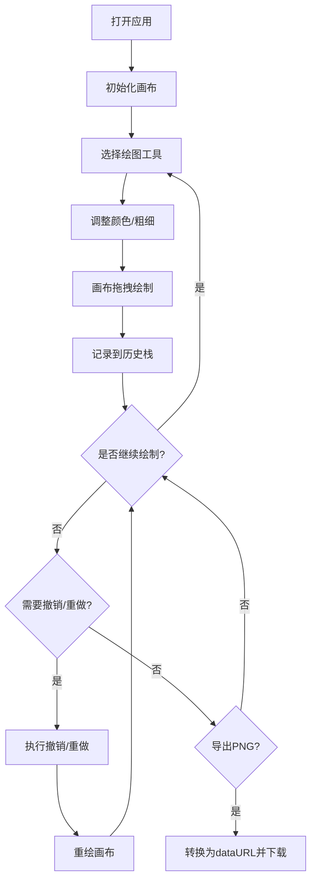

## 1. 产品概述

SketchPulse是一款面向数字创作者的交互式数字绘画Web应用，提供画笔、喷枪、橡皮擦等多种绘图工具，支持撤销/重做历史记录和PNG导出功能。

- 核心价值：为用户提供简洁流畅的数字绘画体验，无需安装任何软件即可在浏览器中进行创意创作
- 目标用户：设计师、插画师、学生及任何需要快速数字绘图的用户

## 2. 核心功能

### 2.1 用户角色
| 角色 | 注册方式 | 核心权限 |
|------|---------|---------|
| 普通用户 | 无需注册 | 使用所有绘图功能，导出作品 |

### 2.2 功能模块
1. **画布区域**：支持鼠标拖拽实时绘制，路径平滑过渡动画
2. **工具栏**：工具切换、颜色选择、粗细调节、撤销/重做、导出
3. **历史记录**：最多20步撤销/重做，超出自动丢弃最早记录
4. **导出功能**：一键导出为PNG格式图片

### 2.3 页面详情
| 页面名称 | 模块名称 | 功能描述 |
|---------|---------|---------|
| 主应用页 | 画布区域 | 800x500px深色画布，支持实时绘制，背景色#1E1E2E，内阴影效果 |
| 主应用页 | 工具栏 | 深色主题工具栏，包含工具按钮、颜色选择器、粗细滑块、操作按钮 |
| 主应用页 | 颜色选择器 | 圆形色块点击弹出160x160px网格取色面板 |
| 主应用页 | 粗细滑块 | 100px宽度滑块，拖拽显示数值提示 |

## 3. 核心流程

用户打开应用 → 选择绘图工具（画笔/喷枪/橡皮擦）→ 调整颜色和粗细 → 在画布上拖拽绘制 → 可撤销/重做操作 → 完成后导出为PNG图片

## 4. 用户界面设计

### 4.1 设计风格
- **主色调**：深紫色系渐变背景（#0F0F23到#1A1A2E），强调色#6C63FF，画笔默认色#FF6B6B
- **按钮样式**：圆形/圆角矩形，选中状态背景高亮，悬停时有亮度变化
- **字体**：使用现代无衬线字体，确保清晰可读
- **布局风格**：居中布局，画布与工具栏垂直排列，间距20px
- **图标风格**：简洁线条图标，清晰表示各工具功能

### 4.2 页面设计概述
| 页面名称 | 模块名称 | UI元素 |
|---------|---------|--------|
| 主应用页 | 画布区域 | #1E1E2E背景，圆角12px，内阴影0 0 15px rgba(0,0,0,0.5)，路径平滑过渡0.15s |
| 主应用页 | 工具栏 | #2D2D3F背景，高度56px，圆角8px，阴影0 2px 10px #00000033 |
| 主应用页 | 工具按钮 | 选中时背景#6C63FF，白色文字，过渡0.2s ease |
| 主应用页 | 颜色选择器 | 直径32px圆形色块，border 2px solid #4A4A6E，取色面板160x160px网格 |
| 主应用页 | 粗细滑块 | 100px宽，4px高，轨道#4A4A6E，滑块#6C63FF，数值提示标签 |
| 主应用页 | 撤销/重做按钮 | 36x36px，点击缩放动画0.1s |
| 主应用页 | 导出按钮 | 背景#6C63FF，白色文字，悬停变亮，过渡0.2s |

### 4.3 响应式
- **桌面优先**：画布默认800x500px，工具栏单行布局
- **移动适配**：视口宽度<900px时，工具栏自动换行，画布宽度变为100%
- **触摸优化**：支持触摸事件，确保移动端可操作

### 4.4 动效设计
- 所有交互元素悬停时有0.2s亮度或位移反馈
- 绘制路径0.15s平滑过渡
- 点击按钮时缩放动画（scale 0.9→1.0，0.1s）
- 滑块数值提示停留1.5秒后淡出
- 颜色面板弹出/关闭过渡0.1s
