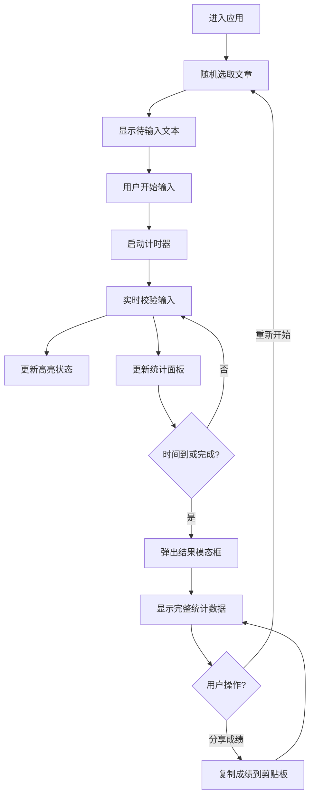

## 1. 产品概述

TypeRush 是一款交互式打字速度测试应用，用户在限时模式下输入随机生成的英文文章段落，实时统计打字速度、准确率和错误分布，帮助用户提升打字技能。

- 核心功能：限时打字测试、实时统计、错误分析、历史热力图
- 目标用户：希望提升英文打字速度和准确率的学习者和从业者
- 产品价值：通过可视化的错误分析和热力图，帮助用户精准定位薄弱环节

## 2. 核心功能

### 2.1 功能模块

1. **打字测试主页**：文本显示区、输入区域、统计面板
2. **结果模态框**：完整统计数据、错误分布图、WPM变化折线图
3. **热力图模式**：基于历史数据的单词错误热力图

### 2.2 页面详情

| 页面名称 | 模块名称 | 功能描述 |
|-----------|-------------|---------------------|
| 打字测试主页 | 文本显示区 | 显示待输入文本，高亮当前字符和错误区域 |
| 打字测试主页 | 输入区域 | 实时捕获键盘事件并校验输入正确性 |
| 打字测试主页 | 统计面板 | 实时显示倒计时、WPM、准确率、错误字符频率 |
| 打字测试主页 | 热力图切换 | 切换热力图显示模式 |
| 结果模态框 | 统计概览 | 显示平均WPM、最高WPM、准确率、总输入字符数 |
| 结果模态框 | 错误分布图 | 错误字符频率条形图 |
| 结果模态框 | WPM折线图 | 每10秒WPM变化折线图（Canvas绘制） |
| 结果模态框 | 操作按钮 | 重新开始、分享成绩 |

## 3. 核心流程

用户进入应用后，随机选取一篇英文文章显示在文本区域。用户开始输入后，计时器启动，实时高亮当前字符并反馈正确/错误状态。右侧统计面板实时更新WPM、准确率和错误分布。60秒倒计时结束或用户完成全文后，弹出结果模态框展示完整统计数据，用户可选择重新开始或分享成绩。

## 4. 用户界面设计

### 4.1 设计风格

- **主题配色**：Catppuccin Mocha 深色主题
  - 主背景色：#1E1E2E
  - 强调色：#89B4FA
  - 成功色：#A6E3A1
  - 错误色：#F38BA8
  - 警告色：#F9E2AF
  - 文本色：#CDD6F4
  - 次级背景：#313244
- **字体**：系统等宽字体（'Courier New', monospace）
- **字号**：20px（正文）
- **行高**：1.8
- **布局**：Flex 布局，居中显示，间距 32px
- **动效**：所有交互元素 0.2s ease-out 平滑过渡

### 4.2 页面设计概述

| 页面名称 | 模块名称 | UI 元素 |
|-----------|-------------|-------------|
| 打字测试主页 | 文本显示区 | 等宽字体、深色背景、字符高亮、错误波浪线、闪烁动画 |
| 打字测试主页 | 统计面板 | 固定宽度300px、圆角16px、内边距24px、边框1px solid #313244 |
| 打字测试主页 | 热力图按钮 | 圆形、直径36px、背景色#313244、选中时#89B4FA |
| 结果模态框 | 模态框 | 背景遮罩#00000080、圆角20px、阴影0 8px 32px rgba(0,0,0,0.5) |
| 结果模态框 | 按钮 | 主按钮背景#89B4FA、次按钮背景#313244、圆角8px |

### 4.3 性能要求

- 输入响应延迟 ≤ 16ms（一个帧周期）
- WPM 统计更新频率 ≥ 12次/秒
- 错字闪烁动画帧率 ≥ 30fps

### 4.4 响应式

桌面端优先设计，输入区与统计面板横向排列。移动端可考虑统计面板移至顶部或底部，但核心交互保持一致。
