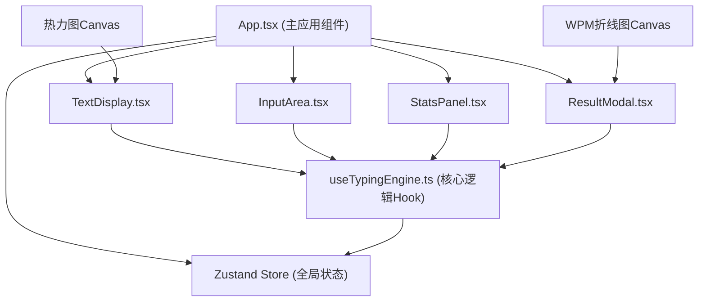

## 1. 架构设计



## 2. 技术描述

- **前端框架**：React@18 + TypeScript
- **构建工具**：Vite
- **状态管理**：Zustand
- **样式方案**：原生 CSS（CSS 变量 + 深色主题）
- **图表绘制**：Canvas API
- **唯一ID生成**：uuid

## 3. 文件结构

| 文件路径 | 用途 |
|-------|---------|
| package.json | 项目依赖与脚本 |
| vite.config.js | Vite 配置（含 React 插件） |
| tsconfig.json | TypeScript 严格模式配置 |
| index.html | 入口页面 |
| src/App.tsx | 主应用组件，整合所有子组件，管理全局状态 |
| src/components/TextDisplay.tsx | 显示待输入文本，高亮当前字符和错误区域 |
| src/components/InputArea.tsx | 用户输入区域，实时捕获键盘事件并校验 |
| src/components/StatsPanel.tsx | 显示速度、准确率、时间等统计面板 |
| src/components/ResultModal.tsx | 测试结果模态框 |
| src/hooks/useTypingEngine.ts | 核心逻辑 hook，处理输入校验、计时、结果统计 |
| src/store/typingStore.ts | Zustand 全局状态管理 |
| src/data/articles.ts | 内置英文文章数据 |
| src/styles.css | 全局样式，深色主题和动态过渡效果 |

## 4. 核心数据模型

### 4.1 打字状态

```typescript
interface TypingState {
  status: 'idle' | 'playing' | 'finished';
  currentText: string;
  currentIndex: number;
  correctChars: number;
  totalChars: number;
  errors: Record<string, number>;
  wordErrors: Record<string, number>;
  startTime: number | null;
  timeLeft: number;
  wpmHistory: { time: number; wpm: number }[];
  currentWpm: number;
  peakWpm: number;
  accuracy: number;
  heatmapMode: boolean;
  showResult: boolean;
}
```

### 4.2 字符状态

```typescript
type CharStatus = 'pending' | 'correct' | 'incorrect' | 'current';
```

## 5. 核心算法

### 5.1 WPM 计算

```
WPM = (正确字符数 / 5) / (已用时间 / 60)
```

### 5.2 准确率计算

```
准确率 = 正确字符数 / 总输入字符数 × 100%
```

### 5.3 输入校验

- 逐字符比对用户输入与目标文本
- 正确字符标记为绿色，错误字符标记为红色波浪线
- 当前字符高亮显示
- 错误时触发闪烁动画

## 6. 性能优化策略

1. **输入响应优化**：使用 `requestAnimationFrame` 确保 16ms 内响应
2. **统计更新频率**：WPM 统计使用 `setInterval` 每秒更新 12 次
3. **渲染优化**：字符渲染使用 memo 化，避免不必要的重渲染
4. **Canvas 绘制**：热力图和折线图使用 Canvas 绘制，保证帧率
5. **闪烁动画**：使用 CSS keyframes 实现 30fps 以上的流畅动画
