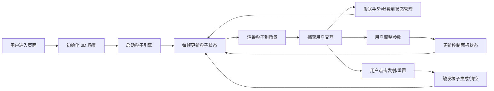

## 1. 产品概述

FluidSculpt 是一个基于 WebGL 的三维流体粒子雕塑系统，让数据艺术家和创意用户通过交互式的粒子系统创作动态视觉艺术作品。

- 核心价值：将复杂的物理模拟与直观的手势交互结合，使用户无需专业编程知识即可创建流体动力学视觉效果
- 目标用户：数据艺术家、视觉设计师、创意编程爱好者、教育工作者

## 2. 核心功能

### 2.1 用户角色

| 角色 | 注册方式 | 核心权限 |
|------|----------|----------|
| 创意用户 | 无需注册，直接访问 | 创建、交互和调整粒子雕塑效果 |

### 2.2 功能模块

1. **粒子引擎模块**：粒子生成、噪声场驱动运动、生命周期管理、手势交互响应
2. **3D 场景渲染模块**：基于 Three.js 的粒子系统渲染、相机控制、景深效果
3. **控制面板模块**：粒子参数调整、发射控制、重置功能、暂停/继续
4. **性能监控模块**：FPS 计数器、粒子数量统计、动态性能调节

### 2.3 页面详情

| 页面名称 | 模块名称 | 功能描述 |
|----------|----------|----------|
| 主页面 | 3D 场景区域 | 渲染粒子系统，支持拖拽旋转视角、滚轮缩放、点击发射粒子 |
| 主页面 | 控制面板 | 提供粒子数量、噪声强度、粒子寿命等参数调节滑块 |
| 主页面 | 性能指示器 | 左上角实时显示 FPS、粒子总数、每秒生成数 |

## 3. 核心流程

**主要用户流程描述：**
1. 用户进入页面后，3D 场景自动初始化，粒子系统开始运行
2. 用户可通过拖拽旋转视角，滚轮缩放视图
3. 拖拽过程中，手势方向和速度会作为外力施加到粒子上
4. 用户可通过右侧控制面板调整粒子参数
5. 点击"发射"按钮或在场景上拖拽可生成新粒子
6. 点击"重置"按钮清空所有粒子并重新发射
7. 点击"暂停/继续"按钮控制粒子运动

## 4. 用户界面设计

### 4.1 设计风格

- **主色调**：暗色背景 `#0A0A15`，霓虹蓝绿色 `#00D4AA` 作为主强调色，粒子颜色从 `#00CCFF`（冷蓝）渐变到 `#FF6B6B`（暖红）
- **按钮样式**：圆角 8px，背景 `#00D4AA`，文字颜色 `#0A0A15`，悬停亮度提高 15%，点击缩放 0.95，过渡动画 0.2s
- **字体**：等宽字体用于性能指示器，现代无衬线字体用于控制面板
- **布局风格**：左右分栏，左侧 75% 为 3D 场景，右侧固定 320px 为控制面板
- **视觉风格**：数字流体感，暗色背景配合霓虹发光粒子，营造科技艺术氛围

### 4.2 页面设计概述

| 页面名称 | 模块名称 | UI 元素 |
|----------|----------|----------|
| 主页面 | 3D 场景 | 背景 `#0A0A15`，粒子点云，圆形渐变纹理，景深效果，相机位置 (0, 5, 15) |
| 主页面 | 控制面板 | 半透明背景 `#0A0A15CC`，边框 `1px solid #2A2A3A`，圆角 12px，内边距 20px |
| 主页面 | 滑块控件 | 轨道 `#2A2A3A`，按钮 `#00D4AA`，高度 48px，圆角 8px |
| 主页面 | 性能指示器 | 左上角，字体 14px 等宽白色，背景 `#00000066`，圆角 4px，内边距 4px |

### 4.3 响应式设计

- **桌面优先**：针对宽屏设计，左右分栏布局
- **移动适配**：小屏幕下控制面板转为底部抽屉式布局
- **触摸优化**：支持触摸拖拽和双指缩放，按钮最小尺寸 44x44px

### 4.4 3D 场景设计

- **环境与氛围**：纯黑空间背景，粒子自发光，营造宇宙流体感
- **光照设置**：无传统光源，粒子使用自发光材质，颜色由 Y 轴高度决定
- **相机设置**：初始位置 (0, 5, 15)，看向原点，OrbitControls 控制，阻尼 0.1，缩放范围 1-50 倍
- **构图与焦点**：粒子系统围绕原点运动，形成动态雕塑形态
- **交互与动画**：拖拽旋转场景时施加手势力，粒子轨迹流畅自然
- **后期处理**：景深效果 0.5，轻微辉光增强霓虹感
- **性能预算**：3000 粒子时稳定 60FPS，10000 粒子时不低于 30FPS

## 5. 性能要求

- 3000 粒子时稳定 60FPS
- 10000 粒子时不低于 30FPS
- 使用 `Float32Array` 存储粒子数据，避免 GC 压力
- 每帧仅更新活动粒子
- FPS 低于 30 时自动降低粒子发射速率 25%
