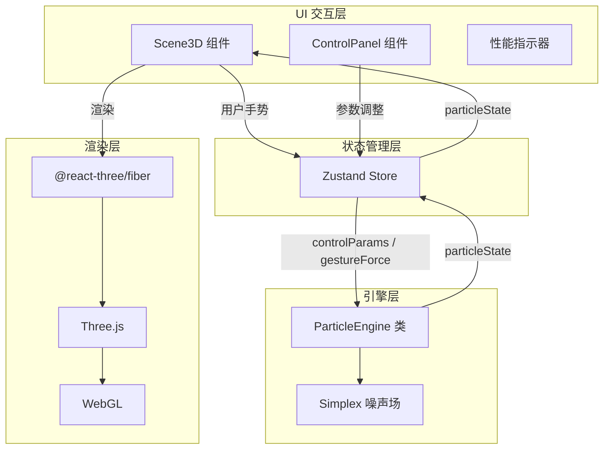

## 1. 架构设计



## 2. 技术描述

### 2.1 前端技术栈

| 技术 | 版本 | 用途 |
|------|------|------|
| React | 18.x | UI 框架 |
| TypeScript | 5.x | 类型安全 |
| Vite | 5.x | 构建工具 |
| Three.js | 0.160.x | 3D 渲染引擎 |
| @react-three/fiber | 8.x | React 渲染器 |
| @react-three/drei | 9.x | 辅助组件库 |
| Zustand | 4.x | 状态管理 |
| simplex-noise | 4.x | Simplex 噪声算法 |
| uuid | 9.x | 唯一 ID 生成 |

### 2.2 项目初始化

使用 `npm create vite@latest` 初始化 React + TypeScript 项目，然后安装所需依赖。

### 2.3 后端

无后端，纯前端应用。

### 2.4 数据库

无数据库，所有状态存储在内存中。

## 3. 路由定义

| 路由 | 用途 |
|------|------|
| / | 主应用页面，包含 3D 场景和控制面板 |

## 4. 核心模块设计

### 4.1 类型定义 (src/engine/types.ts)

```typescript
export interface Particle {
  id: string;
  position: Float32Array; // [x, y, z]
  velocity: Float32Array; // [vx, vy, vz]
  age: number; // 粒子年龄（秒）
  life: number; // 粒子寿命（秒）
  size: number; // 粒子大小
}

export interface ControlParams {
  particleCount: number; // 粒子总数 1000-10000
  noiseStrength: number; // 噪声强度 0.05-0.8
  particleLife: number; // 粒子寿命 1-10秒
}

export interface GestureForce {
  x: number; // X方向力
  y: number; // Y方向力
  z: number; // Z方向力
  strength: number; // 力的强度
}

export interface ParticleState {
  id: string;
  x: number;
  y: number;
  z: number;
  age: number;
  life: number;
}
```

### 4.2 粒子引擎 (src/engine/particleEngine.ts)

**核心职责：**
- 管理粒子池，使用对象池模式避免 GC
- 使用 Simplex 噪声计算粒子加速度
- 接收控制参数和手势力
- 每帧更新粒子状态

**核心方法：**
- `constructor(controlParams: ControlParams)` - 初始化引擎
- `update(deltaTime: number, gestureForce: GestureForce): ParticleState[]` - 每帧更新
- `emit(count: number, position?: [number, number, number]): void` - 发射粒子
- `reset(): void` - 重置粒子系统
- `setControlParams(params: Partial<ControlParams>): void` - 更新控制参数

### 4.3 状态管理 (src/store.ts)

使用 Zustand 管理全局状态，作为引擎和 UI 之间的数据通道。

**状态：**
- `particleState: ParticleState[]` - 粒子状态数组
- `controlParams: ControlParams` - 控制参数
- `gestureForce: GestureForce` - 手势力
- `isPaused: boolean` - 是否暂停

**Actions：**
- `updateParticles(states: ParticleState[]): void`
- `setControlParam(key: keyof ControlParams, value: number): void`
- `setGestureForce(force: Partial<GestureForce>): void`
- `reset(): void`
- `togglePause(): void`
- `emitParticles(count: number, position?: [number, number, number]): void`

### 4.4 3D 场景组件 (src/components/Scene3D.tsx)

**职责：**
- 使用 `@react-three/fiber` 渲染粒子系统
- 使用 `Points` 材质渲染粒子
- 监听鼠标/触摸事件，发送手势力到 store
- 使用 `OrbitControls` 控制相机
- 渲染性能指示器

### 4.5 控制面板组件 (src/components/ControlPanel.tsx)

**职责：**
- 提供粒子数量滑块 (1000-10000, 步长 1000)
- 提供噪声强度滑块 (0.05-0.8, 步长 0.05)
- 提供粒子寿命滑块 (1-10秒, 步长 0.5)
- 提供发射按钮、重置按钮、暂停/继续按钮

## 5. 文件结构

```
.
├── package.json
├── vite.config.js
├── tsconfig.json
├── index.html
└── src/
    ├── engine/
    │   ├── types.ts          # 类型定义
    │   └── particleEngine.ts # 粒子引擎
    ├── components/
    │   ├── Scene3D.tsx       # 3D 场景组件
    │   └── ControlPanel.tsx  # 控制面板组件
    ├── store.ts              # Zustand 状态管理
    ├── App.tsx               # 主应用组件
    └── main.tsx              # 入口文件
```

## 6. 性能优化策略

1. **粒子池模式**：预分配粒子数组，使用 `Float32Array` 存储位置和速度
2. **按需更新**：每帧仅更新活动粒子，跳过已死亡粒子
3. **Points 渲染**：使用 `THREE.Points` 而不是 `Mesh`，一次绘制调用
4. **内存管理**：避免在动画循环中创建新对象，复用已有对象
5. **动态调整**：FPS 低于 30 时自动降低 25% 粒子发射速率
6. **对象复用**：粒子状态对象复用，避免频繁 GC
