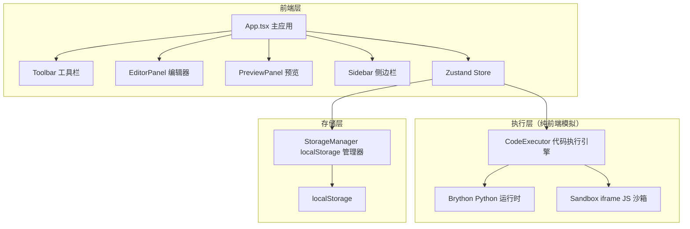
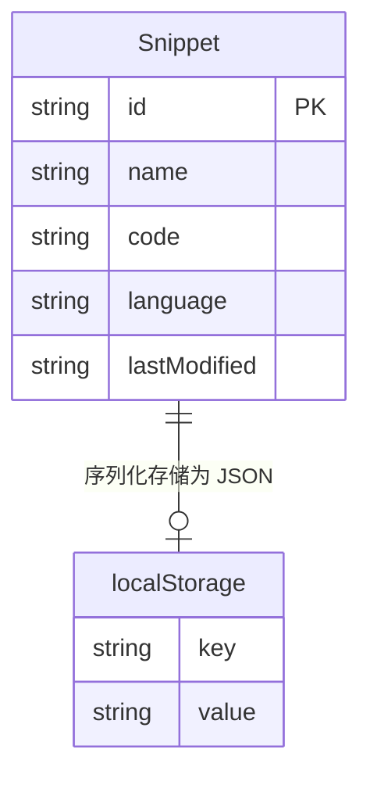

## 1. 架构设计



## 2. 技术说明
- 前端框架：React@18 + TypeScript
- 构建工具：Vite
- 状态管理：Zustand
- 代码编辑器：CodeMirror@6 + @codemirror/lang-javascript + @codemirror/lang-python
- Python 运行时：Brython（浏览器端执行）
- JavaScript 执行：沙箱 iframe eval
- ID 生成：uuid
- 样式方案：CSS Modules / 内联样式（暗色科幻主题）
- 存储：浏览器 localStorage
- 后端：无（纯前端模拟，延迟500ms模拟网络请求）

## 3. 路由定义
| 路由 | 用途 |
|------|------|
| / | 单页应用主界面，包含编辑器、预览、工具栏、侧边栏 |

本项目为单页应用，无需多路由。

## 4. API 定义（无后端，纯前端模拟）

### 4.1 模拟执行接口
```typescript
interface ExecuteRequest {
  code: string;
  language: 'python' | 'javascript';
}

interface ExecuteResponse {
  output: string;
  error: boolean;
}
```

### 4.2 存储接口
```typescript
interface Snippet {
  id: string;
  name: string;
  code: string;
  language: 'python' | 'javascript';
  lastModified: string;
}
```

## 5. 数据模型



## 6. 文件结构

```
CodeCanvas/
├── package.json
├── vite.config.js
├── tsconfig.json
├── index.html
└── src/
    ├── App.tsx
    ├── types.ts
    ├── modules/
    │   ├── editor/
    │   │   ├── EditorPanel.tsx
    │   │   └── PreviewPanel.tsx
    │   ├── executor/
    │   │   └── CodeExecutor.ts
    │   ├── storage/
    │   │   └── StorageManager.ts
    │   └── ui/
    │       ├── Sidebar.tsx
    │       └── Toolbar.tsx
```
