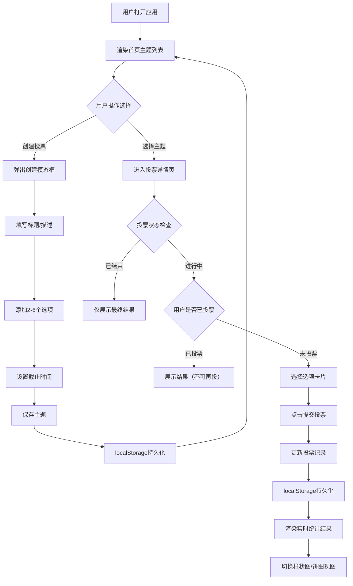

## 1. 产品概述

VoteCast 是一款面向小型团队的轻量匿名投票系统，旨在简化团队协作决策流程，解决聊天工具接龙投票混乱、难以统计的痛点。通过简洁直观的界面，团队成员可以快速创建投票主题、自定义选项、匿名参与投票，并实时查看统计结果。

- **核心价值**：高效、匿名、透明的团队决策工具
- **目标用户**：小型团队负责人及成员（5-20人规模）
- **使用场景**：会议时间确定、项目方案选择、团建活动投票等团队协作决策

## 2. 核心功能

### 2.1 用户角色

| 角色 | 注册方式 | 核心权限 |
|------|----------|----------|
| 普通用户 | 自动生成匿名标识（uuid） | 创建投票、参与投票、查看结果 |

### 2.2 功能模块

1. **首页（主题列表）**：投票主题卡片网格展示、状态标识、创建投票入口
2. **创建投票模态框**：主题标题/描述输入、选项自定义（2-6个）、截止时间设置
3. **投票详情页**：主题信息展示、选项选择、投票提交、实时结果统计（柱状图/饼图切换）

### 2.3 页面详情

| 页面名称 | 模块名称 | 功能描述 |
|----------|----------|----------|
| 首页 | 顶部导航栏 | 显示应用名称、创建投票按钮 |
| 首页 | 主题卡片列表 | 网格布局展示所有投票主题，显示状态标识（进行中/已结束/已投票） |
| 首页 | 空状态提示 | 无投票时显示引导文案 |
| 创建投票模态框 | 表单区域 | 主题标题（≤30字）、描述（可选，≤100字）输入 |
| 创建投票模态框 | 选项管理 | 动态添加/删除选项输入框（2-6个，每个≤50字） |
| 创建投票模态框 | 截止时间选择 | 预设时间（15分钟/1小时/6小时/24小时）+ 自定义时间戳 |
| 投票详情页 | 主题信息区 | 标题、描述、状态、剩余时间展示 |
| 投票详情页 | 选项卡片列表 | 可点击选中的选项卡片，支持单选 |
| 投票详情页 | 投票提交按钮 | 选中选项后可提交，提交后锁定 |
| 投票详情页 | 结果统计区 | 柱状图/饼图切换展示，动画效果，票数与百分比显示 |

## 3. 核心流程

### 3.1 主要用户流程

用户打开应用 → 查看首页投票主题列表 → 点击"创建投票"或选择已有主题 → 
- 创建流程：填写主题信息 → 添加选项 → 设置截止时间 → 保存 → 返回首页查看新主题
- 投票流程：查看主题详情 → 选择选项 → 提交投票 → 查看实时统计结果 → 可切换图表类型

### 3.2 Mermaid 流程图

## 4. 用户界面设计

### 4.1 设计风格

- **主色调**：深色主题，背景 `#0F0F23`，卡片背景 `#1A1A2E`，组件背景 `#1E1E2E`、`#2D2D3F`
- **强调色**：主题色 `#6C63FF`（紫色）、成功色 `#00D4AA`（青绿）、警示色 `#FF6B6B`（红色）
- **文字颜色**：主文字 `#E0E0E0`，辅助文字 `#9090A8`
- **边框颜色**：默认 `#2D2D4A`，聚焦/悬停 `#4A4A6E`、`#6C63FF`
- **按钮样式**：圆角矩形（圆角8px-16px），平滑过渡动画（0.2s-0.3s）
- **字体**：使用现代无衬线字体，层级分明（标题、正文、辅助文字）
- **布局风格**：卡片式设计，网格化布局，充足留白
- **图标风格**：简约线性图标，使用 lucide-react 组件库
- **动效**：所有交互元素带过渡动画，模态框缩放淡入，柱状图上升动画，饼图旋转进入

### 4.2 页面设计概述

| 页面名称 | 模块名称 | UI 元素设计 |
|----------|----------|-------------|
| 首页 | 顶部区域 | 左侧应用标题 "VoteCast"（渐变文字），右侧"创建投票"按钮（宽180px，高44px，背景#6C63FF，悬停#5A52D5） |
| 首页 | 主题卡片 | 背景#1A1A2E，圆角12px，内边距20px，边框1px solid #2D2D4A，悬停边框变#6C63FF，上移4px，过渡0.25s |
| 首页 | 状态标识 | 进行中：绿色圆点#00D4AA（8px，脉冲动画）；已结束：红色圆点#FF6B6B（闪烁动画）；已投票：右侧对勾图标#00D4AA |
| 创建投票模态框 | 遮罩层 | 半透明黑色#00000066，全屏覆盖 |
| 创建投票模态框 | 模态框主体 | 背景#1E1E2E，圆角16px，内边距32px，缩放淡入动画0.3s ease-out |
| 创建投票模态框 | 输入框 | 背景#2D2D3F，边框1px solid #4A4A6E，聚焦边框变#6C63FF，过渡0.3s |
| 创建投票模态框 | 选项输入框 | 宽度360px，"添加选项"按钮，最多6个 |
| 投票详情页 | 选项卡片 | 宽100%，圆角12px，内边距20px，背景#2D2D3F，边框1px solid #4A4A6E，悬停边框变#6C63FF，放大1.02倍，过渡0.2s |
| 投票详情页 | 选中状态 | 边框变#00D4AA，左侧对勾图标 |
| 投票详情页 | 提交按钮 | 宽160px，背景#00D4AA，悬停#00BFA4，白色文字 |
| 投票详情页 | 柱状图 | 柱体渐变#6C63FF→#00D4AA，高度上升动画0.5s，上方显示票数和百分比 |
| 投票详情页 | 饼图 | CSS conic-gradient实现，旋转进入动画0.6s，扇区悬停放大1.1倍 |

### 4.3 响应式设计

- **设计原则**：桌面端优先，移动端自适应
- **网格断点**：
  - 视口 ≥ 768px：3列布局，卡片间距16px
  - 480px - 768px：2列布局
  - < 480px：1列布局
- **模态框适配**：移动端模态框宽度90vw，选项输入框宽度自适应
- **触摸优化**：按钮最小点击区域44×44px，确保移动端可点击性

### 4.4 性能要求

- 首屏渲染时间：≤ 500ms
- 投票提交后柱状图动画：≤ 0.5s
- 输入框聚焦/失焦反馈：≤ 100ms
- 截止时间检查：每秒轮询一次，及时更新状态
