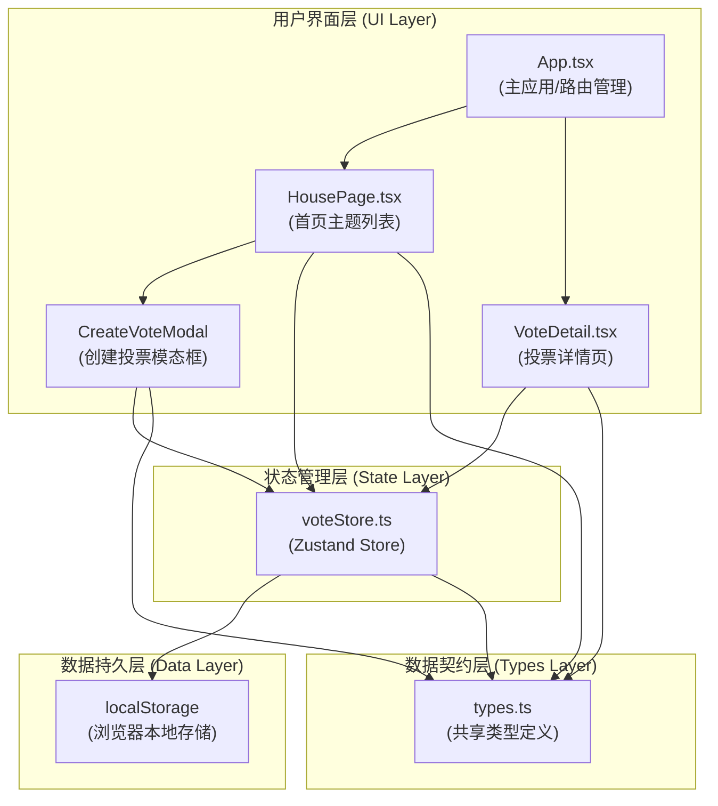

## 1. 架构设计



## 2. 技术说明

- **前端框架**：React@18 + React DOM@18
- **构建工具**：Vite（含 React 插件）
- **类型系统**：TypeScript（严格模式，target ES2020）
- **状态管理**：Zustand（轻量状态管理库）
- **唯一标识**：uuid（生成匿名用户标识和投票ID）
- **数据持久化**：localStorage（JSON 格式存储）
- **图标库**：lucide-react（简约图标组件）
- **样式方案**：原生 CSS + CSS Variables（主题变量统一管理）
- **路由方案**：React Router 客户端路由（或简易哈希路由）

## 3. 文件结构定义

```
vote-cast/
├── package.json              # 项目依赖与脚本配置
├── vite.config.js            # Vite 构建配置（含代理）
├── tsconfig.json             # TypeScript 配置（严格模式）
├── index.html                # 入口 HTML（#root + VoteCast 标题）
└── src/
    ├── main.tsx              # 应用入口（挂载 React）
    ├── App.tsx               # 主应用组件（路由与状态分发）
    ├── types.ts              # 共享类型定义（所有模块引用）
    ├── index.css             # 全局样式与 CSS 变量
    ├── store/
    │   └── voteStore.ts      # Zustand Store + localStorage 模拟 API
    ├── hooks/
    │   └── useVoteApi.ts     # 自定义 Hook（封装 Store 调用）
    ├── components/
    │   ├── HousePage.tsx     # 首页：投票主题列表
    │   ├── VoteDetail.tsx    # 详情页：投票与结果展示
    │   ├── CreateVoteModal.tsx  # 创建投票模态框
    │   ├── VoteCard.tsx      # 投票主题卡片组件
    │   ├── BarChart.tsx      # 柱状图结果组件
    │   └── PieChart.tsx      # 饼图结果组件
    └── utils/
        └── time.ts           # 时间格式化工具函数
```

## 4. 路由定义

| 路由 | 页面组件 | 用途 |
|------|----------|------|
| `/` | HousePage | 首页，展示所有投票主题卡片列表 |
| `/vote/:id` | VoteDetail | 投票详情页，展示单个主题详情、投票操作、结果统计 |

路由实现方式：使用 React Router DOM v6，通过 `createBrowserRouter` 或 `HashRouter` 实现。若用户未安装 react-router-dom，可使用简易状态路由（基于 useState 的页面切换）。

## 5. 数据模型定义

### 5.1 类型接口（types.ts）

```typescript
// 投票状态枚举
export type VoteStatus = 'ongoing' | 'ended';

// 投票选项
export interface VoteOption {
  id: string;           // 选项唯一标识（uuid）
  text: string;         // 选项文字内容
  voteCount: number;    // 该选项获得的票数
}

// 投票记录（记录用户是否已投票）
export interface VoteRecord {
  topicId: string;      // 所属投票主题ID
  optionId: string;     // 选择的选项ID
  votedAt: number;      // 投票时间戳
}

// 投票主题
export interface VoteTopic {
  id: string;           // 主题唯一标识（uuid）
  title: string;        // 主题标题（≤30字）
  description: string;  // 主题描述（≤100字，可选）
  options: VoteOption[]; // 选项列表（2-6个）
  createdAt: number;    // 创建时间戳
  deadline: number;     // 截止时间戳
  status: VoteStatus;   // 投票状态
  totalVotes: number;   // 总票数
}

// 创建投票表单数据
export interface CreateVoteForm {
  title: string;
  description: string;
  options: string[];
  deadline: number;
}

// Store 完整状态
export interface VoteStoreState {
  topics: VoteTopic[];
  currentUserId: string;                // 当前用户匿名标识（uuid）
  voteRecords: VoteRecord[];            // 本地用户投票记录
  createTopic: (form: CreateVoteForm) => VoteTopic;      // Action：创建主题
  submitVote: (topicId: string, optionId: string) => void; // Action：提交投票
  getTopicById: (id: string) => VoteTopic | undefined;    // Selector：获取单个主题
  hasUserVoted: (topicId: string) => boolean;             // Selector：检查是否已投票
  updateTopicStatuses: () => void;                        // Action：更新所有主题状态
}
```

### 5.2 localStorage 存储结构

```typescript
// 存储键名
const STORAGE_KEYS = {
  TOPICS: 'votecast_topics',       // 所有投票主题
  USER_ID: 'votecast_user_id',     // 当前匿名用户ID
  VOTE_RECORDS: 'votecast_records' // 当前用户的投票记录
};

// 存储格式（JSON 字符串）
// TOPICS: VoteTopic[]
// USER_ID: string (uuid)
// VOTE_RECORDS: VoteRecord[]
```

## 6. 数据流向与模块调用关系

### 6.1 数据流向总览

```
用户操作
   ↓
UI 组件 (HousePage / VoteDetail / CreateVoteModal)
   ↓  调用 action 方法
Zustand Store (voteStore.ts)
   ↓  1. 更新内存状态
   ↓  2. 同步写入 localStorage
   ↓  3. 返回最新状态
UI 组件重新渲染
   ↓
从 Store 读取最新数据 → 更新界面
```

### 6.2 各模块详细调用关系

| 调用方 | 被调用方 | 调用方式 | 数据流向 |
|--------|----------|----------|----------|
| `App.tsx` | `HousePage` | 路由渲染 | 传递 topics 数据（或由子组件自行从 Store 读取） |
| `App.tsx` | `VoteDetail` | 路由渲染 | 传递路由参数 :id，组件内部按 id 读取 Store |
| `HousePage.tsx` | `CreateVoteModal.tsx` | 条件渲染 | 控制模态框显示/隐藏，传递 onSubmit 回调 |
| `HousePage.tsx` | `voteStore.ts` | `useVoteStore()` hooks | 读取 `topics`，调用 `createTopic()` |
| `VoteDetail.tsx` | `voteStore.ts` | `useVoteStore()` hooks | 读取单个主题、投票记录，调用 `submitVote()` |
| `VoteDetail.tsx` | `BarChart.tsx` | 组件 Props | 传递 `options` 数据渲染柱状图 |
| `VoteDetail.tsx` | `PieChart.tsx` | 组件 Props | 传递 `options` 数据渲染饼图 |
| `CreateVoteModal.tsx` | `voteStore.ts` | 通过回调 | 提交表单数据，调用 `createTopic()` |
| `voteStore.ts` | `localStorage` | 同步读写 | 初始化时读取，状态变更时写入 |
| `voteStore.ts` | `types.ts` | TypeScript 引用 | 定义接口类型 |
| `所有组件` | `types.ts` | TypeScript 引用 | 使用类型注解 |

### 6.3 核心业务流程时序

**创建投票流程：**
```
用户点击"创建投票"
  → HousePage 设置 modalOpen=true
  → CreateVoteModal 渲染（缩放淡入动画）
  → 用户填写表单（标题/描述/选项/截止时间）
  → 点击"保存"
  → 调用 store.createTopic(formData)
    → voteStore: 生成 uuid 构建 VoteTopic 对象
    → voteStore: topics.push(newTopic)
    → voteStore: localStorage.setItem('votecast_topics', JSON.stringify(topics))
    → voteStore: 返回最新状态
  → CreateVoteModal 关闭
  → HousePage 重新渲染，新主题出现在列表中
```

**提交投票流程：**
```
用户进入 /vote/:id 页面
  → VoteDetail 调用 store.getTopicById(id) 获取主题
  → store.updateTopicStatuses() 检查截止时间（每秒轮询）
  → 用户选择选项卡片 → 组件设置 selectedOptionId
  → 点击"提交投票"
  → 调用 store.submitVote(topicId, optionId)
    → voteStore: 找到对应 topic 和 option
    → voteStore: option.voteCount++，topic.totalVotes++
    → voteStore: voteRecords.push({topicId, optionId, votedAt})
    → voteStore: 同步写入 localStorage（topics + records）
    → voteStore: 返回最新状态
  → VoteDetail 重新渲染
  → 隐藏选项选择区，展示结果统计区
  → BarChart 渲染柱状图（高度上升动画 0.5s）
  → 用户可切换饼图视图（conic-gradient 旋转动画 0.6s）
```
