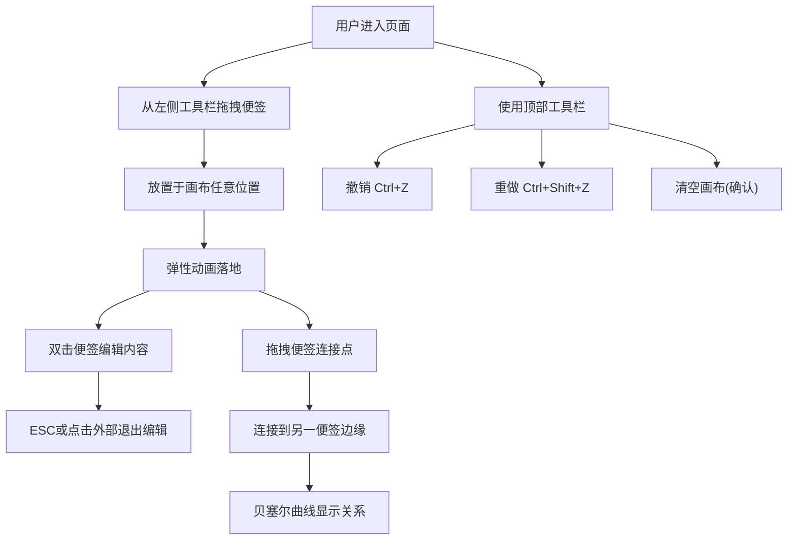

## 1. 产品概述
ReflectBoard 是一款基于浏览器的可视化头脑风暴工具，用户可通过拖拽彩色便签在无限画布上整理思路、做思维导图。它模拟实体白板的使用体验，让创意整理过程更加直观和有趣。
- 核心目标：提供简洁高效的便签白板体验，支持便签创建、编辑、连接和历史回溯
- 目标用户：设计师、产品经理、开发者、学生及需要头脑风暴的团队或个人

## 2. 核心功能

### 2.1 用户角色
| 角色 | 注册方式 | 核心权限 |
|------|---------|---------|
| 普通用户 | 无需注册，直接使用 | 创建/编辑/删除便签、建立连接、撤销/重做操作 |

### 2.2 功能模块
1. **画布模块**：无限画布渲染、便签拖拽定位、层级管理、贝塞尔曲线连接绘制
2. **便签模块**：便签创建、内容编辑、尺寸管理、随机配色、连接点交互
3. **工具栏模块**：撤销操作、重做操作、清空画布
4. **状态模块**：数据持久化（内存）、撤销/重做历史栈管理

### 2.3 页面详情
| 页面名称 | 模块名称 | 功能描述 |
|---------|---------|---------|
| 主页面 | 无限画布 | 背景色 #2B2B3D，支持拖拽浏览，便签渲染区域 |
| 主页面 | 左侧工具栏 | 宽 60px，背景 #1E1E2E，右边缘圆角 4px，提供便签拖拽源 |
| 主页面 | 顶部工具栏 | 高 50px，背景 #1E1E2E，包含撤销/重做/清空按钮 |
| 主页面 | 便签卡片 | 160x160，圆角 12px，5种随机配色，支持双击编辑 |
| 主页面 | 连接线 | 贝塞尔曲线连接便签，可删除 |

## 3. 核心流程
用户从左侧工具栏拖拽便签到画布任意位置 → 便签放置后可双击编辑内容 → 从便签右下角连接点拖拽到另一便签建立关系 → 使用顶部工具栏进行撤销/重做/清空操作

## 4. 用户界面设计

### 4.1 设计风格
- **主色调**：主背景 #2B2B3D，辅助背景 #1E1E2E，主题色 #6C63FF
- **便签配色**：#FF6B6B、#4ECDC4、#FFE66D、#A29BFE、#FD79A8（随机分配）
- **字体**：Inter 14px 行高1.5（全局），Comic Sans MS 16px（便签内容）
- **按钮效果**：点击 0.1s 缩放反馈（1 → 0.95 → 1）
- **毛玻璃效果**：工具栏和左侧栏使用 backdrop-filter: blur(8px) 半透明效果

### 4.2 页面设计概述
| 页面名称 | 模块名称 | UI 元素 |
|---------|---------|---------|
| 主页面 | 无限画布 | 深色背景、网格纹理感、便签绝对定位 |
| 主页面 | 左侧工具栏 | 垂直条带、便签预览图标、右圆角、毛玻璃 |
| 主页面 | 顶部工具栏 | 水平条带、3个功能按钮、下边框、毛玻璃 |
| 主页面 | 便签卡片 | 圆角矩形、阴影 0 4px 12px rgba(0,0,0,0.3)、右下角连接点 |
| 主页面 | 连接线 | 贝塞尔曲线 #6C63FF 2px、两端圆点 |

### 4.3 动画与交互细节
- **便签拖拽**：跟随鼠标，scale 1.05，使用 requestAnimationFrame + transform 保证 55+ fps
- **便签放置**：0.2s 弹性动画（cubic-bezier(0.34, 1.56, 0.64, 1)）恢复原大小
- **编辑状态**：双击进入，textarea 边框 1px dashed #FFF，背景透明，自动聚焦
- **连接绘制**：拖拽时实时贝塞尔曲线预览，0.3s 曲线动画
- **清空画布**：便签依次以 0.1s 间隔淡出，opacity 1→0，过渡 0.3s
- **按钮状态**：禁用时灰色 #555，可用时 #6C63FF

### 4.4 响应式设计
- 桌面端优先设计，画布区域自适应窗口大小
- 工具栏固定定位，不受画布滚动影响
- 最小支持窗口尺寸：800 x 600
