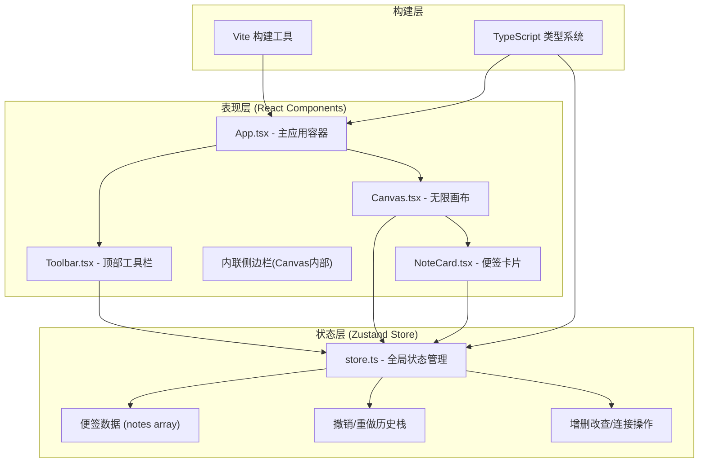

## 1. 架构设计



## 2. 技术描述
- **前端框架**：React@18 + React-DOM@18
- **构建工具**：Vite（@vitejs/plugin-react）
- **编程语言**：TypeScript（严格模式，target ES2020）
- **状态管理**：Zustand 4.x
- **唯一ID生成**：uuid
- **样式方案**：原生 CSS + CSS 变量 + styled-components 风格内联样式
- **拖拽实现**：原生 Pointer 事件 + requestAnimationFrame + transform（高性能）
- **曲线绘制**：SVG 贝塞尔曲线（path d 属性）

## 3. 路由定义
| 路由 | 用途 |
|------|------|
| / | 主页面（唯一页面，单页应用） |

## 4. 核心数据模型

### 4.1 数据结构定义


### 4.2 历史记录结构
```typescript
interface HistoryState {
  past: Note[][];       // 撤销栈（最多50步）
  future: Note[][];     // 重做栈
  present: Note[];      // 当前状态
}
```

## 5. 文件结构
```
.
├── package.json          # 项目依赖与脚本
├── index.html            # 入口 HTML
├── vite.config.js        # Vite 配置
├── tsconfig.json         # TypeScript 配置
└── src/
    ├── App.tsx           # 主应用组件，集成三大模块
    ├── main.tsx          # React 挂载入口
    ├── store.ts          # Zustand 状态管理
    ├── Canvas.tsx        # 画布组件 + 侧边栏 + 连接线
    ├── Toolbar.tsx       # 顶部工具栏
    ├── NoteCard.tsx      # 便签卡片组件
    └── index.css         # 全局样式与 CSS 变量
```

## 6. 核心模块职责

### 6.1 store.ts 职责
- 定义 `Note` 接口类型
- 创建 Zustand store，包含：
  - `notes: Note[]` 当前便签列表
  - `addNote()` 添加便签（推入历史）
  - `moveNote(id, x, y)` 移动便签（推入历史）
  - `editNote(id, text)` 编辑便签（推入历史）
  - `deleteNote(id)` 删除便签（推入历史）
  - `connectNotes(id1, id2)` 建立双向连接（推入历史）
  - `disconnectNotes(id1, id2)` 断开连接（推入历史）
  - `clearAll()` 清空所有便签（推入历史）
  - `undo()` 撤销（past → present → future）
  - `redo()` 重做（future → present → past）
  - `canUndo` / `canRedo` 计算属性
- 历史记录使用不可变更新，撤销栈最大 50 条

### 6.2 Canvas.tsx 职责
- 渲染无限画布背景（#2B2B3D）
- 渲染左侧工具栏（60px 宽，便签拖拽源）
- 渲染所有便签（遍历 notes 渲染 NoteCard）
- 渲染 SVG 连接线图层（贝塞尔曲线）
- 处理画布级拖拽（平移浏览，可选）
- 处理从侧边栏拖入便签的 drop 逻辑
- 管理连接创建的交互状态（拖拽连接点时的临时曲线）

### 6.3 NoteCard.tsx 职责
- 渲染单个便签卡片（圆角、阴影、背景色）
- 渲染 textarea 编辑区（双击进入编辑）
- 渲染右下角连接点（12px 白色圆点）
- 处理便签自身拖拽移动（Pointer Events + rAF + transform）
- 处理双击进入/退出编辑
- 处理连接点拖拽（创建连接线）
- 提供便签落地弹性动画（CSS transition）

### 6.4 Toolbar.tsx 职责
- 渲染撤销按钮（Ctrl+Z 快捷键监听）
- 渲染重做按钮（Ctrl+Shift+Z 快捷键监听）
- 渲染清空按钮（带确认弹窗）
- 实时读取 store 的 canUndo/canRedo 状态控制按钮可用性
- 按钮点击缩放反馈动画

### 6.5 App.tsx 职责
- 全局 CSS 变量定义与注入
- 集成 Toolbar、Canvas
- 初始化 store（空状态）
- 全局键盘快捷键监听（Ctrl+Z、Ctrl+Shift+Z）
- 应用整体布局（Toolbar 顶部固定 + Canvas 填充剩余区域）
