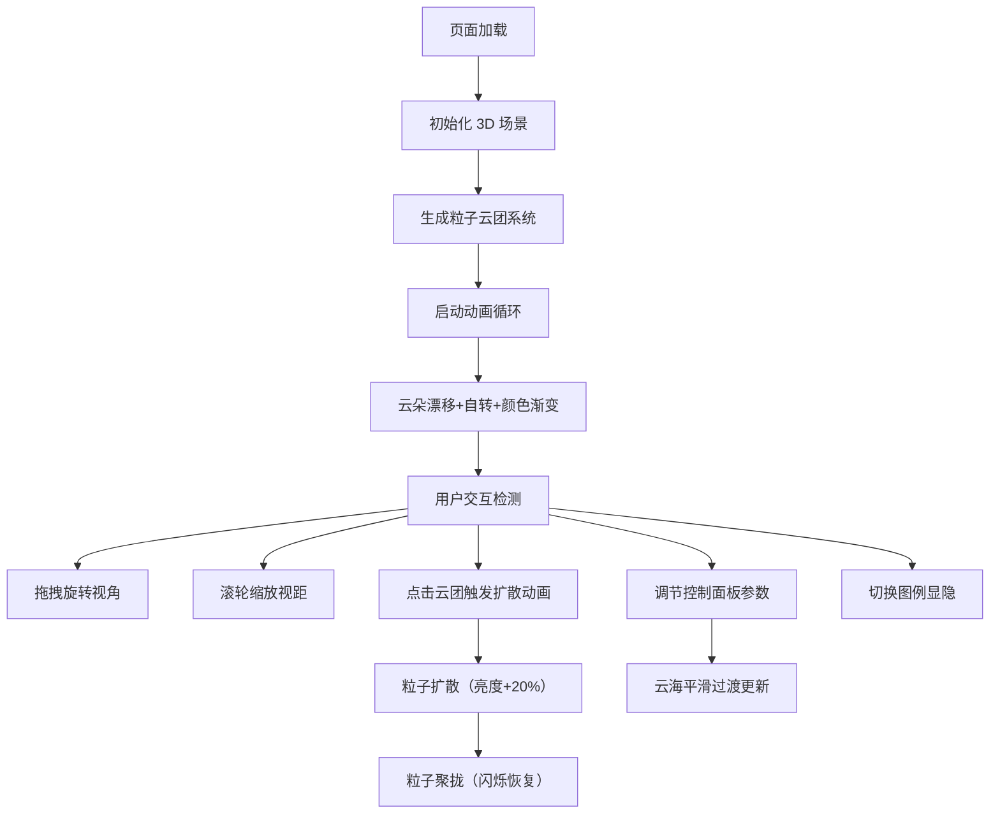

## 1. 产品概述

CloudDrift 是一个沉浸式 3D 抽象云海可视化网页应用，通过粒子系统模拟动态云朵在三维空间中的漂移、融合与分离，为用户提供舒缓的视觉体验和交互式探索乐趣。

- **核心价值**：通过精美的 3D 粒子动画和流畅的交互体验，创造一个具有艺术感和疗愈效果的数字空间
- **目标用户**：喜欢视觉艺术、沉浸式体验的互联网用户，可作为动态壁纸、创意展示或冥想背景使用

## 2. 核心特性

### 2.1 用户角色

| 角色 | 注册方式 | 核心权限 |
|------|----------|----------|
| 访客用户 | 无需注册 | 浏览云海、交互控制、调整参数 |

### 2.2 功能模块

1. **3D 云海场景**：粒子云团系统、渐变天空背景、半透明反射地面
2. **交互控制系统**：鼠标拖拽旋转视角、滚轮缩放、点击云团扩散-聚拢动画
3. **参数控制面板**：云密度滑块、漂移速度滑块、颜色变化速度滑块
4. **图例显示系统**：颜色图例开关、云团色值说明卡片

### 2.3 页面详情

| 页面名称 | 模块名称 | 功能描述 |
|----------|----------|----------|
| 主场景页面 | 3D 云海渲染 | 20-40 团粒子云随机分布，每团 50-150 粒子，大小 2-6px，透明度 0.1-0.6 动态变化 |
| 主场景页面 | 云团自转 | 每团云朵绕自身 Y 轴以 0.01-0.03 rad/s 随机速度缓慢旋转 |
| 主场景页面 | 颜色渐变 | 4 种主色（暖黄、淡蓝、粉红、淡绿），15-25 秒周期缓慢过渡 |
| 主场景页面 | 反射地面 | 半透明平面，云朵倒影，动态波纹效果（幅度 0.01，周期 5 秒） |
| 主场景页面 | 扩散-聚拢动画 | 点击云团时 0.6 秒扩散（亮度提升 20%）、0.8 秒聚拢（恢复原色并闪烁），周围粒子连锁偏移 |
| 控制面板 | 参数调节 | 云密度 0.5x-2x、漂移速度 0.1-1.0、颜色速度可调，平滑过渡 |
| 控制面板 | 图例开关 | 切换颜色图例卡片的显示/隐藏 |

## 3. 核心流程

用户进入页面后，自动加载 3D 云海场景，云朵开始缓慢漂移和颜色渐变。用户可通过鼠标拖拽旋转视角（Y 轴 360 度、X 轴 ±30 度），滚轮调整视距（5-30 单位），点击任意云团触发放散-聚拢动画。右下角控制面板可实时调节云海参数，图例按钮可显示/隐藏颜色说明。

## 4. 用户界面设计

### 4.1 设计风格

- **主色调**：深蓝 #0B1A3A 到暗紫 #2B1A4A 渐变背景
- **云朵色彩**：暖黄 #E8D5B7、淡蓝 #A8D8EA、粉红 #D4A5A5、淡绿 #B8D4B8
- **交互强调色**：#7FB3D8（滑块主色）
- **视觉风格**：极简主义、沉浸式、梦幻感、科技与自然融合
- **毛玻璃效果**：控制面板使用 rgba(255,255,255,0.1) 背景，1px 白色半透明边框，12px 圆角
- **字体**：现代无衬线字体，深色半透明背景上使用浅色文字

### 4.2 页面设计概述

| 页面名称 | 模块名称 | UI 元素 |
|----------|----------|----------|
| 主场景 | 全屏 Canvas | 黑色背景，Three.js 渲染，响应式尺寸 |
| 控制面板 | 滑块组件 | 轨道高度 4px、主色 #7FB3D8、手柄 16px 发光光晕，数值实时显示 |
| 控制面板 | 图例卡片 | 背景 #0D1B2A、边框 #2C3E50、3px 圆角、文字 #E0E0E0 |
| 控制面板 | 开关按钮 | 固定右下角，切换图例显隐 |

### 4.3 响应式设计

- **桌面优先**：全屏 Canvas 自适应窗口尺寸
- **移动端适配**：支持触摸拖拽旋转、双指缩放
- **性能优化**：粒子总数 ≤ 10000，维持 60fps

### 4.4 3D 场景设计

- **环境与氛围**：深空渐变背景，营造梦幻、宁静的宇宙空间感
- **光照设置**：环境光 + 微弱方向光，突出粒子半透明质感
- **相机设置**：PerspectiveCamera，初始距离 15 单位，视野角 75 度
- **相机动画**：0.8 秒平滑阻尼，视角切换自然流畅
- **构图元素**：云朵分布在 Y 轴 -5 到 10 空间范围，地面位于 Y = -10
- **交互动画**：点击扩散 0.6 秒、聚拢 0.8 秒，参数变化 0.3 秒平滑过渡
- **后期效果**：无，通过粒子材质本身实现半透明叠加效果
- **性能预算**：粒子数 ≤ 10000，draw call ≤ 10
