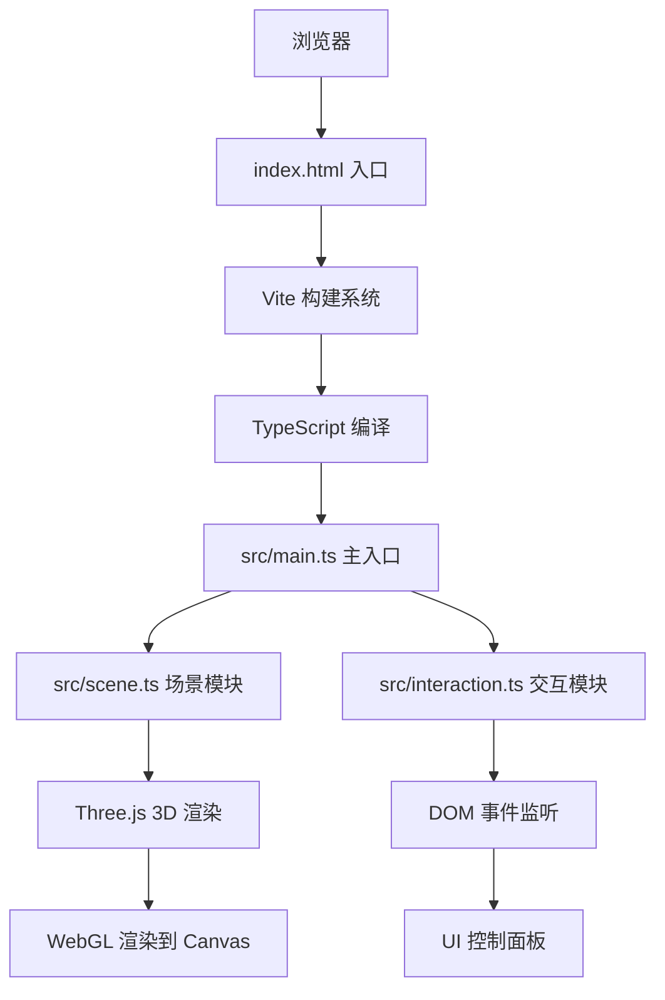

## 1. 架构设计



## 2. 技术描述

- **前端框架**：原生 TypeScript + Three.js 0.160（非 React/Vue，用户明确指定）
- **构建工具**：Vite 5.x
- **3D 引擎**：Three.js 0.160
- **类型定义**：@types/three 0.160.x
- **项目初始化**：手动创建文件结构，不使用 Vite 模板脚手架
- **后端**：无，纯前端应用
- **数据库**：无

## 3. 路由定义

| 路由 | 用途 |
|------|------|
| / | 主场景页面，全屏 3D 云海 |

## 4. 目录结构

```
auto11/
├── index.html              # 入口 HTML，全屏 Canvas
├── package.json            # 项目依赖和脚本
├── tsconfig.json           # TypeScript 配置（严格模式，ES2020）
├── vite.config.js          # Vite 基础配置
└── src/
    ├── main.ts             # 入口：初始化场景、相机、渲染器、动画循环
    ├── scene.ts            # 场景构建：粒子系统、反射地面、环境光效
    └── interaction.ts      # 交互控制：鼠标事件、点击动画、控制面板
```

## 5. 核心模块设计

### 5.1 src/main.ts

**职责**：应用入口，负责初始化和主循环

| 函数/类 | 功能 |
|---------|------|
| `init()` | 初始化场景、相机、渲染器、控制面板 UI |
| `animate()` | 主动画循环，调用场景更新和渲染 |
| `onWindowResize()` | 窗口尺寸变化处理 |

### 5.2 src/scene.ts

**职责**：3D 场景构建和粒子系统管理

| 类型/函数 | 功能 |
|-----------|------|
| `interface CloudParticle` | 单个粒子数据结构（位置、速度、原始位置、颜色、大小、透明度） |
| `interface CloudCluster` | 云团数据结构（粒子组、中心位置、速度、自转速度、旋转角度、颜色、目标颜色、颜色过渡进度） |
| `interface SceneState` | 场景状态（云密度、漂移速度、颜色速度） |
| `createScene()` | 创建 Three.js 场景、背景渐变、环境光 |
| `createGround()` | 创建带动态波纹的反射地面 |
| `createCloudClusters()` | 生成 20-40 个云团，每团 50-150 粒子 |
| `updateClouds(deltaTime, state)` | 更新云朵位置、自转、颜色渐变、透明度 |
| `updateGround(deltaTime)` | 更新地面波纹动画 |
| `triggerDiffusion(clusterIndex)` | 触发指定云团的扩散动画 |
| `updateDiffusionAnimation(deltaTime)` | 更新扩散-聚拢动画状态 |

### 5.3 src/interaction.ts

**职责**：用户交互和 UI 控制

| 类型/函数 | 功能 |
|-----------|------|
| `interface CameraState` | 相机状态（目标角度、当前角度、目标距离、当前距离） |
| `setupControls(camera, renderer, sceneApi)` | 绑定鼠标/触摸事件、初始化控制面板 |
| `updateCamera(deltaTime)` | 更新相机位置（带阻尼平滑） |
| `handleClick(event)` | 处理点击，射线检测云团 |
| `bindControlPanel(state, onChange)` | 绑定滑块事件、图例开关 |
| `createControlPanelUI()` | 动态创建控制面板 DOM 元素 |

## 6. 关键技术实现

### 6.1 粒子系统

- 使用 `THREE.Points` + `THREE.BufferGeometry` 批量渲染所有粒子
- 每个云团使用独立的 Points 对象，便于单独控制旋转和动画
- 粒子材质：`THREE.PointsMaterial`，启用 `transparent` 和 `depthWrite: false`
- 粒子大小使用 `sizeAttenuation: true` 实现透视效果

### 6.2 云团自转

- 每个 CloudCluster 维护 `rotationSpeed`（0.01-0.03 rad/s 随机）和 `rotationY` 属性
- 动画循环中更新 `rotationY += rotationSpeed * deltaTime`
- 应用到 Points 对象的 `rotation.y` 属性

### 6.3 扩散-聚拢动画

- 每个粒子维护 `originalPosition` 和 `animationState`（idle/diffusing/gathering）
- 扩散时：`position += direction * speed * deltaTime`，速度随距离衰减
- 聚拢时：`position.lerp(originalPosition, factor * deltaTime)`
- 颜色偏移：扩散时亮度 ×1.2，聚拢时逐步恢复

### 6.4 地面波纹

- 使用 `THREE.PlaneGeometry`，增加分段数（128×128）
- 维护顶点原始位置数组
- 每帧更新顶点 Y 坐标：`y = originalY + sin(x * freq + time) * cos(z * freq + time) * amplitude`
- 幅度 0.01，频率根据时间在 0.8-1.2 之间周期变化（5 秒周期）

### 6.5 性能优化

- 使用 BufferGeometry 而不是 Geometry
- 粒子总数限制在 10000 以内
- 每帧只更新必要的属性（position、color）
- 避免在动画循环中创建新对象

## 7. 数据结构

```typescript
// 单个粒子
interface CloudParticle {
  position: THREE.Vector3;
  originalPosition: THREE.Vector3;
  velocity: THREE.Vector3;
  baseSize: number;
  baseOpacity: number;
  opacityPhase: number;
}

// 云团
interface CloudCluster {
  particles: CloudParticle[];
  points: THREE.Points;
  center: THREE.Vector3;
  driftVelocity: THREE.Vector3;
  rotationSpeed: number;
  rotationY: number;
  color: THREE.Color;
  targetColor: THREE.Color;
  colorTransitionProgress: number;
  colorTransitionDuration: number;
  animationState: 'idle' | 'diffusing' | 'gathering';
  animationProgress: number;
  boundingRadius: number;
}

// 场景状态
interface SceneState {
  densityMultiplier: number;
  driftSpeed: number;
  colorSpeed: number;
}

// 相机状态
interface CameraState {
  targetTheta: number;
  targetPhi: number;
  targetDistance: number;
  currentTheta: number;
  currentPhi: number;
  currentDistance: number;
  isDragging: boolean;
  lastMouseX: number;
  lastMouseY: number;
}
```
