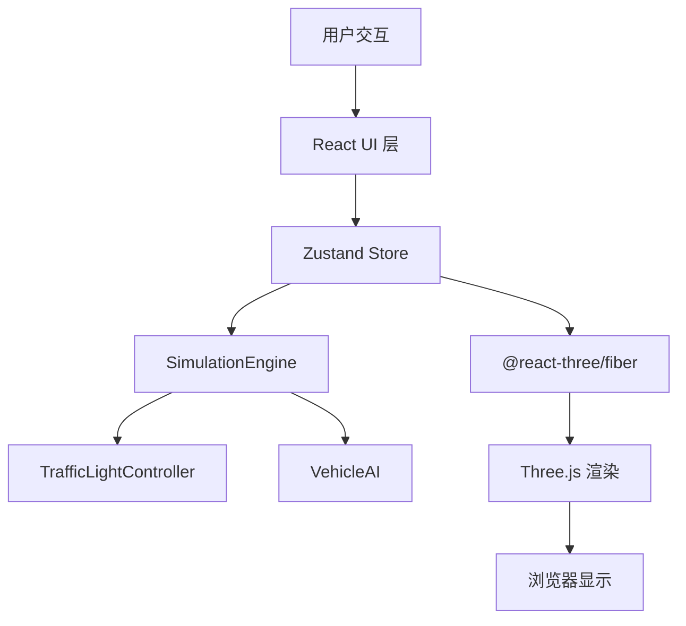
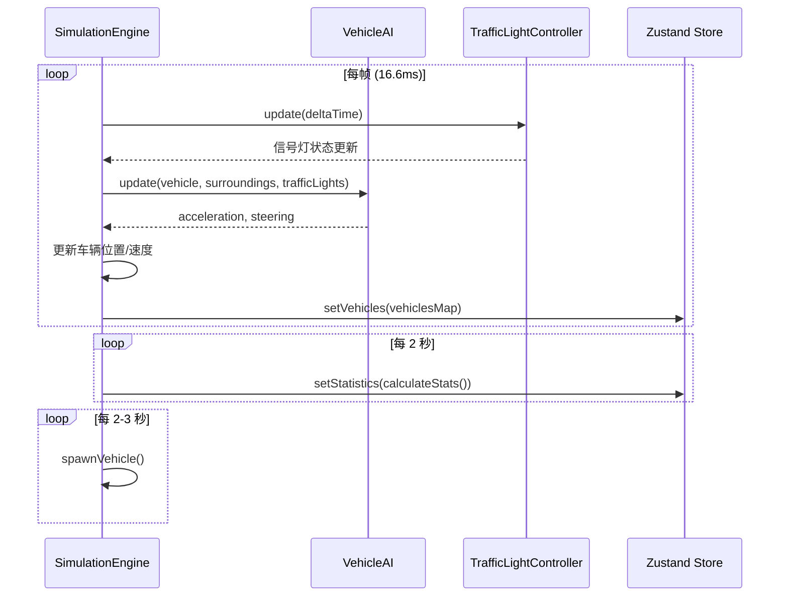

# CityFlow 3D 交通流模拟器 - 技术架构文档

## 1. 技术选型

| 技术 | 版本 | 用途 |
|------|------|------|
| TypeScript | - | 类型安全的开发语言 |
| React | 18 | UI 框架 |
| Three.js | 0.160 | 3D 渲染引擎 |
| @react-three/fiber | 8 | React 封装的 Three.js 渲染器 |
| @react-three/drei | 9 | Three.js 辅助组件库 |
| Zustand | 4 | 轻量级状态管理 |
| Vite | - | 构建工具 |
| uuid | - | 唯一 ID 生成 |

---

## 2. 项目结构

```
auto111/
├── package.json
├── vite.config.js
├── tsconfig.json
├── index.html
└── src/
    ├── App.tsx                    # 主应用组件
    ├── engine/
    │   ├── types.ts               # 类型定义
    │   ├── TrafficLightController.ts  # 信号灯控制器
    │   ├── VehicleAI.ts           # 车辆 AI 驾驶逻辑
    │   └── SimulationEngine.ts    # 核心模拟引擎
    ├── components/
    │   ├── Scene.tsx              # 3D 场景组件
    │   ├── CityGrid.tsx           # 道路网格组件
    │   └── ControlPanel.tsx       # 控制面板组件
    └── store/
        └── useSimulationStore.ts  # Zustand 状态管理
```

---

## 3. 系统架构

### 3.1 架构总览



### 3.2 分层设计

1. **UI 层**（React 组件）
   - `App.tsx`：主组件，整合 3D 场景和控制面板
   - `ControlPanel.tsx`：右侧控制面板，提供用户交互
   - `Scene.tsx`：3D 场景容器
   - `CityGrid.tsx`：道路网格渲染

2. **状态层**（Zustand）
   - `useSimulationStore.ts`：全局状态管理
   - 存储车辆数据、统计数据、配置参数

3. **引擎层**（纯 TypeScript）
   - `SimulationEngine.ts`：核心模拟引擎，协调各模块
   - `TrafficLightController.ts`：信号灯相位控制
   - `VehicleAI.ts`：车辆驾驶逻辑
   - `types.ts`：所有类型定义

4. **渲染层**（Three.js）
   - 基于 `@react-three/fiber` 声明式渲染
   - `@react-three/drei` 提供 OrbitControls 等辅助组件

---

## 4. 核心数据结构

### 4.1 类型定义（types.ts）

```typescript
// 车辆状态
interface VehicleState {
  id: string;
  position: { x: number; z: number };
  rotation: number; // 绕 Y 轴旋转角度
  speed: number; // m/s
  targetSpeed: number; // m/s
  color: string;
  currentLane: LaneId;
  targetIntersection: IntersectionId;
  nextTurn: 'left' | 'right' | 'straight';
  turnIndicatorActive: boolean;
  turnIndicatorTimer: number;
  waitingTime: number;
  isWaiting: boolean;
}

// 路口状态
interface IntersectionState {
  id: string;
  gridX: number;
  gridZ: number;
  centerX: number;
  centerZ: number;
  trafficLight: TrafficLightState;
  waitingVehicles: Set<string>;
}

// 信号灯相位
type TrafficLightPhase = 'GREEN_EW' | 'YELLOW_EW' | 'GREEN_NS' | 'YELLOW_NS';

// 信号灯状态
interface TrafficLightState {
  phase: TrafficLightPhase;
  timeRemaining: number;
  eastWest: { red: boolean; yellow: boolean; green: boolean };
  northSouth: { red: boolean; yellow: boolean; green: boolean };
}

// 道路网格配置
interface GridConfig {
  sizeX: number; // 横向路口数
  sizeZ: number; // 纵向路口数
  roadLength: number;
  roadWidth: number;
  intersectionSize: number;
}

// 统计数据
interface Statistics {
  totalVehicles: number;
  averageSpeed: number; // km/h
  congestionIndex: number; // 0-1
  averageWaitingTime: number; // seconds
}
```

### 4.2 状态流



---

## 5. 核心模块设计

### 5.1 SimulationEngine

**职责**：
- 管理整个模拟的生命周期
- 协调车辆生成、物理更新、AI 决策
- 维护车辆状态 Map
- 计算统计数据

**核心方法**：
```typescript
class SimulationEngine {
  vehicles: Map<string, VehicleState>;
  intersections: Map<string, IntersectionState>;
  gridConfig: GridConfig;
  trafficLightController: TrafficLightController;

  update(deltaTime: number): void;
  spawnVehicle(): void;
  calculateStatistics(): Statistics;
}
```

### 5.2 TrafficLightController

**职责**：
- 管理每个路口的信号灯相位切换
- 处理黄灯闪烁逻辑（2Hz）
- 响应绿灯时长配置变更

**核心方法**：
```typescript
class TrafficLightController {
  greenDuration: number;
  yellowDuration: number = 3;

  update(deltaTime: number): void;
  getLightState(intersectionId: string): TrafficLightState;
  setGreenDuration(seconds: number): void;
}
```

### 5.3 VehicleAI

**职责**：
- 跟车模型：检测前方 5 米内车辆，调整速度
- 信号灯响应：红灯停车、绿灯启动
- 速度控制：加速、减速逻辑
- 转向决策：路口转向指示

**核心方法**：
```typescript
class VehicleAI {
  static calculateAcceleration(
    vehicle: VehicleState,
    surroundingVehicles: VehicleState[],
    trafficLight: TrafficLightState,
    distanceToStopLine: number
  ): number;

  static checkTurnIndicator(
    vehicle: VehicleState,
    distanceToIntersection: number
  ): boolean;
}
```

### 5.4 Zustand Store

**职责**：
- 存储所有可序列化状态
- 提供状态更新方法
- 连接引擎层和 UI 层

**核心状态**：
```typescript
interface SimulationState {
  vehicles: VehicleState[];
  statistics: Statistics;
  greenDuration: number;
  gridConfig: GridConfig;
  lodEnabled: boolean;
  followedVehicleId: string | null;
  actions: {
    setGreenDuration: (n: number) => void;
    regenerateGrid: () => void;
    followVehicle: (id: string | null) => void;
  };
}
```

---

## 6. 渲染层设计

### 6.1 Scene 组件

- 使用 `<Canvas>` 作为 Three.js 渲染入口
- 配置相机（透视相机，初始俯视角）
- 配置光照（环境光 + 方向光 + 路灯光源）
- 使用 `OrbitControls` 实现视角控制
- 集成 `CityGrid`、车辆、信号灯组件

### 6.2 CityGrid 组件

**生成逻辑**：
1. 根据 `gridConfig` 计算每个路口和道路的位置
2. 生成道路平面（BoxGeometry）
3. 生成车道线（虚线，使用多个小长方体）
4. 生成人行道
5. 生成路口中央交通岛（圆柱体）
6. 生成路灯（每 20 米一个）

### 6.3 车辆组件

**渲染细节**：
- LOD 模式：>200 辆车且距离 >100 米时使用简化模型
- 完整模型：车身 + 4 个车轮 + 车灯 + 转向灯
- 简化模型：仅长方体车身
- 转向灯光：0.3×0.3 米，淡黄色，闪烁效果

### 6.4 信号灯组件

**渲染细节**：
- 灯杆（圆柱体，高 4 米）
- 横杆（圆柱体，长 2 米）
- 三个灯头（球体，直径 0.4 米）
- 亮灯时添加 PointLight（强度 0.3，范围 5 米）

---

## 7. 交互控制

### 7.1 视角控制

使用 `@react-three/drei` 的 `OrbitControls`：
- 左键拖拽：旋转（polarAngle: 0-90°, azimuthAngle: 0-360°）
- 右键拖拽：平移
- 滚轮：缩放（距离 10-200 米）

### 7.2 车辆跟随模式

**实现流程**：
1. 点击车辆时触发 `onClick` 事件
2. 记录 `followedVehicleId` 到 Store
3. `Scene` 组件监听此状态变化
4. 使用 `useFrame` 实现 1.5 秒平滑过渡
5. 过渡曲线：`easeInOutCubic`
6. 跟随模式下：
   - 相机位置 = 车辆位置 + 后方偏移 + 上方偏移
   - 相机看向 = 车辆前方一点
   - 按 Esc 退出跟随模式

---

## 8. 性能优化

### 8.1 LOD（Level of Detail）

- 触发条件：`vehicles.length > 200`
- 判断逻辑：每帧计算车辆与相机的距离
- 距离 > 100 米：使用简化模型（`BoxGeometry`）
- 距离 ≤ 100 米：使用完整模型

### 8.2 帧率优化

- 物理更新：60FPS，使用 `requestAnimationFrame`
- 统计更新：2 秒一次，避免频繁计算
- 状态更新：仅在必要时更新 Zustand Store
- 使用 `useMemo` 和 `React.memo` 避免不必要的重渲染

### 8.3 Three.js 优化

- 复用几何体和材质
- 使用 `InstancedMesh` 渲染大量重复物体（路灯、车道线）
- 合理设置 `far` 裁剪面
- 开启阴影时使用适当的阴影贴图分辨率

---

## 9. 构建与部署

### 9.1 Vite 配置

```javascript
import { defineConfig } from 'vite';
import react from '@vitejs/plugin-react';

export default defineConfig({
  plugins: [react()],
  server: {
    port: 5173,
    open: true
  }
});
```

### 9.2 TypeScript 配置

- `target: ES2020`
- `module: ESNext`
- 严格模式：`strict: true`
- JSX: `react-jsx`

---

## 10. 关键算法

### 10.1 跟车模型（Gipps 模型简化版）

```
desired_speed = min(target_speed, speed_of_front_vehicle)
if distance < 5m:
  acceleration = (desired_speed - current_speed) / reaction_time
else:
  acceleration = (target_speed - current_speed) / acceleration_time
```

### 10.2 车辆路径规划

- 生成车辆时随机选择起点和终点
- 路径由一系列路口连接
- 到达路口时随机选择下一方向（直行/左转/右转）
- 根据方向切换车道

### 10.3 信号灯相位切换

```
cycle_duration = greenDuration * 2 + yellowDuration * 2
phase_order = [GREEN_EW, YELLOW_EW, GREEN_NS, YELLOW_NS]
phase_durations = [greenDuration, yellowDuration, greenDuration, yellowDuration]
```

### 10.4 平滑过渡曲线（easeInOutCubic）

```
function easeInOutCubic(t: number): number {
  return t < 0.5 ? 4*t*t*t : 1 - Math.pow(-2*t + 2, 3) / 2;
}
```
