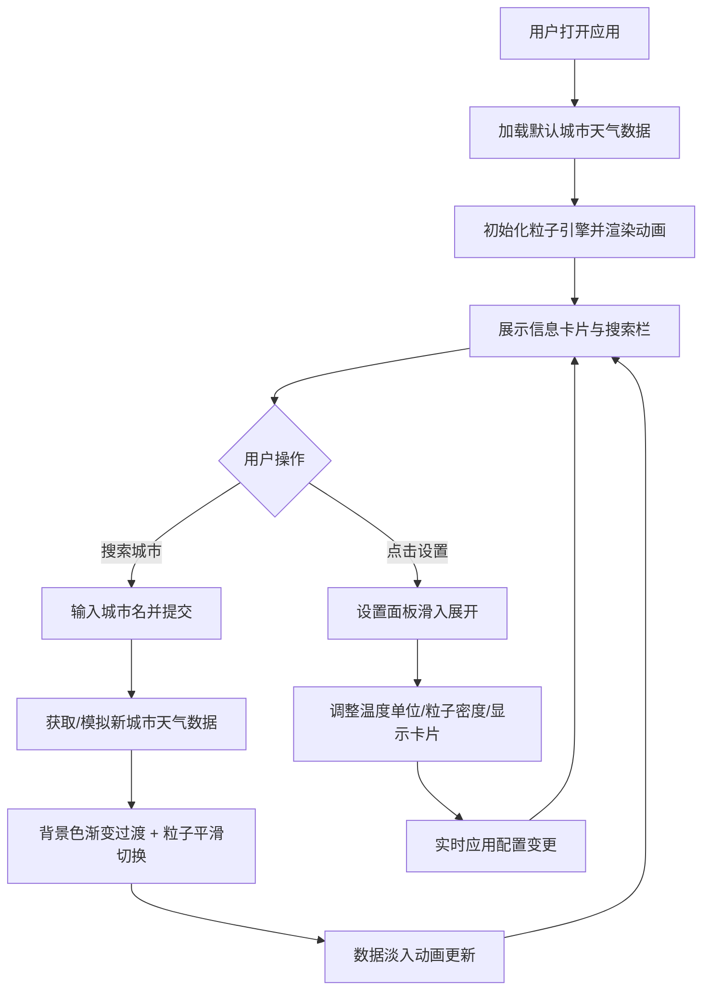

## 1. 产品概述
WeatherCanvas是一款浏览器端动态天气可视化应用，将实时天气数据转化为生动的粒子动画背景与简洁的数据面板，为用户提供沉浸式的天气信息展示体验。
- 主要目的：通过粒子动画和视觉化设计，让天气数据更直观、更具观赏性
- 目标用户：追求视觉体验的天气信息使用者、设计师与开发者
- 产品价值：将枯燥的天气数据转化为艺术化的可视化体验，兼具实用性与美感

## 2. 核心功能

### 2.1 功能模块
1. **主画布页面**：全屏粒子动画背景、动态天气背景色、信息卡片叠加层
2. **搜索与设置模块**：城市搜索栏、设置面板、粒子与单位配置

### 2.2 页面详情
| 页面名称 | 模块名称 | 功能描述 |
|-----------|-------------|---------------------|
| 主页面 | 粒子画布 | 根据天气类型（晴/多云/雨/雪）渲染对应粒子效果，背景色动态渐变切换，60fps流畅动画 |
| 主页面 | 信息卡片 | 右下角半透明毛玻璃卡片，展示城市名、温度、天气图标、湿度、风速、降水概率及迷你进度条 |
| 主页面 | 搜索栏 | 顶部居中搜索框+圆形搜索按钮，输入城市名切换天气，带淡入过渡动画 |
| 主页面 | 设置面板 | 右上角齿轮图标触发，右侧/底部滑入，温度单位、粒子密度、卡片显示开关 |

## 3. 核心流程
用户进入应用后，默认展示模拟城市的天气粒子动画；在搜索栏输入城市名并点击搜索，界面淡入切换至新城市天气，同时粒子系统平滑过渡；点击右上角齿轮图标展开设置面板，可调整温度单位、粒子密度及是否显示数据卡片。

## 4. 用户界面设计

### 4.1 设计风格
- **主色调**：动态背景色根据天气变化——晴天#87CEEB（天蓝）、多云#A9A9A9（暗灰）、雨天#4A4A4A（深灰）、雪天#E0E0E0（浅白灰）
- **强调色**：搜索按钮#4A90D9，悬停#357ABD；开关滑块#6C63FF，关闭态#555
- **文字色**：温度#FFFFFF，卡片文字白色系
- **按钮风格**：搜索按钮圆形（直径40px），设置齿轮32x32
- **字体**：使用现代无衬线字体，温度32px大号显示，天气图标64x64（emoji或SVG）
- **布局风格**：全屏沉浸式画布，浮动UI层，卡片式信息展示，毛玻璃效果（backdrop-filter: blur(10px)）
- **动画**：背景色1.5s渐变过渡，搜索切换0.5s ease-out淡入，设置面板0.4s cubic-bezier滑入，齿轮悬停90度旋转（0.3s）

### 4.2 页面设计概述
| 页面名称 | 模块名称 | UI元素 |
|-----------|-------------|-------------|
| 主页面 | 粒子画布 | 全屏Canvas，动态背景色渐变，粒子2-6px随机大小，晴500金点/雨800蓝线/雪600白六边形，60fps流畅渲染 |
| 主页面 | 信息卡片 | 右下角320px宽，圆角16px，rgba(0,0,0,0.6)背景+毛玻璃，24px内边距，温度32px白色大号字，数据项配主题色迷你进度条 |
| 主页面 | 搜索栏 | 顶部居中300x40px，圆角20px，半透明白背景+边框，聚焦2px白边（0.3s过渡），圆形蓝色搜索按钮内含白色箭头 |
| 主页面 | 设置面板 | 从右/底部滑入，rgba(30,30,50,0.9)深色背景，圆角边缘，三个圆形滑块开关配标签说明 |

### 4.3 响应式设计
采用桌面优先设计，移动端自适应：
- **<768px屏幕**：数据卡片移至底部全宽，圆角顶部12px；搜索栏宽度80%；设置面板改为从底部滑入（高60%，宽100%）
- **触控优化**：按钮最小点击区域40x40px，搜索按钮与齿轮图标易于触控
