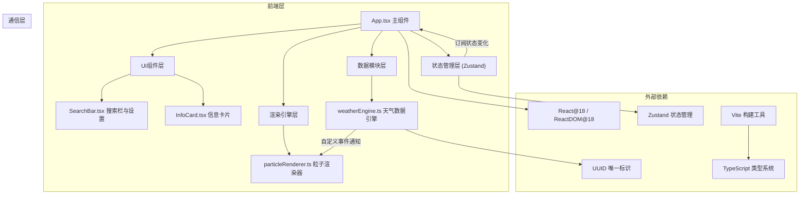

## 1. 架构设计



## 2. 技术说明
- **前端框架**：React@18 + ReactDOM@18
- **构建工具**：Vite（含@vitejs/plugin-react插件）
- **语言**：TypeScript（严格模式，target ES2020）
- **状态管理**：Zustand（轻量级全局状态）
- **渲染技术**：Canvas 2D API（纯原生，无第三方库）
- **样式方案**：原生CSS + CSS变量 + 响应式媒体查询
- **通信机制**：自定义事件（CustomEvent）实现模块间解耦通信
- **模拟数据**：内置城市天气模拟生成器，无需真实API

## 3. 项目文件结构
```
WeatherCanvas/
├── package.json          # 依赖与脚本配置
├── vite.config.js        # Vite构建配置
├── tsconfig.json         # TypeScript配置
├── index.html            # 入口HTML（仅root挂载点）
└── src/
    ├── App.tsx           # 主组件，协调模块与全局状态
    ├── weatherEngine.ts  # 天气数据模块：类型定义、模拟数据、事件触发
    ├── particleRenderer.ts # 渲染模块：粒子类、Canvas绘制、动画循环
    ├── components/
    │   ├── InfoCard.tsx  # 天气数据展示卡片组件
    │   └── SearchBar.tsx # 搜索栏与设置面板组件
    └── styles.css        # 全局样式、CSS变量、响应式规则
```

## 4. 核心模块接口定义

### 4.1 天气类型定义
```typescript
type WeatherType = 'sunny' | 'cloudy' | 'rainy' | 'snowy';

interface WeatherData {
  city: string;
  type: WeatherType;
  temperatureC: number;      // 摄氏度
  temperatureF: number;      // 华氏度
  humidity: number;          // 0-100
  windSpeed: number;         // km/h
  precipitationChance: number; // 0-100
  icon: string;              // emoji图标
}
```

### 4.2 粒子配置映射
| 天气类型 | 粒子数量 | 粒子形态 | 颜色 | 运动方式 |
|---------|---------|---------|------|---------|
| sunny | 500 | 圆形光点 | 金色系 | 缓慢飘动 |
| cloudy | 300 | 圆形雾点 | 灰白系 | 水平漂移 |
| rainy | 800 | 下落线条 | 蓝色系 | 垂直下落 |
| snowy | 600 | 六边形 | 白色系 | 缓慢飘落+摆动 |

### 4.3 全局状态（Zustand Store）
```typescript
interface AppState {
  weather: WeatherData | null;
  isLoading: boolean;
  // 设置
  useCelsius: boolean;       // true=摄氏，false=华氏
  particleDensity: 'low' | 'medium' | 'high'; // 密度系数
  showInfoCard: boolean;     // 是否显示信息卡片
  isSettingsOpen: boolean;   // 设置面板开关
  // 操作
  setWeather: (w: WeatherData) => void;
  setLoading: (v: boolean) => void;
  toggleTemperatureUnit: () => void;
  setParticleDensity: (d: 'low'|'medium'|'high') => void;
  toggleInfoCard: () => void;
  toggleSettings: () => void;
  searchCity: (name: string) => void;
}
```

### 4.4 模块间自定义事件
- **'weather:update'**：天气数据更新时触发，携带WeatherData payload
- **'settings:change'**：设置变更时触发，携带粒子密度等配置

## 5. 性能优化策略
1. **Canvas渲染优化**：使用requestAnimationFrame驱动60fps循环，单Canvas上下文
2. **粒子池化**：粒子对象复用，避免频繁GC
3. **离屏计算**：粒子位置更新与绘制分离计算
4. **响应式Canvas**：DPR适配（devicePixelRatio），避免高分屏模糊与过度绘制
5. **CSS硬件加速**：面板滑入、过渡动画使用transform/opacity触发GPU合成
6. **状态最小化订阅**：Zustand选择器精确订阅，避免不必要重渲染
