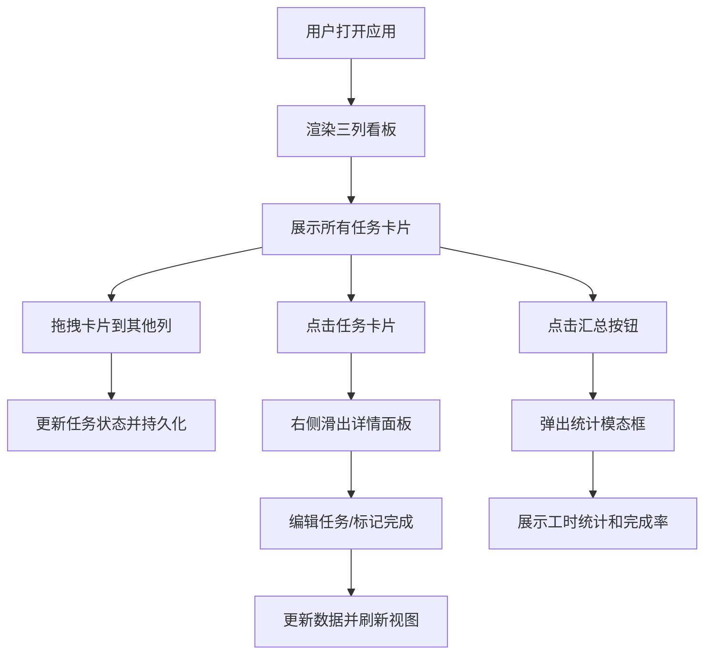

## 1. 产品概述

PlanifLow 是一款轻量级看板任务管理应用，帮助个人或小团队以可视化方式管理任务进度，提供自动化到期提醒和简单工时统计功能。

- 核心价值：将复杂任务管理简化为直观的看板拖拽操作，兼顾任务进度追踪与工时效率分析
- 目标用户：自由职业者、小型创业团队、学生项目组

## 2. 核心功能

### 2.1 功能模块

1. **看板主界面**：三列任务看板、拖拽排序、任务卡片展示
2. **任务详情面板**：任务详情展示、日期选择、任务状态更新
3. **工时统计**：预估/实际工时展示、汇总统计模态框、完成率计算

### 2.2 页面详情

| 页面名称 | 模块名称 | 功能描述 |
|----------|----------|----------|
| 看板主页 | 三列看板 | 待办/进行中/已完成三列布局，列宽均分，支持列间拖拽移动任务 |
| 看板主页 | 任务卡片 | 显示任务标题、到期标记、预估/实际工时，支持拖拽和点击展开 |
| 看板主页 | 汇总按钮 | 点击弹出模态框展示总预估工时、总实际工时、完成率 |
| 详情面板 | 任务详情 | 右侧滑入面板，显示任务名、描述、创建时间、到期时间、完成按钮 |

## 3. 核心流程

## 4. 用户界面设计

### 4.1 设计风格

- **主色调**：#6C63FF（紫色主题色）、#5A52D5（悬停态）
- **背景色**：#F5F5FA（整体浅色背景）、#FFFFFF（卡片背景）、#F0F0F5（列头背景）、#1E1E2E（详情面板深色背景）
- **标记色**：#FF8C00（到期前橙色）、红色（过期闪烁）
- **文字颜色**：#333（主要文字）、白色（深色面板文字）
- **圆角规范**：卡片 8px、列头 8px 8px 0 0、详情面板 12px 0 0 12px、模态框 16px、按钮圆角矩形
- **阴影规范**：卡片 0 1px 3px rgba(0,0,0,0.12)、拖拽中 0 4px 16px rgba(108,99,255,0.3)、模态框 0 8px 32px rgba(0,0,0,0.2)
- **过渡动画**：0.2s ease（通用）、0.3s cubic-bezier(0.4, 0, 0.2, 1)（详情面板）
- **字体**：14px 加粗（列头）

### 4.2 页面设计概览

| 页面名称 | 模块名称 | UI 元素 |
|----------|----------|---------|
| 看板主页 | 三列布局 | 列宽均分、最小 280px、间距 16px、桌面三列、移动端单列 |
| 看板主页 | 任务卡片 | 宽 100%、内边距 12px、下边距 8px、拖拽时旋转 3° 放大 1.02 倍 |
| 看板主页 | 到期标记 | 左上角 8px 圆点、到期前橙色、过期红色闪烁动画（1s opacity 0.3-1 无限循环） |
| 看板主页 | 汇总按钮 | 宽 100px、高 36px、紫色背景白字、悬停变深紫 |
| 详情面板 | 滑入面板 | 宽 320px、深色背景白字、从右侧滑入 |
| 统计模态框 | 弹窗 | 宽 500px、居中显示、展示统计数字 |

### 4.3 响应式

- **桌面端**（≥768px）：三列横向并排布局
- **移动端**（<768px）：单列纵向排列，每列占满宽度，卡片自适应

### 4.4 性能要求

- 首次加载：1 秒内完成渲染
- 拖拽响应：延迟不超过 50ms
