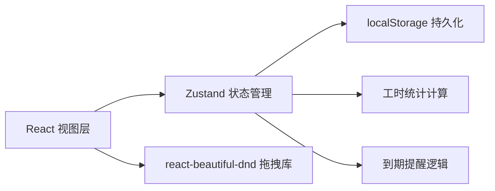
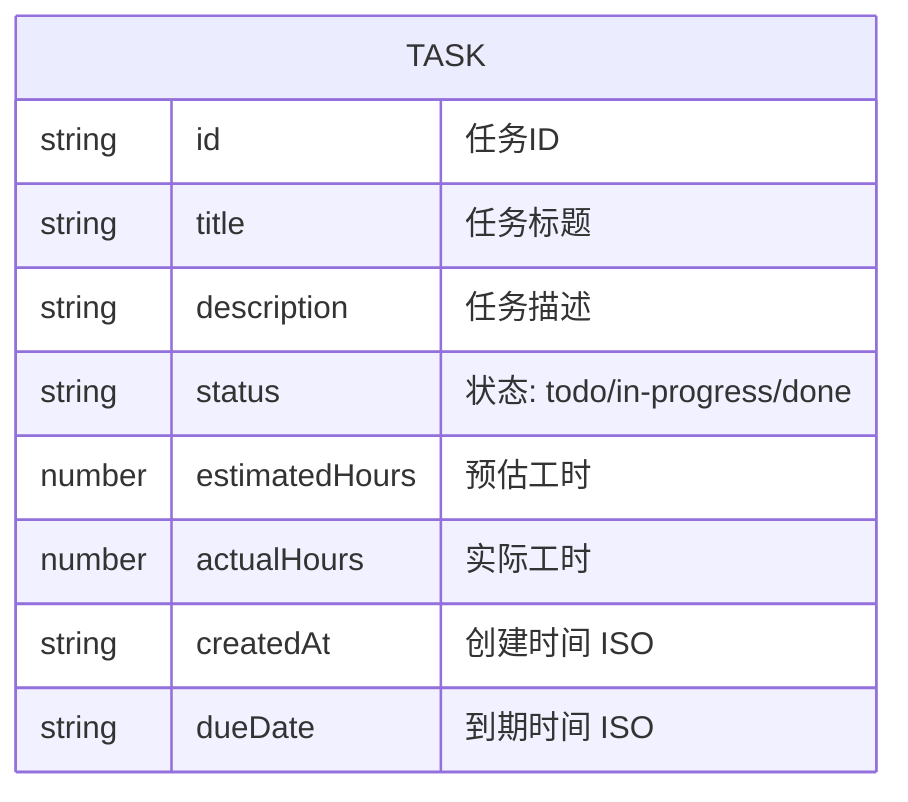

## 1. 架构设计



## 2. 技术说明

- **前端框架**：React@18 + TypeScript
- **构建工具**：Vite
- **状态管理**：Zustand
- **拖拽库**：react-beautiful-dnd
- **ID 生成**：uuid
- **数据持久化**：localStorage（纯前端模拟）
- **样式方案**：CSS Modules / 内联样式（遵循设计规范）

## 3. 路由定义

| 路由 | 用途 |
|------|------|
| / | 看板主页面（唯一页面） |

## 4. 数据模型

### 4.1 数据模型定义



### 4.2 TypeScript 类型定义

```typescript
type TaskStatus = 'todo' | 'in-progress' | 'done';

interface Task {
  id: string;
  title: string;
  description: string;
  status: TaskStatus;
  estimatedHours: number;
  actualHours: number;
  createdAt: string;
  dueDate: string | null;
}

interface TaskStatistics {
  totalEstimatedHours: number;
  totalActualHours: number;
  completionRate: number;
  totalTasks: number;
  completedTasks: number;
}
```

## 5. 文件结构

```
src/
├── App.tsx                    # 主应用入口
├── components/
│   ├── KanbanBoard.tsx        # 三列看板组件
│   ├── TaskCard.tsx           # 任务卡片组件
│   └── Modal.tsx              # 汇总模态框组件
├── data/
│   └── taskStore.ts           # Zustand 状态管理
└── index.css                  # 全局样式
```

## 6. Zustand Store 方法

| 方法名 | 参数 | 用途 |
|--------|------|------|
| addTask | task: Partial<Task> | 添加新任务 |
| moveTask | taskId, newStatus, newIndex | 移动任务到新列/新位置 |
| updateTask | taskId, updates: Partial<Task> | 更新任务信息 |
| deleteTask | taskId | 删除任务 |
| completeTask | taskId | 标记任务完成 |
| getStatistics | - | 计算并返回工时统计 |
