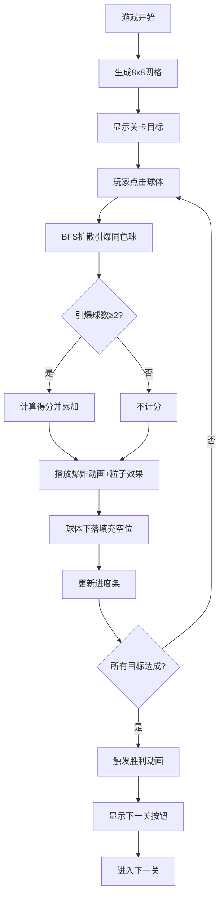

## 1. 产品概述

ChainReactor 是一款连锁爆炸解谜游戏，玩家在8×8网格棋盘上点击能量球引爆，通过BFS扩散消除相邻同色球体，目标是完成每关指定颜色球的引爆数量。面向休闲益智游戏玩家，强调策略性点击和视觉冲击力。

## 2. 核心功能

### 2.1 功能模块
1. **游戏主界面**: 8×8网格棋盘、得分状态栏、操作面板
2. **关卡系统**: 多关卡递进，每关不同颜色引爆目标

### 2.2 页面详情
| 页面名称 | 模块名称 | 功能描述 |
|----------|----------|----------|
| 游戏主界面 | 网格棋盘 | 渲染8×8彩色能量球，支持点击引爆、爆炸动画、下落填充 |
| 游戏主界面 | 状态栏 | 显示当前得分，背景#2C3E50，白色加粗文字 |
| 游戏主界面 | 操作面板 | 各颜色进度条、得分统计、下一关按钮 |
| 游戏主界面 | 胜利动画 | 棋盘闪烁、胜利文字、下一关按钮出现 |

## 3. 核心流程

玩家打开游戏 → 查看关卡目标（各颜色引爆数量） → 点击棋盘上的球体 → 触发BFS连锁爆炸（相邻同色球体依次引爆） → 计算得分（2球10分，3球25分，4球50分，递增） → 球体消失后上方球体下落填充 → 更新进度条 → 判断是否达成所有目标 → 达成则触发胜利动画并解锁下一关

## 4. 用户界面设计

### 4.1 设计风格
- 主色调：深色背景#1A1A2E，状态栏#2C3E50，强调色#00D2D3
- 球体颜色：红#FF4757、绿#2ED573、蓝#3742FA、黄#FFA502、紫#A29BFE
- 球体圆形50%圆角，带内阴影inset 0 2px 4px rgba(0,0,0,0.3)
- 网格线1px solid #2C3E50，格子最小40×40px
- 按钮圆角矩形，hover缩放1.05，active反馈

### 4.2 页面设计概览
| 页面名称 | 模块名称 | UI元素 |
|----------|----------|--------|
| 游戏主界面 | 网格棋盘 | 深色背景居中，8×8彩色圆形球体，网格线#2C3E50，自适应尺寸 |
| 游戏主界面 | 状态栏 | 顶部#2C3E50背景，圆角8px，白色18px加粗文字显示得分 |
| 游戏主界面 | 操作面板 | 右侧面板，各颜色进度条（20px高，实心/空心2px边框），得分统计 |
| 游戏主界面 | 爆炸动画 | CSS关键帧：缩放1.2倍→消失，冲击波0.4s扩散，粒子飞溅0.5s |
| 游戏主界面 | 下落动画 | 0.3s ease-in下落填充 |
| 游戏主界面 | 胜利动画 | 背景闪烁3次（#1A1A2E↔#00D2D3），白色48px加粗文字+外发光，下一关按钮 |

### 4.3 响应式
- 桌面优先设计，棋盘居中，左右留白
- 移动端：棋盘缩小，状态栏和操作面板堆叠显示
- 格子最小40×40px，随窗口自适应

### 4.4 动画规格
- 爆炸动画：球体缩放1.2→消失，冲击波0.4s（透明度0.6→0，半径0→50px）
- 粒子效果：6个彩色小点向各方向飞散，持续0.5s
- 下落动画：0.3s ease-in
- 进度条动画：蛇形更新0.3s
- 胜利闪烁：3次，每次0.3s
