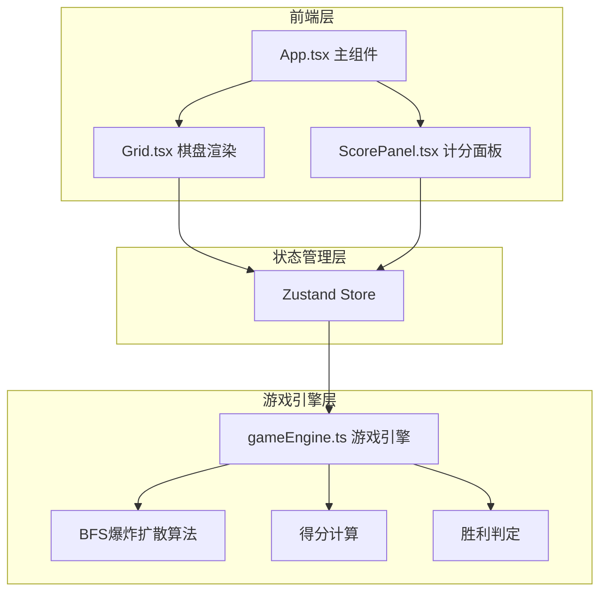

## 1. 架构设计



## 2. 技术说明
- 前端：React@18 + TypeScript + Vite
- 状态管理：Zustand
- 样式：CSS-in-JS（内联样式 + CSS关键帧动画）
- 初始化工具：vite-init（react-ts模板）
- 后端：无
- 数据库：无

## 3. 路由定义
| 路由 | 用途 |
|------|------|
| / | 游戏主界面（单页应用，无路由） |

## 4. 数据流

用户点击球体 → Grid组件捕获点击坐标 → Zustand Store调用gameEngine处理 → BFS扩散计算引爆链 → 更新网格状态/得分/进度 → Store通知UI更新 → Grid重新渲染（含动画） → ScorePanel更新得分和进度

## 5. 核心模块设计

### 5.1 gameEngine.ts
- `createGrid(rows, cols)`: 生成8×8随机颜色网格
- `triggerExplosion(grid, row, col)`: 点击引爆，BFS扩散同色球
- `applyGravity(grid)`: 球体下落填充空位
- `calculateScore(explodedCount)`: 得分计算（2→10, 3→25, 4→50, n→n*(n-1)*5/2近似）
- `checkWin(targets, progress)`: 胜利判定
- `generateLevel(level)`: 关卡目标生成

### 5.2 Zustand Store
```typescript
interface GameState {
  grid: Cell[][]
  score: number
  level: number
  targets: ColorTarget[]
  progress: Record<string, number>
  isAnimating: boolean
  isWin: boolean
  explodedCells: Set<string>
  triggerExplosion: (row: number, col: number) => void
  nextLevel: () => void
  resetGame: () => void
}
```

### 5.3 动画系统
- CSS @keyframes：爆炸缩放、冲击波扩散、下落、闪烁
- 粒子效果：DOM元素 + CSS动画，6个方向飞散
- 动画状态通过Store管理，防止动画期间重复点击

## 6. 文件结构
```
├── package.json
├── vite.config.js
├── tsconfig.json
├── index.html
└── src/
    ├── App.tsx
    ├── gameEngine.ts
    ├── Grid.tsx
    └── ScorePanel.tsx
```
