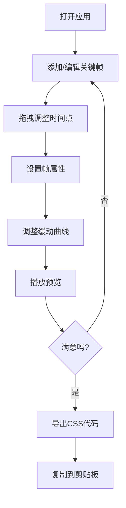

## 1. 产品概述
KeyframePlayground 是一个面向前端开发者的CSS动画可视化编辑器，让用户能够快速预览和调试CSS动画。通过可视化编辑关键帧、缓动函数和触发方式，开发者可以实时查看动画效果并导出可用的CSS代码。

- 主要用途：帮助前端开发者快速创建、调试和导出CSS动画
- 解决问题：传统CSS动画编写需要反复试错，缺乏直观的可视化编辑工具
- 目标用户：前端开发者、UI设计师、动画设计师
- 产品价值：提升CSS动画开发效率，降低学习曲线，即时预览效果

## 2. 核心功能

### 2.1 功能模块
1. **动画预览区**：实时展示动画效果，支持播放/暂停/重置/速度控制
2. **时间轴编辑器**：可视化管理关键帧序列，支持添加/删除/拖拽
3. **缓动曲线编辑器**：通过贝塞尔控制点编辑cubic-bezier缓动函数
4. **属性面板**：编辑选中关键帧的CSS属性（transform、opacity、background-color等）
5. **代码导出功能**：生成完整CSS @keyframes规则并支持一键复制

### 2.2 页面详情
| 页面名称 | 模块名称 | 功能描述 |
|-----------|-------------|---------------------|
| 主界面 | 动画预览区 | 展示预览对象，播放/暂停/重置控制，进度条显示 |
| 主界面 | 时间轴编辑器 | 关键帧可视化管理，支持添加、删除、拖拽调整时间点 |
| 主界面 | 缓动曲线编辑器 | 贝塞尔曲线控制点拖拽编辑，实时预览缓动效果 |
| 主界面 | 属性面板 | 编辑选中关键帧的transform、opacity、background-color属性 |
| 主界面 | 代码导出弹窗 | 生成完整CSS代码，支持一键复制到剪贴板 |

## 3. 核心流程

**主要用户流程：**
用户打开应用 → 在时间轴上添加/编辑关键帧 → 拖拽调整关键帧位置 → 在属性面板设置帧属性 → 在曲线编辑器调整缓动 → 点击播放预览效果 → 满意后导出CSS代码 → 复制代码使用

## 4. 用户界面设计

### 4.1 设计风格
- **主色调**：紫色(#6C63FF) - 强调色
- **交互色**：红色(#FF6B6B) - 选中/交互状态
- **成功色**：绿色(#4CAF50) - 播放状态
- **背景色**：深色主题，主背景#121220，面板#1E1E2E，预览区#2B2B3D
- **文字颜色**：#E0E0E0（浅灰色）
- **按钮风格**：圆角8px为主，有悬停过渡效果（0.2s ease-out）
- **字体**：系统默认sans-serif字体
- **布局风格**：左右分栏（桌面端），上下堆叠（移动端）
- **图标风格**：简洁线性图标，使用lucide-react

### 4.2 页面设计概述
| 页面名称 | 模块名称 | UI元素 |
|-----------|-------------|-------------|
| 主界面 | 动画预览区 | 深色背景(#2B2B3D)、200x200预览矩形、播放/暂停/重置按钮、进度条、速度控制 |
| 主界面 | 时间轴编辑器 | 40个刻度线、40x20px关键帧色块(圆角4px)、选中时2px红色边框、拖拽时显示时间标签 |
| 主界面 | 缓动曲线编辑器 | 200x200坐标系、网格线、2个可拖拽控制点(圆形半径6px)、cubic-bezier数值显示 |
| 主界面 | 属性面板 | 宽260px深色面板(#1E1E2E)、圆角8px、transform选择器、opacity滑块、颜色选择器 |
| 主界面 | 代码导出弹窗 | 全屏半透明遮罩、600x400对话框、等宽字体代码区、复制按钮 |

### 4.3 响应式
- **桌面端**（≥1024px）：左右分栏布局，左侧预览区占2/3，右侧编辑器占1/3
- **移动端**（<1024px）：上下堆叠布局，预览区在上占60vh，编辑器区在下
- 所有文字和控件大小随屏幕缩放保持合理比例
- 触屏设备优化拖拽交互
