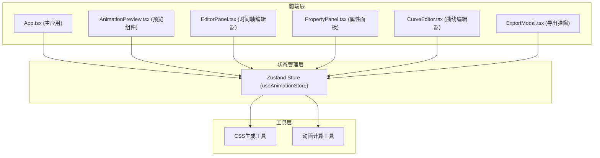

## 1. 架构设计



**数据流向：**
1. 用户操作各组件 → 组件调用Store的action方法
2. Store更新状态 → 所有订阅组件自动重新渲染
3. AnimationPreview 从Store读取配置 → 生成CSS样式 → 渲染预览
4. 导出功能从Store读取所有配置 → 生成CSS代码字符串

## 2. 技术描述

- **前端框架**：React@18 + TypeScript
- **构建工具**：Vite
- **状态管理**：Zustand
- **唯一ID生成**：uuid
- **动画实现**：纯CSS animation和transition（不使用第三方动画库）
- **初始化方式**：使用 vite-init 模板创建项目

## 3. 项目文件结构

```
d:\P\tasks\auto120/
├── index.html                          # 入口HTML页面
├── package.json                        # 项目依赖配置
├── vite.config.js                      # Vite构建配置
├── tsconfig.json                       # TypeScript配置
├── src/
│   ├── main.tsx                        # 应用入口
│   ├── App.tsx                         # 主应用组件
│   ├── index.css                       # 全局样式
│   ├── store/
│   │   └── useAnimationStore.ts        # Zustand状态管理
│   ├── components/
│   │   ├── AnimationPreview.tsx        # 动画预览组件
│   │   ├── EditorPanel.tsx             # 时间轴编辑器组件
│   │   ├── PropertyPanel.tsx           # 属性面板组件
│   │   ├── CurveEditor.tsx             # 缓动曲线编辑器
│   │   └── ExportModal.tsx             # 导出代码弹窗
│   ├── types/
│   │   └── animation.ts                # TypeScript类型定义
│   └── utils/
│       ├── cssGenerator.ts             # CSS代码生成工具
│       └── animationUtils.ts           # 动画相关计算工具
```

## 4. 数据模型

### 4.1 类型定义

```typescript
// 关键帧数据结构
interface Keyframe {
  id: string;
  time: number; // 0-4秒，精确到0.1秒
  transform: {
    translateX: number;
    translateY: number;
    rotate: number;
    scale: number;
  };
  opacity: number; // 0-1
  backgroundColor: string;
}

// 缓动曲线数据
interface EasingCurve {
  x1: number;
  y1: number;
  x2: number;
  y2: number;
}

// 动画配置
interface AnimationConfig {
  duration: number; // 总时长（秒）
  easing: EasingCurve;
  iterations: number | 'infinite';
}

// Store状态
interface AnimationState {
  keyframes: Keyframe[];
  selectedKeyframeId: string | null;
  isPlaying: boolean;
  currentTime: number;
  playbackSpeed: number;
  animationConfig: AnimationConfig;
  isExportModalOpen: boolean;
  
  // Actions
  addKeyframe: (time: number) => void;
  deleteKeyframe: (id: string) => void;
  updateKeyframe: (id: string, updates: Partial<Keyframe>) => void;
  selectKeyframe: (id: string | null) => void;
  setPlaying: (playing: boolean) => void;
  setCurrentTime: (time: number) => void;
  setPlaybackSpeed: (speed: number) => void;
  setEasing: (curve: EasingCurve) => void;
  setExportModalOpen: (open: boolean) => void;
  resetAnimation: () => void;
  generateCSS: () => string;
}
```

## 5. 关键实现说明

### 5.1 性能优化策略
- 使用Zustand的selector避免不必要的重渲染
- 拖拽操作使用requestAnimationFrame节流，确保<50ms响应延迟
- CSS动画使用transform和opacity（GPU加速属性）保证30FPS+帧率
- 代码生成使用字符串拼接而非模板引擎，确保<20ms生成时间

### 5.2 关键交互实现
- 关键帧拖拽：鼠标事件监听 + 位置映射计算（像素→时间）
- 贝塞尔曲线编辑：SVG路径渲染 + 控制点拖拽
- 时间轴刻度：0-4秒共40个刻度，每0.1秒一格
- 进度条：基于animation的currentTime实时更新

### 5.3 CSS代码生成
将关键帧数据转换为标准CSS @keyframes规则，包含：
- 动画名称（自定义）
- 每个关键帧的时间百分比
- transform、opacity、background-color属性
- animation属性（duration、timing-function、iteration-count）
