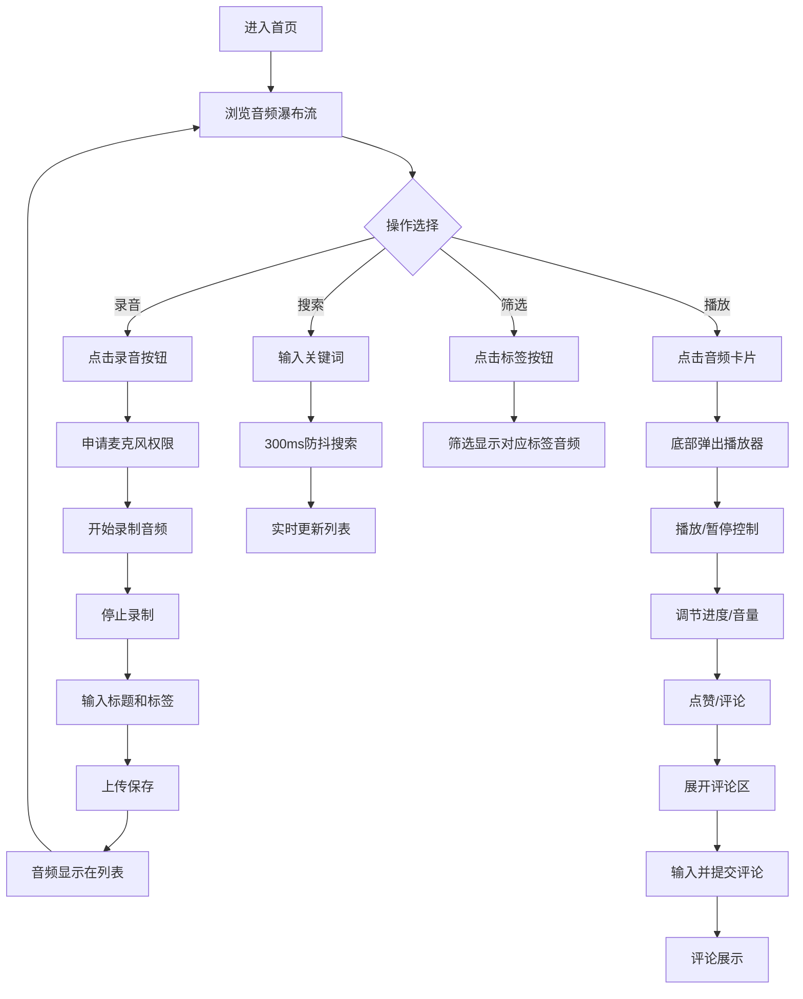

## 1. 产品概述
SoundScape是一个社交音频体验平台，让用户录制并分享环境音片段（如雨声、咖啡馆氛围、森林鸟鸣等），其他用户可以播放、评论并点赞这些音频。

- **核心目标**：打造一个专注于环境声音分享的社区平台，让用户通过声音连接世界
- **目标用户**：声音爱好者、冥想者、白噪音使用者、内容创作者
- **市场价值**：填补环境音频社交领域的空白，满足用户对沉浸式声音体验的需求

## 2. 核心功能

### 2.1 用户角色
| 角色 | 注册方式 | 核心权限 |
|------|---------|---------|
| 普通用户 | 无需注册（匿名） | 录制上传音频、播放音频、点赞、评论、搜索筛选 |

### 2.2 功能模块
1. **首页**：瀑布流音频列表、搜索栏、标签筛选、顶部导航
2. **音频录制上传**：麦克风录制、Web Audio API处理、标题标签输入
3. **音频播放器**：底部弹出播放器、播放控制、进度条、音量调节、点赞评论
4. **评论系统**：评论列表展示、评论输入、时间倒序排列

### 2.3 页面详情
| 页面名称 | 模块名称 | 功能描述 |
|---------|---------|---------|
| 首页 | 瀑布流音频列表 | 两列瀑布流布局，展示音频卡片，支持懒加载，响应式适配 |
| 首页 | 搜索与筛选 | 关键词搜索音频标题和标签，300ms防抖；标签按钮筛选分类 |
| 首页 | 录音按钮 | 固定悬浮按钮，点击展开录音界面 |
| 录音组件 | 录制控制 | 开始/停止录制，麦克风权限申请，Web Audio API处理 |
| 录音组件 | 信息填写 | 标题输入（最多30字），标签选择（最多3个），上传提交 |
| 播放器组件 | 播放控制 | 播放/暂停、进度拖拽、音量调节（0-1） |
| 播放器组件 | 互动功能 | 点赞按钮（心形动画）、评论按钮（展开评论区） |
| 评论组件 | 评论列表 | 按时间倒序展示，显示用户昵称、内容、时间 |
| 评论组件 | 评论输入 | 最多100字，支持提交评论 |

## 3. 核心流程

### 3.1 录音上传流程
用户点击录音按钮 → 申请麦克风权限 → 开始录制（webm格式，44100Hz） → 停止录制 → 输入标题和标签 → 上传保存 → 音频显示在列表中

### 3.2 播放互动流程
用户浏览瀑布流 → 点击音频卡片 → 底部弹出播放器 → 播放音频 → 点赞/评论 → 展开评论区 → 输入评论 → 提交展示

## 4. 用户界面设计

### 4.1 设计风格
- **主题**：深色主题，沉浸式听觉体验氛围
- **主色调**：背景色#121220，卡片背景#1E1E2E，播放器背景#2A2A3D
- **强调色**：#6C63FF（按钮、进度条、选中状态），#FF6B6B（点赞、热度高点）
- **辅助色**：灰色#888（次要文字），白色#FFFFFF（主要文字）
- **字体**：现代无衬线字体，展示字体使用Playfair Display，正文字体使用Inter
- **布局**：弹性盒子布局，卡片式设计，圆角16px，柔和阴影
- **动效**：所有交互元素0.2-0.25s ease-out平滑过渡，悬停微动画，点赞缩放动画

### 4.2 页面设计概述
| 页面名称 | 模块名称 | UI元素 |
|---------|---------|--------|
| 首页 | 顶部导航 | 品牌Logo"SoundScape"，搜索栏，标签筛选按钮行 |
| 首页 | 瀑布流列表 | 两列（移动端单列），卡片背景#1E1E2E，圆角16px，内边距16px，阴影0 4px 12px rgba(0,0,0,0.3)，悬停上移4px |
| 首页 | 音频卡片 | 波形图占位条（10条，高度随机，热度渐变#6C63FF→#FF6B6B），标题（白色14px，单行截断），标签（圆角，背景#3A3A5C，12px），播放量（灰色12px），点赞数（红色12px） |
| 首页 | 录音按钮 | 固定右下角，圆形悬浮按钮，强调色#6C63FF，白色麦克风图标 |
| 录音组件 | 录制界面 | 模态框，录制计时器，波形可视化，开始/停止按钮 |
| 录音组件 | 表单 | 标题输入框（最多30字），标签选择器（最多3个），提交按钮 |
| 播放器组件 | 播放控制栏 | 背景#2A2A3D，圆角16px 16px 0 0，高度80px（移动端100px），固定底部 |
| 播放器组件 | 控制按钮 | 播放/暂停按钮（圆形40px，#6C63FF，悬停#5A52D5），点赞按钮（心形，灰色→红色#FF6B6B，缩放动画0.8→1.0） |
| 播放器组件 | 进度条 | 宽度60%，高度6px，背景#3A3A5C，已播放#6C63FF，圆角3px，可拖拽 |
| 播放器组件 | 音量控制 | 滑块，范围0-1，步长0.1，宽度120px |
| 评论组件 | 评论区 | 展开高度自适应，最大300px，背景#1A1A2E，圆角12px，内边距12px |
| 评论组件 | 评论输入 | 背景#2A2A3D，白色文字12px，圆角8px，边框1px solid #3A3A5C，聚焦边框#6C63FF |

### 4.3 响应式设计
- **桌面端（≥768px）**：瀑布流两列，最小宽度300px，列间距16px；搜索栏和标签行横向排列；播放器高度80px
- **移动端（<768px）**：瀑布流单列；搜索栏和标签行纵向排列；播放器高度100px，毛玻璃效果（背景rgba(42,42,61,0.9)，backdrop-filter: blur(8px)）
- **触摸优化**：所有可点击元素最小44x44px触摸区域，滑动手势支持

### 4.4 性能要求
- 滚动帧率≥55fps
- 瀑布流懒加载波形图
- 音频播放延迟<200ms
- 录音开始响应<500ms
