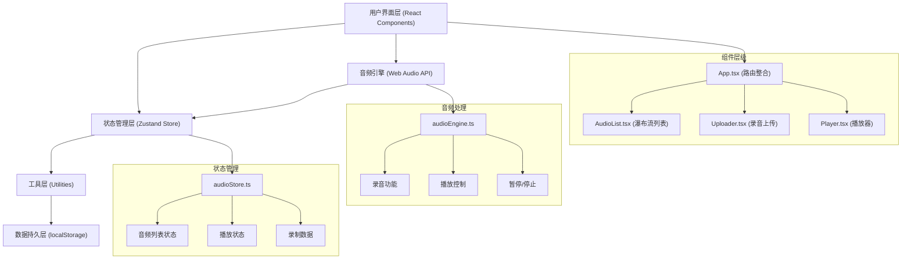

## 1. 架构设计



## 2. 技术描述

- **前端框架**：React@18 + TypeScript
- **构建工具**：Vite
- **状态管理**：Zustand
- **唯一标识**：uuid
- **音频处理**：Web Audio API（原生）
- **数据持久化**：localStorage（模拟后端）
- **样式方案**：CSS Modules / 内联样式（根据需求）

### 2.1 技术选型理由
- **Vite**：快速冷启动，热更新，原生ESM支持，开发体验优秀
- **Zustand**：轻量级状态管理，API简洁，无需Provider包裹，性能优秀
- **Web Audio API**：原生支持，低延迟，高质量音频处理，满足录音播放需求
- **localStorage**：模拟后端数据持久化，无需真实服务器，满足演示需求

## 3. 目录结构

```
soundscape/
├── package.json
├── vite.config.js
├── tsconfig.json
├── index.html
└── src/
    ├── App.tsx                 # 主应用组件
    ├── stores/
    │   └── audioStore.ts       # Zustand状态管理
    ├── components/
    │   ├── AudioList.tsx       # 瀑布流音频列表
    │   ├── Uploader.tsx        # 录音上传组件
    │   └── Player.tsx          # 音频播放器
    └── utils/
        └── audioEngine.ts      # 音频引擎工具模块
```

## 4. 核心数据模型

### 4.1 TypeScript 类型定义

```typescript
interface AudioClip {
  id: string;
  title: string;
  tags: string[];
  audioUrl: string;
  blob: Blob;
  duration: number;
  playCount: number;
  likeCount: number;
  isLiked: boolean;
  createdAt: number;
  waveformData: number[];
  comments: Comment[];
}

interface Comment {
  id: string;
  nickname: string;
  content: string;
  createdAt: number;
}

interface AudioState {
  audioList: AudioClip[];
  currentAudio: AudioClip | null;
  isPlaying: boolean;
  currentTime: number;
  volume: number;
  searchQuery: string;
  selectedTag: string | null;
  isRecording: boolean;
  recordingBlob: Blob | null;
  recordingDuration: number;
}
```

### 4.2 数据持久化
- 使用localStorage存储音频元数据和Blob（通过Base64编码）
- 应用启动时从localStorage加载数据
- 每次状态变更时自动同步到localStorage

## 5. 核心模块设计

### 5.1 audioEngine.ts - 音频引擎
核心方法：
- `startRecording()`: 请求麦克风权限，开始录制，返回MediaRecorder
- `stopRecording()`: 停止录制，生成webm格式Blob（采样率44100Hz）
- `playAudio(audioUrl: string)`: 创建AudioContext，播放音频
- `pauseAudio()`: 暂停播放
- `stopAudio()`: 停止播放，重置状态
- `setVolume(volume: number)`: 设置音量（0-1）
- `seekTo(time: number)`: 跳转到指定播放位置

### 5.2 audioStore.ts - Zustand Store
状态：
- `audioList`: 音频列表数组
- `currentAudio`: 当前播放的音频
- `isPlaying`: 播放状态
- `currentTime`: 当前播放时间
- `volume`: 音量（0-1，默认0.8）
- `searchQuery`: 搜索关键词
- `selectedTag`: 选中的筛选标签
- `isRecording`: 是否正在录音
- `recordingBlob`: 录音生成的Blob

操作方法：
- `addAudio(audio: AudioClip)`: 添加新音频
- `playAudio(audio: AudioClip)`: 播放指定音频
- `togglePlay()`: 切换播放/暂停
- `updateTime(time: number)`: 更新播放时间
- `setVolume(volume: number)`: 设置音量
- `likeAudio(audioId: string)`: 点赞/取消点赞
- `addComment(audioId: string, comment: Comment)`: 添加评论
- `setSearchQuery(query: string)`: 设置搜索关键词
- `setSelectedTag(tag: string | null)`: 设置筛选标签
- `startRecording()`: 开始录音
- `stopRecording()`: 停止录音
- `clearRecording()`: 清除录音数据

### 5.3 AudioList.tsx - 瀑布流列表
功能：
- 从store获取过滤后的音频列表
- 两列瀑布流布局（CSS columns实现）
- 懒加载波形图（IntersectionObserver）
- 卡片点击触发播放
- 搜索和标签筛选逻辑

### 5.4 Uploader.tsx - 录音上传
功能：
- 麦克风权限申请
- 录音计时器显示
- 实时波形可视化
- 标题输入（最多30字）
- 标签选择（最多3个，预设：雨声、森林、城市、咖啡馆、海洋、夜晚）
- 上传保存到store

### 5.5 Player.tsx - 播放器
功能：
- 底部滑入动画
- 播放/暂停控制
- 进度条拖拽（可交互）
- 音量滑块
- 点赞按钮（缩放动画）
- 评论区展开/收起
- 评论输入和展示

## 6. 性能优化策略

### 6.1 列表性能
- 使用CSS columns实现瀑布流，避免JS计算布局
- IntersectionObserver实现懒加载，仅渲染可视区域
- 波形图数据预计算，存储在AudioClip中
- 使用React.memo优化卡片组件重渲染

### 6.2 音频性能
- Web Audio API原生处理，低延迟
- 音频Blob缓存，避免重复解码
- 预加载下一个音频（可选）

### 6.3 搜索性能
- 300ms防抖处理，避免频繁过滤
- 搜索结果缓存

## 7. 浏览器兼容性
- 现代浏览器支持（Chrome、Firefox、Safari、Edge）
- Web Audio API兼容性处理
- MediaRecorder API polyfill考虑（可选）
