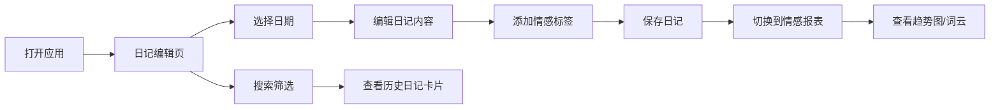

## 1. 产品概述

EmoDiary 是一款在浏览器中运行的个人日记应用，集成情感分析功能，帮助用户记录日常心情并通过数据可视化发现情绪周期和关键事件影响。

- 核心价值：解决写日记时缺乏回顾分析工具、难以从长期记录中发现情绪规律的问题
- 目标用户：希望通过日记记录生活、关注自身情绪变化的个人用户
- 独特卖点：深色主题沉浸式体验 + 自动情感标签打分 + 月度趋势可视化

## 2. 核心功能

### 2.1 功能模块

1. **日记编辑页面**：日历面板 + 日记编辑器 + 搜索筛选
2. **情感报表页面**：月度情感趋势图 + 关键事件提示 + 词云展示

### 2.2 页面详情

| 页面名称 | 模块名称 | 功能描述 |
|-----------|-------------|---------------------|
| 日记编辑 | 日历面板 | 月视图展示，有日记的日期标记红点，点击切换日期 |
| 日记编辑 | 日记编辑器 | 富文本编辑区，支持情感标签，自动保存 |
| 日记编辑 | 搜索筛选 | 关键词搜索 + 标签多选筛选，卡片列表展示结果 |
| 情感报表 | 趋势折线图 | 月度情感分数变化，渐变色折线，交互tooltip |
| 情感报表 | 关键事件 | 得分异常日期及日记片段展示 |
| 情感报表 | 标签词云 | 当月高频标签，字体大小按频率变化 |

## 3. 核心流程

用户打开应用 → 默认进入日记编辑页，显示今日日期 → 在左侧日历选择日期 → 右侧编辑区加载/创建日记 → 添加情感标签 → 保存日记 → 切换到情感报表页 → 查看月度趋势图和词云分析 → 可通过搜索功能查找历史日记

## 4. 用户界面设计

### 4.1 设计风格

- **主题**：深色主题（Dark Mode），沉浸式写作体验
- **主背景色**：#121220
- **卡片/面板背景色**：#1E1E2E
- **强调色**：#6C63FF（紫色）
- **文字主色**：#E0E0E0
- **次要文字**：#9999AA
- **正面情感色**：#4ECDC4（青绿色）
- **负面情感色**：#FF6B6B（珊瑚红）
- **圆角**：统一 12px，按钮 8px
- **阴影**：轻微阴影 0 2px 8px rgba(0,0,0,0.3)
- **过渡动画**：0.2s ease-out 统一标准
- **字体**：Noto Sans SC（Google Fonts）

### 4.2 页面设计概述

| 页面名称 | 模块名称 | UI元素 |
|-----------|-------------|-------------|
| 日记编辑 | 顶部导航 | 标题 + 搜索栏 + 页面切换按钮 |
| 日记编辑 | 日历面板 | 280px宽左侧面板，月视图，日期格子32x32px |
| 日记编辑 | 编辑区域 | 日期标题 + textarea + 标签选择 + 保存按钮 |
| 日记编辑 | 搜索结果 | 卡片列表，展示日期/摘要/标签 |
| 情感报表 | 趋势图表 | Chart.js折线图，渐变色，数据点交互 |
| 情感报表 | 关键事件 | 异常日期卡片列表 |
| 情感报表 | 标签词云 | 不同字号标签云布局 |

### 4.3 响应式

- 桌面端：左右两栏布局（日历 + 编辑器）
- 移动端（<768px）：日历折叠为顶部横条，横向滚动，日期格子缩小为24x24px
- 页面切换：淡入淡出效果（opacity 0→1，0.3s）

### 4.4 性能指标

- 日历切换月份渲染：≤ 50ms
- 情感图表生成：≤ 200ms
- 搜索响应：≤ 100ms（防抖 300ms）
