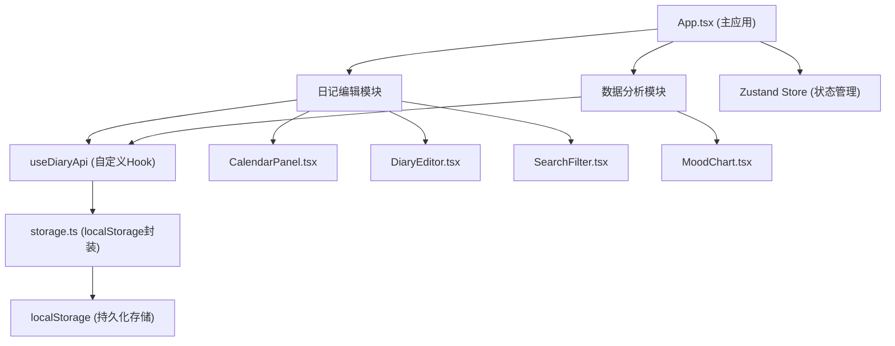

## 1. 架构设计



## 2. 技术选型说明

- **前端框架**：React@18 + TypeScript
- **构建工具**：Vite
- **状态管理**：Zustand
- **图表库**：Chart.js + react-chartjs-2
- **数据存储**：localStorage（后端模拟）
- **ID生成**：uuid
- **字体**：Google Fonts Noto Sans SC

## 3. 数据模型

### 3.1 日记条目 (DiaryEntry)

| 字段 | 类型 | 说明 |
|------|------|------|
| id | string | 唯一标识 (uuid) |
| date | string | 日期，格式 YYYY-MM-DD |
| content | string | 日记内容 |
| tags | string[] | 情感标签列表 |
| score | number | 当日情感总分 (-3 到 +3) |
| createdAt | number | 创建时间戳 |
| updatedAt | number | 更新时间戳 |

### 3.2 情感标签定义

**正面标签 (8个，每个+1分)**：
开心、满足、平静、感恩、兴奋、充实、温暖、希望

**负面标签 (7个，每个-1分)**：
焦虑、疲惫、悲伤、愤怒、孤独、压力、迷茫

**分数规则**：
- 正面标签 +1分/个，负面标签 -1分/个
- 每日最高 ±3 分（超过按3/-3计算）

## 4. 文件结构

```
src/
├── App.tsx                    # 主应用组件，页面路由切换
├── components/
│   ├── CalendarPanel.tsx      # 日历面板组件
│   ├── DiaryEditor.tsx        # 日记编辑器组件
│   ├── SearchFilter.tsx       # 搜索筛选组件
│   └── MoodChart.tsx          # 情感趋势图表组件
├── hooks/
│   └── useDiaryApi.ts         # 数据交互统一Hook
├── utils/
│   └── storage.ts             # localStorage封装
├── store/
│   └── diaryStore.ts          # Zustand状态管理
├── types/
│   └── index.ts               # TypeScript类型定义
└── styles/
    └── global.css             # 全局样式
```

## 5. 接口定义 (useDiaryApi)

```typescript
interface UseDiaryApi {
  getDiary: (date: string) => Promise<DiaryEntry | null>
  saveDiary: (date: string, content: string, tags: string[]) => Promise<DiaryEntry>
  deleteDiary: (date: string) => Promise<void>
  listDiaryByMonth: (year: number, month: number) => Promise<DiaryEntry[]>
  searchDiaries: (keyword: string, tags: string[]) => Promise<DiaryEntry[]>
  calculateScore: (tags: string[]) => number
}
```

## 6. 性能优化策略

1. **日历渲染**：使用 React.memo 避免不必要重渲染
2. **搜索防抖**：useDebounce hook，300ms 延迟
3. **图表优化**：数据缓存，月份切换时复用已计算数据
4. **localStorage读写**：批量操作，减少IO次数
5. **状态管理**：Zustand 细粒度订阅，减少重渲染
