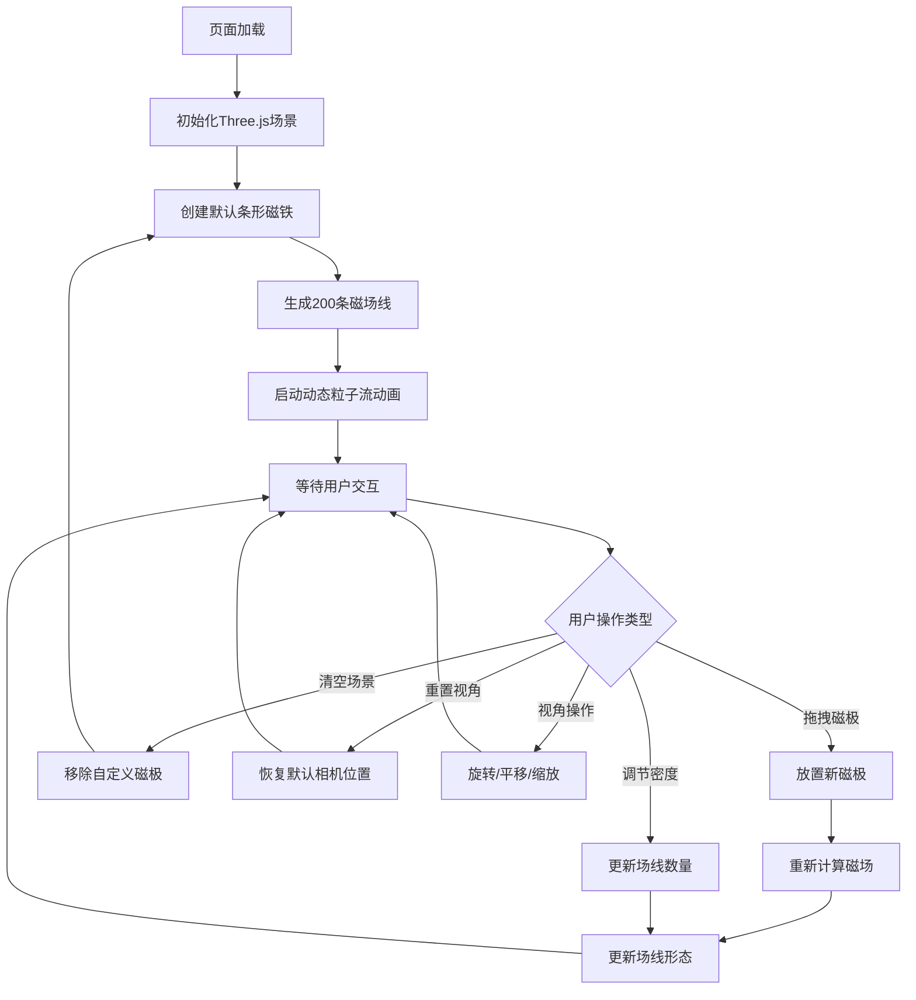

## 1. 产品概述
MagneticFlow是一个交互式3D磁场可视化沙盘，在浏览器中模拟磁场线在三维空间中的分布和动态流动。用户通过放置磁极（N/S极）来实时改变场线形态，将物理课本中的磁感线图转化为可交互的3D体验。
- 主要用途：物理教学演示、科学可视化、交互式学习工具
- 目标用户：物理教师、学生、科学爱好者

## 2. 核心功能

### 2.1 功能模块
1. **3D磁场可视化场景**：条形磁铁默认展示，发光粒子流场线动画
2. **磁极拖拽放置系统**：左侧工具栏拖拽N/S磁极到3D场景任意位置
3. **参数控制面板**：顶部栏场线密度调节、场景清空、视角重置
4. **相机交互系统**：鼠标旋转/平移/缩放视角

### 2.2 页面详情
| 页面名称 | 模块名称 | 功能描述 |
|-----------|-------------|---------------------|
| 主场景 | 3D磁场渲染 | 默认显示条形磁铁（2×0.4×0.4单位），200条动态发光场线从N极流向S极 |
| 主场景 | 左侧工具栏 | 宽80px垂直居中工具栏，提供N极/S极拖拽源，半透明深色背景 |
| 主场景 | 顶部控制面板 | 高60px毛玻璃效果面板，含场线密度滑块（50-500）、清空按钮、重置视角按钮 |
| 主场景 | 背景环境 | 深空渐变背景（#0A0A1A→#1A1A3A），50个随机星点装饰 |

## 3. 核心流程
用户进入页面后看到默认条形磁铁和动态流动的磁场线。用户从左侧工具栏拖拽N极或S极到3D场景中，场线立即重新计算和渲染。用户可通过顶部滑块调节场线密度，点击清空移除所有自定义磁极，点击重置视角恢复默认相机位置。鼠标左键旋转、右键平移、滚轮缩放观察3D场景。

## 4. 用户界面设计
### 4.1 设计风格
- **主色调**：深空蓝紫渐变背景（#0A0A1A→#1A1A3A），N极红色（#FF4444），S极蓝色（#4444FF）
- **强调色**：场线渐变（#FF8800→#0088FF），滑块紫色（#6C63FF），清空按钮红色（#FF6B6B），重置按钮青色（#4ECDC4）
- **视觉风格**：科技感深空主题，发光粒子效果，毛玻璃半透明面板
- **按钮风格**：圆角矩形（8px圆角），悬停缩放1.05，白色14px文字
- **布局**：全屏3D画布覆盖，左侧工具栏垂直居中，顶部控制面板横向居中

### 4.2 页面设计概述
| 页面名称 | 模块名称 | UI元素 |
|-----------|-------------|-------------|
| 主场景 | 3D画布 | 全屏WebGL渲染，深空渐变背景，星点装饰，发光场线，磁极模型 |
| 主场景 | 左侧工具栏 | 80px宽，rgba(26,26,46,0.9)背景，右侧8px圆角，12px内边距，两个圆形磁极图标（N红S蓝） |
| 主场景 | 顶部控制面板 | 60px高，rgba(26,26,46,0.8)背景，backdrop-filter:blur(10px)，flex居中，密度滑块+清空按钮+重置按钮 |

### 4.3 响应性
- 桌面端优先，全屏自适应
- 相机控制支持鼠标操作
- UI元素使用固定像素尺寸，不随窗口缩放变形

### 4.4 3D场景指导
- **环境**：深空渐变背景，无外部HDRI，50个随机星点点缀
- **光照**：环境光+方向光，确保磁极和场线清晰可见
- **相机**：PerspectiveCamera，初始距离~5单位，阻尼0.1，距离范围1-20单位
- **交互**：OrbitControls，左键旋转、右键平移、滚轮缩放
- **动画**：场线粒子以1单位/秒速度从N极流向S极的循环动画
- **性能**：帧率≥45fps，磁极>6时自动降低场线顶点总数至15000以内
