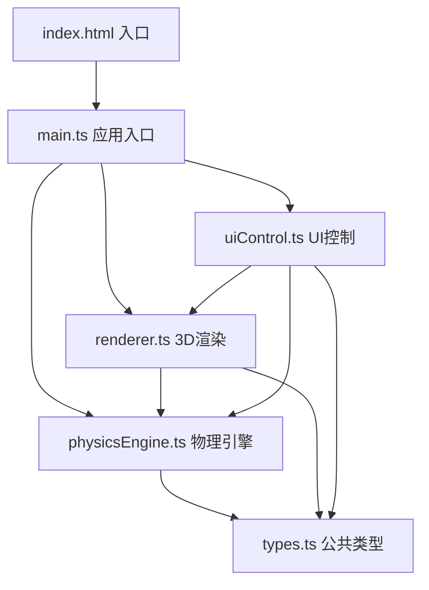

## 1. 架构设计



## 2. 技术描述
- **前端框架**：Vanilla TypeScript（无框架）
- **构建工具**：Vite 5.x（vanilla-ts模板）
- **3D引擎**：Three.js（通过CDN引入importmap）
- **语言**：TypeScript 5.x，严格模式，target ES2020
- **无后端**：纯前端应用

## 3. 文件结构定义
| 文件路径 | 用途 |
|-------|---------|
| /package.json | 项目依赖与启动脚本 |
| /vite.config.js | Vite vanilla-ts配置 |
| /tsconfig.json | TypeScript严格模式配置 |
| /index.html | 应用入口HTML，CDN引入Three.js |
| /src/types.ts | 磁极接口、场线参数接口等公共类型 |
| /src/physicsEngine.ts | 磁场向量计算、场线路径生成算法 |
| /src/renderer.ts | Three.js场景初始化、场线粒子渲染、磁极模型、相机控制 |
| /src/uiControl.ts | 工具栏/顶栏DOM元素创建与事件绑定 |
| /src/main.ts | 应用入口，协调各模块初始化与通信 |

## 4. 核心数据模型

### 4.1 类型定义
```typescript
// 磁极类型
interface MagneticPole {
  id: string;
  type: 'N' | 'S';
  position: { x: number; y: number; z: number };
  strength: number;
}

// 场线参数
interface FieldLineParams {
  totalLines: number;       // 场线总数
  verticesPerLine: number;  // 每条场线顶点数
  lineWidth: number;        // 线宽
  flowSpeed: number;        // 流动速度 单位/秒
  colorN: string;           // N极附近颜色
  colorS: string;           // S极附近颜色
  glowIntensity: number;    // 发光强度
}

// 场景配置
interface SceneConfig {
  backgroundColor: [string, string]; // 渐变起止色
  starCount: number;
  minDistance: number;
  maxDistance: number;
  dampingFactor: number;
}
```

### 4.2 物理算法说明
- **磁场向量计算**：空间中点P的磁场向量 = 所有磁极的磁场向量叠加，每个磁极在P点产生的磁场强度 = k * 磁极强度 / r²，方向：N极远离磁极，S极指向磁极
- **场线追踪**：从N极表面均匀采样点出发，沿磁场方向使用欧拉法或Runge-Kutta法步进，到达S极表面或超出边界时终止
- **动态粒子流**：每条场线作为TubeGeometry或Line，使用shader或texture offset实现粒子沿曲线流动效果

### 4.3 性能优化策略
- 磁极数≤6时：顶点总数 = 场线数 × 每线顶点数
- 磁极数>6时：顶点总数上限15000，自动减少场线数或每线顶点数
- 使用BufferGeometry减少draw call
- 场线更新采用增量更新，避免全量重建
