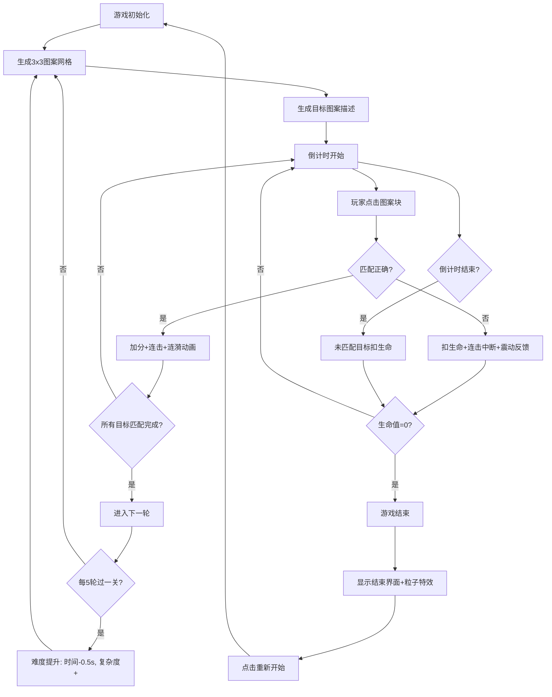

## 1. 产品概述

PatternMatch 是一款快节奏的图案匹配游戏，玩家通过在限定时间内快速识别并点击符合目标描述的图案块来获取分数，获得成就感和挑战乐趣。

- 核心目的：通过即时反馈的视觉刺激和节奏压力，为玩家提供短平快的休闲娱乐体验
- 目标用户：休闲游戏爱好者、追求反应速度挑战的玩家
- 产品价值：低门槛高反馈的游戏机制，适合碎片化时间游玩，兼具视觉享受和心智挑战

## 2. 核心功能

### 2.1 功能模块列表

1. **游戏主界面**：3x3图案网格、状态栏、目标图案指示器
2. **游戏引擎系统**：图案生成、匹配判定、倒计时、计分计算
3. **关卡递进系统**：难度递增（时间缩短、图案复杂度增加）
4. **连击奖励系统**：连击加成、视觉震动反馈
5. **生命与结束机制**：生命值管理、游戏结束界面、粒子扩散光效
6. **视觉动效系统**：涟漪动画、闪烁动画、数字滚动、脉冲放大

### 2.2 页面详情

| 页面名称 | 模块名称 | 功能描述 |
|-----------|-------------|---------------------|
| 游戏主界面 | 状态栏 | 圆形倒计时进度条、当前得分、生命值、连击数、轮次/关卡显示 |
| 游戏主界面 | 游戏板 | 3x3网格渲染、图案块点击交互、匹配正确/错误动画 |
| 游戏主界面 | 目标指示器 | 底部中央显示当前需要匹配的颜色/图标组合提示 |
| 游戏结束页 | 结束遮罩 | 半透明黑色遮罩、最终得分滚动动画、重新开始按钮、粒子扩散特效 |

## 3. 核心流程

### 3.1 游戏主流程

## 4. 用户界面设计

### 4.1 设计风格

**深色科幻赛博朋克风格**

- **主色调**：深空蓝 `#0F0F23`（背景）、霓虹青 `#00C8FF`（发光边缘）
- **状态色**：
  - 成功绿 `#00FF88`（匹配正确、倒计时>3s）
  - 警告黄 `#FFD700`（倒计时>1s）
  - 危险红 `#FF3355`（错误、倒计时≤1s、游戏结束粒子）
  - 粒子色 `#FF6B6B`（结束扩散特效）
- **按钮色**：常态 `#2A2A4A` → 悬停 `#3A3A6A`，圆角12px，过渡0.2s
- **字体**：采用 Orbitron（科幻显示字体）+ JetBrains Mono（数字字体）组合
- **布局**：居中对称布局，游戏板为视觉焦点，状态栏居顶，目标提示居底
- **视觉细节**：所有图案块带微弱发光阴影（`0 0 8px rgba(0,200,255,0.3)`），营造霓虹科技感

### 4.2 页面设计概览

| 页面名称 | 模块名称 | UI元素 |
|-----------|-------------|-------------|
| 游戏主界面 | 状态栏 | 圆形SVG进度条（绿/黄/红渐变）、脉冲数字、霓虹发光文字、水平排列 |
| 游戏主界面 | 游戏板 | 3x3网格（120x120px圆角12px）、发光边缘、涟漪/缩放/闪烁动画 |
| 游戏主界面 | 目标指示器 | 底部中央色块+图标组合提示，带标签"目标匹配" |
| 游戏结束页 | 结束遮罩 | `rgba(0,0,0,0.7)`半透明层、数字滚动得分、圆角按钮、30个粒子从中心扩散（半径200px，1秒） |

### 4.3 响应式设计

- 采用桌面端优先设计，游戏板固定居中
- 小屏幕设备自适应：图案块尺寸按比例缩小，保持网格比例
- 触摸设备优化：点击区域不小于80px，确保触控精准

### 4.4 动画规范

| 动画名称 | 触发条件 | 时长 | 效果描述 |
|-----------|----------|------|----------|
| 涟漪匹配 | 正确点击 | 0.3s | 从中心放大至1.2倍→恢复，颜色变绿`#00FF88` |
| 错误闪烁 | 错误点击 | 0.2s | 快速闪烁红色`#FF3355`，放大至1.5倍→恢复 |
| 震动反馈 | 连击中断 | 0.2s | 游戏板整体缩放抖动 |
| 倒计时脉冲 | 倒计时期间 | 0.5s周期 | 数字交替放大缩小 |
| 数字滚动 | 游戏结束 | 每个数字0.05s | 得分从0滚动至最终值 |
| 粒子扩散 | 游戏结束 | 1s | 30个粒子从中心扩散至半径200px |
