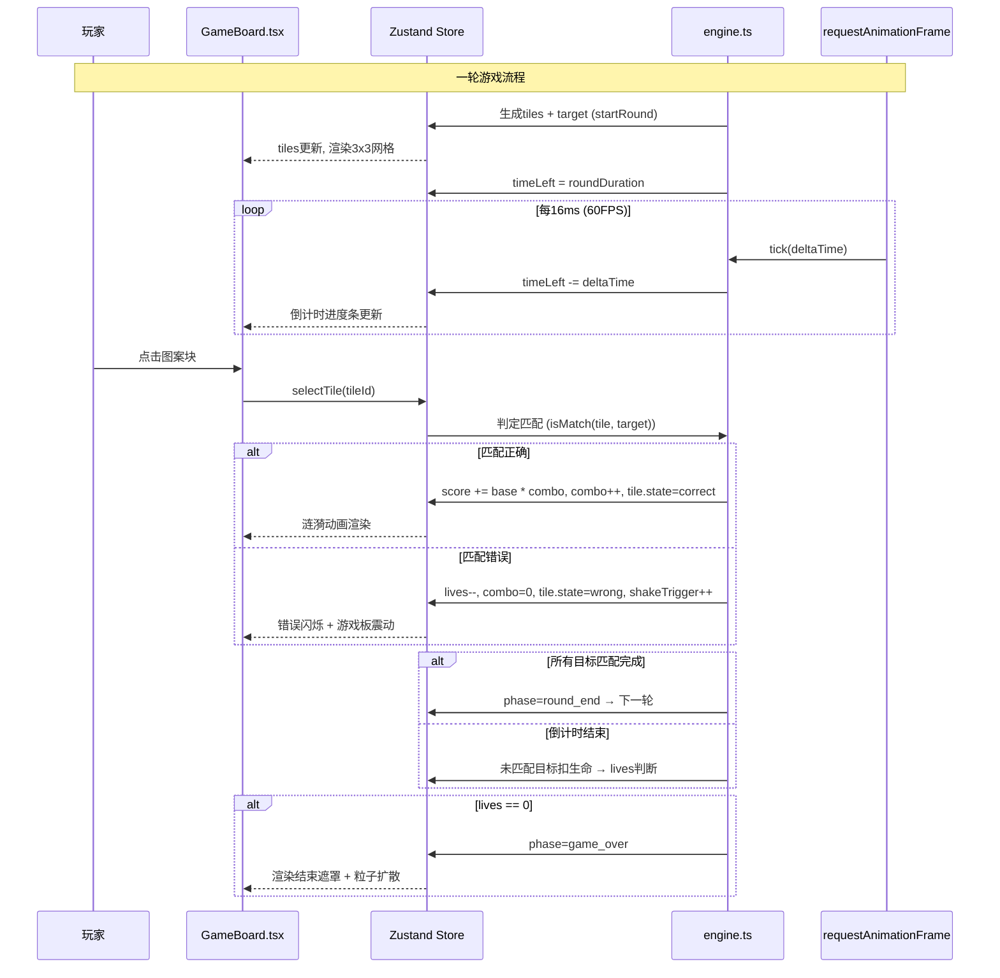

## 1. 架构设计

```mermaid
graph TD
    subgraph "表现层 (UI Layer)"
        App["App.tsx 主组件"]
        GameBoard["GameBoard.tsx 游戏板"]
        StatusBar["StatusBar.tsx 状态栏"]
        GameOver["GameOverOverlay 结束遮罩"]
    end

    subgraph "状态层 (State Layer)"
        Store["store.ts Zustand Store"]
    end

    subgraph "逻辑层 (Engine Layer)"
        Engine["engine.ts 游戏引擎"]
    end

    subgraph "渲染驱动"
        RAF["requestAnimationFrame 循环"]
    end

    App -->|组合渲染| GameBoard
    App -->|组合渲染| StatusBar
    App -->|条件渲染| GameOver
    GameBoard -->|读取状态| Store
    GameBoard -->|派发 action (select)| Store
    StatusBar -->|只读状态| Store
    Store -->|写入图案/分数/阶段| Engine
    Engine -->|输出状态变化| Store
    RAF -->|60FPS 驱动| Engine
    Engine -->|倒计时更新| Store
```

## 2. 技术栈说明

- **前端框架**：React@18 + ReactDOM@18
- **构建工具**：Vite（含 @vitejs/plugin-react）
- **语言**：TypeScript（严格模式，target ES2020）
- **状态管理**：Zustand（全局状态，引擎与UI通信桥梁）
- **工具库**：uuid（生成图案块唯一标识）
- **样式方案**：原生CSS（CSS Modules + CSS Variables，确保动效性能）
- **动画驱动**：CSS Keyframes + requestAnimationFrame

## 3. 模块与文件结构

| 文件路径 | 职责 | 输入/输出 |
|----------|------|-----------|
| `package.json` | 依赖声明与脚本配置 | 依赖: react@18, react-dom@18, zustand, uuid; 脚本: dev |
| `vite.config.js` | Vite构建配置 | 启用React插件 |
| `tsconfig.json` | TypeScript编译配置 | 严格模式, target ES2020, JSX preserve |
| `index.html` | 应用入口 | 标题PatternMatch, 背景色#0F0F23 |
| `src/engine.ts` | 游戏引擎核心 | 输入: store指令(startRound, selectTile, tick); 输出: 图案状态, 分数, 生命, 阶段 |
| `src/store.ts` | Zustand全局状态 | 存储: tiles, target, score, lives, combo, round, level, phase, timeLeft; Actions: 被UI和Engine调用 |
| `src/components/GameBoard.tsx` | 3x3游戏板组件 | 数据流: store→渲染→点击→store.select()→engine判定 |
| `src/components/StatusBar.tsx` | 顶部状态栏 | 数据流: store只读（倒计时圆形进度条、得分、生命、连击、轮次/关卡） |
| `src/components/TargetIndicator.tsx` | 底部目标指示器 | 数据流: store只读（当前目标颜色+图标） |
| `src/components/GameOverOverlay.tsx` | 游戏结束遮罩 | 数据流: store只读得分; 派发: restart() |
| `src/App.tsx` | 根组件 | 组合StatusBar+GameBoard+TargetIndicator+GameOverOverlay, 初始化游戏 |

## 4. 数据模型

### 4.1 核心类型定义

```typescript
// 颜色枚举 (6种, 随关卡逐步解锁)
type ColorKey = 'red' | 'blue' | 'green' | 'yellow' | 'purple' | 'cyan';

// 图标枚举 (4种, 随关卡逐步解锁)
type IconKey = 'star' | 'circle' | 'square' | 'triangle';

// 图案块状态
interface Tile {
  id: string;           // uuid唯一标识
  color: ColorKey;
  icon: IconKey;
  row: number;          // 0-2
  col: number;          // 0-2
  state: 'idle' | 'correct' | 'wrong' | 'matched'; // 动画状态
}

// 目标匹配规则
interface MatchTarget {
  type: 'color' | 'icon' | 'both';  // 匹配类型
  color?: ColorKey;
  icon?: IconKey;
  description: string;  // 人类可读描述
}

// 游戏阶段
type GamePhase = 'idle' | 'playing' | 'round_end' | 'game_over';

// 全局状态 (Zustand Store)
interface GameStore {
  // 状态数据
  tiles: Tile[];
  target: MatchTarget | null;
  score: number;
  lives: number;
  combo: number;
  maxCombo: number;
  round: number;        // 当前轮次 (从1开始)
  level: number;        // 当前关卡 (每5轮一关)
  phase: GamePhase;
  timeLeft: number;     // 剩余时间 (ms)
  roundDuration: number;// 当前轮总时长 (ms)
  shakeTrigger: number; // 震动触发器 (递增触发CSS动画)

  // UI Actions
  selectTile: (tileId: string) => void;  // 玩家点击
  restart: () => void;                    // 重新开始

  // Engine Actions (由engine调用)
  _engineUpdate: (patch: Partial<GameStore>) => void;
  _startGame: () => void;
}
```

### 4.2 数据流时序



## 5. 性能保障策略

1. **渲染循环**：使用 `requestAnimationFrame` 驱动倒计时，确保与浏览器刷新率同步（60FPS）
2. **状态更新**：Zustand 天然支持选择器订阅，UI组件只订阅所需字段，避免不必要重渲染
3. **动画性能**：所有视觉动画使用 CSS `transform` 和 `opacity`，不触发 Layout/Paint，保证GPU加速
4. **内存管理**：
   - 游戏结束时清理 RAF 循环引用
   - tiles数组每轮重建，旧引用自动GC
   - 无全局事件监听器泄漏
5. **交互延迟**：点击事件直接同步调用store→engine判定，单次判定时间<1ms，总延迟<16ms
6. **压力测试保证**：
   - 粒子系统使用CSS动画而非JS计算
   - 图案数据量固定9块，无指数级增长
   - 连击数与得分使用数字基础类型，无累积对象
