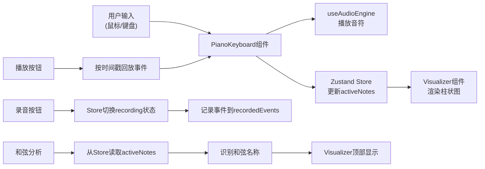

## 1. 产品概述

虚拟钢琴音乐可视化工具，为音乐爱好者提供在网页上实时创作简单旋律并获得即时视觉反馈的交互式体验。

- 主要用途：在线演奏虚拟钢琴，录制创作旋律，实时观看音符动态可视化效果
- 解决问题：音乐爱好者无需专业硬件即可在浏览器中体验音乐创作与可视化反馈
- 目标用户：音乐爱好者、学生、创作者

## 2. 核心功能

### 2.1 功能模块

1. **虚拟钢琴键盘**：C4-C6音域共43键（25白键+18黑键），支持鼠标点击和键盘快捷键输入
2. **音符柱状可视化**：演奏时生成对应音高、力度的彩色动态柱状图，带淡出收缩动画
3. **和弦音高分析**：实时识别并显示当前演奏的和弦名称
4. **录音与回放**：录制演奏时序，支持播放/暂停回放
5. **Web Audio音效**：正弦波音色+混响效果，模拟真实钢琴听感

### 2.2 页面详情

| 页面名称 | 模块名称 | 功能描述 |
|-----------|-------------|---------------------|
| 主页面 | 可视化区域 | 400px高度深色背景，显示彩色音符柱状图和和弦名称 |
| 主页面 | 钢琴键盘 | 底部居中显示43键钢琴键盘，支持鼠标和键盘输入 |
| 主页面 | 录音控制 | 右上角圆形录音按钮，停止后显示播放/暂停按钮 |
| 主页面 | 柱状动画 | 音符触发时向上生成彩色柱，1.5秒内淡出收缩 |

## 3. 核心流程

### 3.1 演奏流程
用户通过鼠标点击或键盘按键触发钢琴键 → 系统播放对应频率的正弦波音频 → 在可视化区域生成对应音高的彩色柱状图 → 柱体在1.5秒内淡出收缩至消失

### 3.2 录音流程
点击录音按钮开始录制 → 记录所有按键事件和时间戳 → 再次点击停止录制 → 显示播放/暂停按钮 → 点击播放按原有时序自动回放

### 3.3 和弦识别流程
监测当前按下的所有音符 → 分析音程关系 → 匹配和弦类型（maj、min、7、m7、sus4等）→ 在可视化区域顶部显示和弦名称

## 4. 用户界面设计

### 4.1 设计风格
- **主色调**：深色背景 #0D0D1A，营造沉浸式音乐创作氛围
- **钢琴键**：白键 #F5F0E8（按下 #E0D4B8），黑键 #2C2C2C（按下 #1A1A1A）
- **可视化柱**：HSL渐变从C4的hsl(0,80%,60%)到C6的hsl(300,80%,60%)
- **控制按钮**：录音 #FF4444（悬停 #CC3333），播放 #4444FF（悬停 #3333CC）
- **和弦文字**：#88FF88 绿色 monospace 字体，带发光效果
- **动画**：琴键按下0.1s过渡，柱体0.1s弹性缓出，1.5s淡出收缩
- **字体**：Google Fonts 等宽 monospace 字体

### 4.2 页面设计概述

| 页面名称 | 模块名称 | UI元素 |
|-----------|-------------|-------------|
| 主页面 | 可视化区域 | 400px高度深色背景，顶部中央显示和弦名称，绝对定位的彩色柱体 |
| 主页面 | 钢琴键盘 | 底部居中，43键按标准钢琴布局排列，键面显示快捷键字母 |
| 主页面 | 录音控制 | 右上角圆形按钮，悬停变色效果，0.2s过渡 |
| 主页面 | 键盘区域渐变 | 从下往上 #1A1A2E 到 #0D0D1A 的微弱渐变 |

### 4.3 响应式
- 桌面端优先设计，最小宽度800px
- 钢琴键盘水平居中排列
- 可视化区域占满剩余宽度
- 支持窗口大小变化自适应

### 4.4 性能要求
- 同时最多处理12个音符（和声音符上限）
- 按键到发声延迟不超过50ms
- 回放动画帧率稳定在60fps
