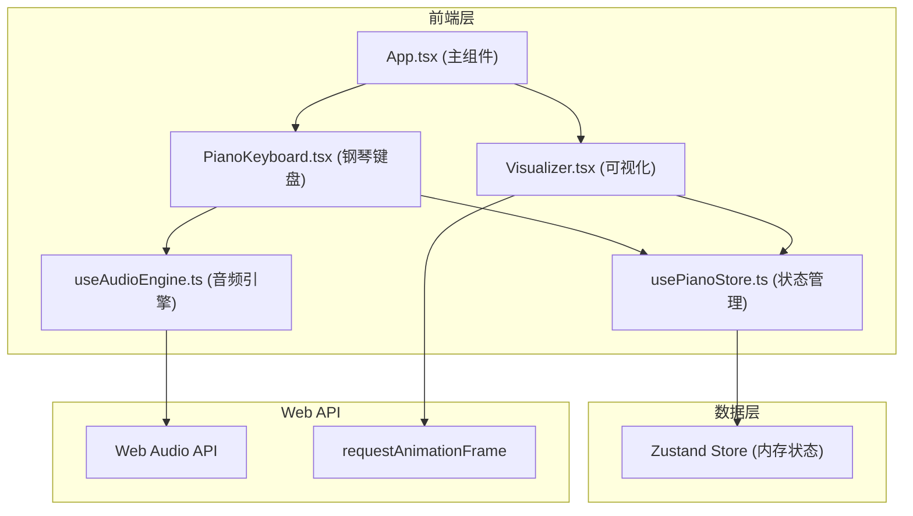

## 1. 架构设计



## 2. 技术描述

- **前端框架**：React@18 + TypeScript
- **构建工具**：Vite 5 + @vitejs/plugin-react
- **状态管理**：Zustand
- **唯一ID生成**：uuid
- **音频引擎**：Web Audio API（原生）
- **动画**：CSS Transition + requestAnimationFrame

**文件组织结构**：
```
d:\P\tasks\auto128/
├── index.html
├── package.json
├── vite.config.js
├── tsconfig.json
└── src/
    ├── main.tsx
    ├── App.tsx
    ├── store/
    │   └── usePianoStore.ts
    ├── hooks/
    │   └── useAudioEngine.ts
    └── components/
        ├── PianoKeyboard.tsx
        └── Visualizer.tsx
```

## 3. 数据模型

### 3.1 Note 音符对象

| 字段 | 类型 | 说明 |
|------|------|------|
| id | string | 唯一标识（uuid） |
| note | string | 音名（如C4、D#5） |
| freq | number | 频率（Hz） |
| color | string | HSL颜色值 |
| velocity | number | 力度（0-100） |
| startTime | number | 触发时间戳（ms） |

### 3.2 RecordedEvent 录制事件

| 字段 | 类型 | 说明 |
|------|------|------|
| type | 'noteOn' \| 'noteOff' | 事件类型 |
| note | string | 音名 |
| freq | number | 频率 |
| timestamp | number | 相对开始时间（ms） |

### 3.3 Store 状态

| 状态 | 类型 | 说明 |
|------|------|------|
| activeNotes | Note[] | 当前活跃的音符数组 |
| recording | boolean | 是否正在录音 |
| recordedEvents | RecordedEvent[] | 已录制的事件数组 |
| isPlaying | boolean | 是否正在回放 |
| recordingStartTime | number | 录音开始时间戳 |

## 4. 核心模块说明

### 4.1 usePianoStore (Zustand状态管理)
- 管理活跃音符、录音状态、录制事件
- 提供 addNote、removeNote、startRecording、stopRecording、playRecording 等 action
- 限制同时活跃音符不超过12个

### 4.2 useAudioEngine (自定义Hook)
- 初始化 AudioContext，创建主增益节点和混响节点
- 提供 playNote(freq, duration) 和 stopNote(freq) 方法
- 内部管理振荡器和增益节点的创建与销毁
- 正弦波音色，音量0.3，混响decay 1.5s

### 4.3 PianoKeyboard 组件
- 渲染C4-C6共43键（25白键+18黑键）
- 绑定 mousedown/mouseup/mouseleave/keydown/keyup 事件
- 键盘映射：A= C4, W=C#4, S=D4, E=D#4, D=E4, F=F4, T=F#4, G=G4, Y=G#4, H=A4, U=A#4, J=B4, K=C5...
- 调用 audioEngine 播放/停止音符
- 更新 store 中的 activeNotes

### 4.4 Visualizer 组件
- 从 store 读取 activeNotes 渲染彩色柱状图
- 柱体绝对定位，宽度与键宽一致，高度对应力度
- CSS transition 实现弹性缓出（0.1s cubic-bezier）和淡出收缩（1.5s）
- 和弦分析逻辑：根据 activeNotes 识别和弦名称并显示在顶部

### 4.5 和弦识别算法
- 定义常见和弦类型的音程模式（maj: 0-4-7, min: 0-3-7, 7: 0-4-7-10, m7: 0-3-7-10, sus4: 0-5-7 等）
- 将当前活跃音符转换为半音集合，找到最低音作为根音
- 计算其他音符相对根音的半音数，匹配和弦模式

## 5. 性能优化策略

1. **音符数量限制**：同时活跃音符最多12个，超出时忽略新输入
2. **音频节点复用**：使用节点池管理振荡器，避免频繁创建销毁
3. **CSS硬件加速**：动画使用 transform 和 opacity，启用GPU加速
4. **requestAnimationFrame**：柱状图更新使用RAF确保60fps
5. **事件防抖**：键盘事件防抖处理，避免重复触发
6. **状态批量更新**：Zustand 批量更新减少重渲染
