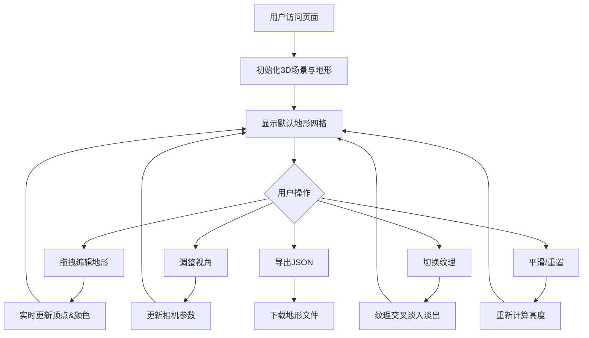

## 1. 产品概述
基于Web的交互式3D地形编辑器，通过拖拽、缩放和旋转在浏览器中探索自定义几何地形。
- 主要目标：解决设计师和非专业用户无法在网页上快速生成和编辑地形模型的问题
- 目标用户：游戏设计师、景观设计师、3D爱好者和非专业用户

## 2. 核心功能

### 2.1 功能模块
1. **地形编辑器主页面**：3D场景渲染区、右侧控制面板、视角控制、地形编辑

### 2.2 页面详情
| 页面名称 | 模块名称 | 功能描述 |
|---------|---------|---------|
| 主页面 | 3D场景渲染区 | 30x30网格地形渲染，支持高度渐变着色，柔和阴影，渐变背景 |
| 主页面 | 地形编辑 | 鼠标拖拽抬高/降低顶点，3格半径衰减影响，实时更新颜色 |
| 主页面 | 视角控制 | 拖拽旋转、滚轮缩放、右键平移 |
| 主页面 | 控制面板 | 平滑/重置按钮、纹理选择、导出功能、地形尺寸显示 |
| 主页面 | 纹理系统 | 4种预设纹理（草地/沙漠/雪地/岩石），交叉淡入淡出过渡 |
| 主页面 | 导出功能 | JSON高度数据导出，包含高度矩阵和纹理索引 |

## 3. 核心流程

用户打开页面 → 看到默认生成的30x30地形 → 通过拖拽编辑地形高度 → 使用平滑/重置优化地形 → 切换纹理模板 → 调整视角查看效果 → 导出JSON文件

## 4. 用户界面设计

### 4.1 设计风格
- 主色调：深色主题，背景#1A1A2E，面板#2C2C3A
- 强调色：绿色#4CAF50（按钮），紫色#6C63FF（滑块）
- 按钮样式：圆角8px，高44px，hover亮度提升20%
- 字体：14px主字体，12px辅助信息，#E0E0E0文字色
- 布局：左右分栏，左侧75% 3D场景，右侧固定260px控制面板

### 4.2 页面设计概述
| 页面名称 | 模块名称 | UI元素 |
|---------|---------|---------|
| 主页面 | 3D场景区 | 全屏渲染、渐变背景(#0A0A1A→#1A1A3A)、无滚动条 |
| 主页面 | 控制面板 | 圆角12px、内边距20px、控件间距12px |
| 主页面 | 按钮 | 宽100%、高44px、圆角8px、#4CAF50背景、#FFFFFF文字 |
| 主页面 | 滑块 | 高32px、轨道#444466、滑块#6C63FF、圆角4px |
| 主页面 | 下拉菜单 | 高36px、背景#3A3A4A、圆角6px、14px字体 |
| 主页面 | 地形渐变 | 低处#4CAF50→中间#8BC34A→高处#FFEB3B→雪线#FFFFFF |

### 4.3 响应式
桌面端优先，左侧场景最小宽度800px，控制面板固定宽度。

### 4.4 3D场景指导
- 环境：渐变背景，模拟昼夜氛围
- 光照：方向光(强度0.8,位置10,20,10)+环境光(强度0.3)+半球光(天空#87CEEB,地面#4CAF50,强度0.4)
- 相机：透视视角，默认仰角45度，缩放范围5-50
- 阴影：阴影贴图1024x1024，柔和阴影效果
- 交互：拖拽旋转(0.005rad/px)、滚轮缩放(阻尼0.1)、右键平移(0.01单位/px)
- 性能：帧率≥30FPS，编辑响应≤50ms
