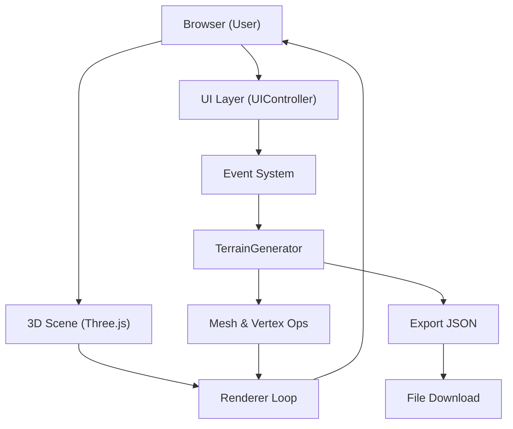

## 1. 架构设计



## 2. 技术说明
- 前端框架：原生 TypeScript + Three.js @ 0.160
- 构建工具：Vite（无额外插件）
- 后端服务：无，纯前端实现
- 数据存储：浏览器端内存，导出为本地JSON文件

### 文件结构
```
.
├── package.json
├── vite.config.js
├── tsconfig.json
├── index.html
└── src/
    ├── main.ts            入口：场景/相机/渲染器，核心循环
    ├── TerrainGenerator.ts  地形网格生成、编辑、平滑、导出
    └── UIController.ts     控制面板DOM、事件绑定
```

## 3. 模块职责

### TerrainGenerator.ts
- 生成30x30 PlaneGeometry，每个格子1单位
- 按高度计算顶点颜色（4段渐变）
- `raiseVertex(cx, cy, radius, amount)` 按半径衰减抬高/降低
- `smooth()` 邻域平均平滑
- `reset()` 重置为平坦
- `exportData()` → `{ heights: number[][], textureIndex: number }`
- 纹理管理：4种Canvas生成的程序化纹理 + 交叉淡入淡出(0.3s)

### UIController.ts
- 创建控制面板（260px宽，#2C2C3A背景，圆角12px）
- 显示地形尺寸标题
- 平滑/重置按钮、纹理下拉菜单、导出按钮
- 绑定事件到 TerrainGenerator

### main.ts
- PerspectiveCamera：默认距离，仰角45°
- OrbitControls 自定义：左键旋转(0.005rad/px)、右键平移(0.01)、滚轮缩放(5-50,阻尼0.1)
- 光源：DirectionalLight(阴影1024²) + AmbientLight + HemisphereLight
- 鼠标拾取：Raycaster 用于编辑顶点
- requestAnimationFrame 主循环

## 4. 类型定义

```typescript
interface TerrainData {
  heights: number[][];    // 30 x 30
  textureIndex: number;   // 0-3
}

interface TerrainOptions {
  gridSize: number;       // 30
  cellSize: number;       // 1
  brushRadius: number;    // 3
}
```

## 5. 性能策略
- 顶点位置/颜色标记 `needsUpdate=true`，避免整Mesh重建
- 编辑时仅更新影响范围内的顶点颜色
- 阴影贴图固定1024，不开PCFSoft以平衡质量/速度
- 纹理使用256x256 Canvas程序化生成，避免外部资源
