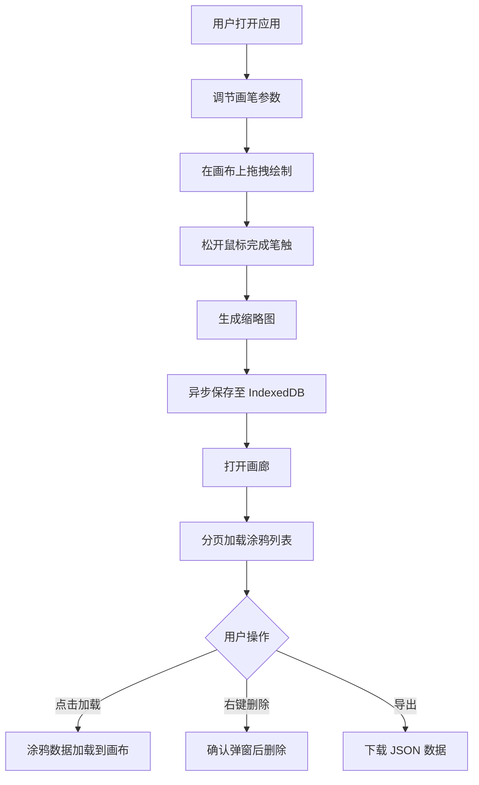

## 1. 产品概述

FlowScape 是一款面向数字艺术爱好者的交互式涂鸦画板应用，用户可在无限画布上自由创作抽象艺术作品。
- 核心目标：提供沉浸式、高性能的涂鸦创作体验，结合丰富的画笔参数和混合模式，激发用户创意表达
- 目标用户：数字艺术创作者、设计师、休闲涂鸦爱好者、学生

## 2. 核心功能

### 2.1 用户角色
| 角色 | 注册方式 | 核心权限 |
|------|---------|---------|
| 普通用户 | 无需注册，直接使用 | 画布创作、画笔调节、涂鸦保存、画廊浏览、删除导出 |

### 2.2 功能模块
1. **工具栏模块**：画笔颜色选择器、粗细调节滑块、混合模式下拉框、撤销/重做按钮
2. **画布模块**：无限画布绘制、鼠标滚轮平移视口、笔触实时渲染
3. **画廊模块**：涂鸦缩略图展示、分页加载、点击加载编辑、删除确认、导出功能
4. **本地存储模块**：IndexedDB 涂鸦持久化、异步读写、缩略图生成

### 2.3 页面详情
| 页面名称 | 模块名称 | 功能描述 |
|---------|---------|-----------|
| 主页面 | 工具栏 | 提供 12 种预置颜色 + 自定义十六进制输入、1-50px 粗细滑块、4 种混合模式选择、撤销/重做按钮 |
| 主页面 | 画布区域 | 2000x2000px 初始画布、鼠标拖拽绘制、滚轮平移、坐标自动转换、60FPS 渲染 |
| 主页面 | 画廊抽屉 | 从右侧滑出（320px）、分页展示缩略图（每页20条）、点击加载、右键删除、导出功能 |

## 3. 核心流程

用户打开应用 → 调节画笔参数（颜色/粗细/混合模式） → 在画布上拖拽绘制 → 松开完成笔触 → 自动生成缩略图并异步保存到 IndexedDB → 打开画廊浏览所有涂鸦 → 点击某涂鸦加载到画布继续编辑 / 右键删除 / 导出涂鸦数据

## 4. 用户界面设计

### 4.1 设计风格
- **主色调**：深紫蓝灰 `#1A1A2E`（画布背景）、深蓝 `#16213E`（画廊背景）、半透明深色 `rgba(0,0,0,0.7)`（工具栏背景）
- **辅色调**：12 种预置颜色（红、橙、黄、绿、青、蓝、紫、粉、黑、白、灰、棕）
- **字体**：使用现代无衬线字体（Space Grotesk 或 Outfit），配合精致的字重变化
- **按钮/控件风格**：圆角 8px、悬停放大 1.05 倍（过渡 0.2s）、毛玻璃效果、柔和阴影
- **布局风格**：顶栏固定 + 全屏画布 + 右侧抽屉式画廊
- **图标风格**：使用 lucide-react 线性图标，保持简洁一致

### 4.2 页面设计概述
| 页面名称 | 模块名称 | UI 元素 |
|---------|---------|--------|
| 主页面 | 工具栏 | 高度 56px、毛玻璃 backdrop-filter: blur(10px)、颜色选择器预置色块 + 十六进制输入、范围滑块、下拉选择框、撤销/重做按钮 |
| 主页面 | 画布区域 | 占满屏幕、背景色 #1A1A2E、超出可滚动、鼠标拖拽绘制、滚轮平移视口 |
| 主页面 | 画廊抽屉 | 宽度 320px、背景 #16213E、从右侧滑入动画、缩略图卡片（圆角 8px、阴影、悬停 scale 1.05 过渡 0.3s）、分页控件 |

### 4.3 响应式设计
- **桌面优先**：所有功能完整可用，画布占满屏幕，画廊 320px 宽度
- **移动端适配**：工具栏可折叠、画布支持触摸事件、画廊改为底部抽屉
- **触摸优化**：支持触摸拖拽绘制、双指平移视口

### 4.4 动效设计
- 页面加载：工具栏从顶部淡入下滑，画布渐显
- 工具栏控件：hover 放大 1.05（0.2s 过渡）、激活态高亮
- 画廊抽屉：translateX 300ms 缓动滑入滑出
- 缩略图卡片：hover scale 1.05（0.3s 过渡）、阴影加深
- 确认弹窗：淡入 + 轻微缩放出现动画
